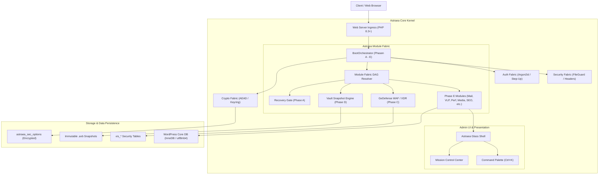
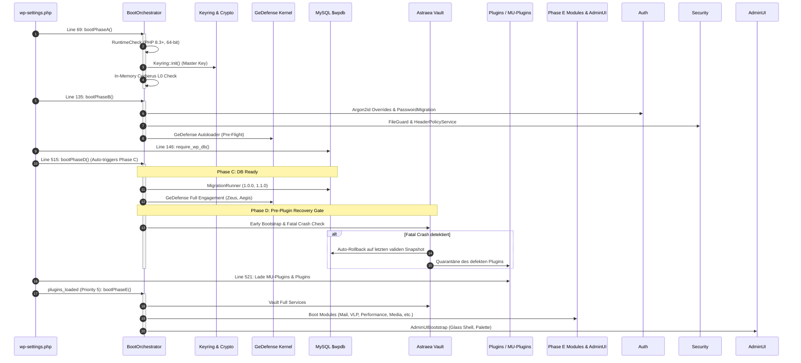
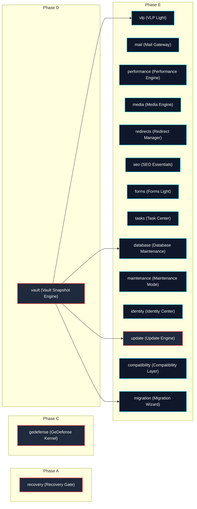
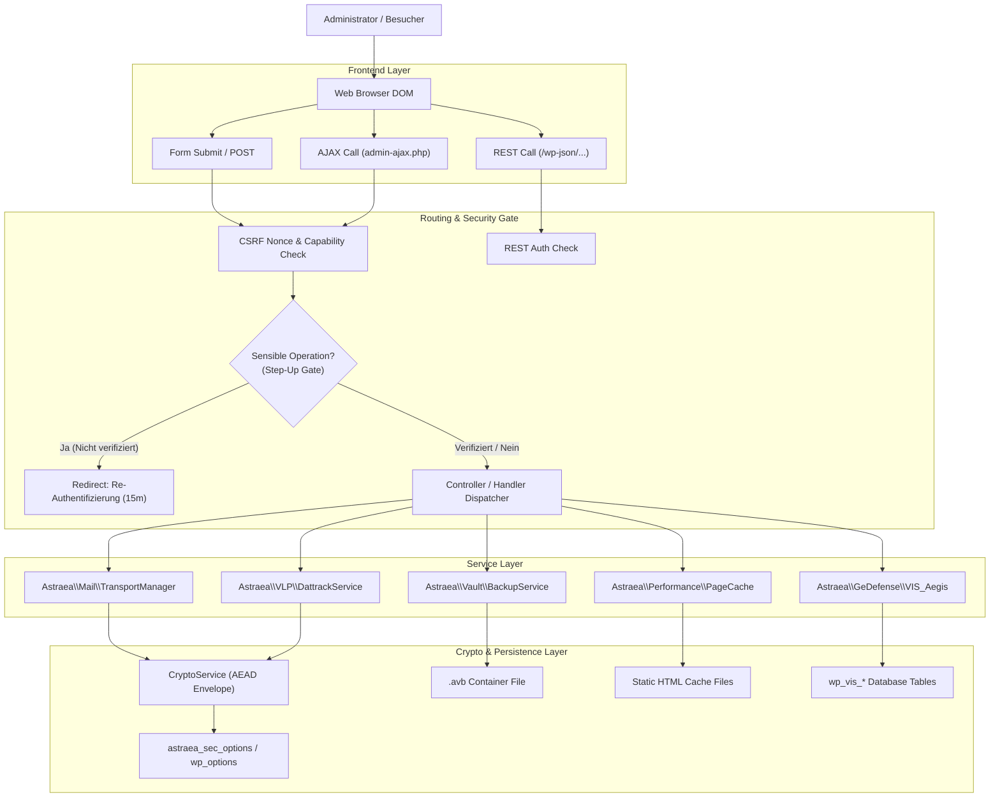

# Architecture

## Public-Beta Hardening Invariants

- **DOM/XML ist blocking:** Secure Genesis und `RuntimeCheck` verlangen `DOMDocument`; das Media-Modul blockiert lokal fail-closed, bevor SVG verarbeitet wird.
- **Gorgon Literal DSL v1:** Nexus-Daten dürfen ausschließlich begrenzte UTF-8-Literale liefern. Remote-PCRE und `meta_regex` sind kein ausführbarer Eingang mehr; Aegis erzeugt Regex ausschließlich lokal via `preg_quote()`.
- **404-Telemetrie ist zeilenatomar:** `${prefix}astraea_404_events` ersetzt den serialisierten Options-Blob. `INSERT ... ON DUPLICATE KEY UPDATE` verhindert Lost Updates; ein DB-Lock serialisiert die harte 200-Zeilen-Grenze.
- **Update und Schema bilden eine Recovery Unit:** Ein Vault-Snapshot ist zwingend. Migrationen führen ein lokales Change-Set und werden bei Migrations- oder Health-Fehlern rückwärts kompensiert. Scheitert die DB-Kompensation, bleiben neue Dateien und Maintenance-Gate erhalten, damit Code und Schema nicht auseinanderlaufen.
- **Forms-Budgets folgen der Validierung:** Globale Upload-Zähler werden erst konsumiert, nachdem sämtliche Felder und Uploads erfolgreich validiert wurden; verworfene Eingaben können kein Tagesbudget verbrennen.
- **Public Release ist signiert:** Der Packager akzeptiert standardmäßig nur ein extern offline mit Ed25519 signiertes Root-Manifest. Unsigned Builds benötigen den expliziten Development-Schalter `--allow-unsigned`.

> **AstraeaOS WP** (`Version 0.6.0-alpha`)  
> **Upstream-Basis:** WordPress 7.1 (de_DE)  
> **Ecosystem:** AstraeaOS / VisionGaiaTechnology  
> **Architektur-Leitmotiv:** *"WordPress without the Plugin Stack"*  
> **Status:** Vollständige technische System- und Architektur-Landkarte

---

## Architekturindex

- [1. Systemübersicht](#1-systemübersicht)
- [2. Globaler Architekturbaum](#2-globaler-architekturbaum)
- [3. Dateien einer Architektur zuordnen](#3-dateien-einer-architektur-zuordnen)
- [4. Modul-Dokumentation](#4-modul-dokumentation)
  - [4.1 Modul: Recovery Gate (`recovery`)](#41-modul-recovery-gate-recovery)
  - [4.2 Modul: GeDefense Security Kernel (`gedefense`)](#42-modul-gedefense-security-kernel-gedefense)
  - [4.3 Modul: Vault Snapshot Engine (`vault`)](#43-modul-vault-snapshot-engine-vault)
  - [4.4 Modul: VLP Light Privacy Kernel (`vlp`)](#44-modul-vlp-light-privacy-kernel-vlp)
  - [4.5 Modul: Mail Gateway (`mail`)](#45-modul-mail-gateway-mail)
  - [4.6 Modul: Performance Engine (`performance`)](#46-modul-performance-engine-performance)
  - [4.7 Modul: Media Engine (`media`)](#47-modul-media-engine-media)
  - [4.8 Modul: Redirect Manager (`redirects`)](#48-modul-redirect-manager-redirects)
  - [4.9 Modul: SEO Essentials (`seo`)](#49-modul-seo-essentials-seo)
  - [4.10 Modul: Forms Light (`forms`)](#410-modul-forms-light-forms)
  - [4.11 Modul: Task Center (`tasks`)](#411-modul-task-center-tasks)
  - [4.12 Modul: Database Maintenance (`database`)](#412-modul-database-maintenance-database)
  - [4.13 Modul: Maintenance Mode (`maintenance`)](#413-modul-maintenance-mode-maintenance)
  - [4.14 Modul: Identity Center (`identity`)](#414-modul-identity-center-identity)
  - [4.15 Modul: Update Engine (`update`)](#415-modul-update-engine-update)
  - [4.16 Modul: Compatibility Layer (`compatibility`)](#416-modul-compatibility-layer-compatibility)
  - [4.17 Modul: Migration Wizard (`migration`)](#417-modul-migration-wizard-migration)
  - [4.18 Subsystem: Internationalization (I18n) & 9-Language Sovereign Policy](#418-subsystem-internationalization-i18n--9-language-sovereign-policy)
- [5. Dashboard detailliert dokumentieren](#5-dashboard-detailliert-dokumentieren)
  - [5.1 Dashboard → Control Center / Mission Control](#51-dashboard--control-center-mission-control)
  - [5.2 Dashboard → GeDefense Security HUD](#52-dashboard--gedefense-security-hud)
  - [5.3 Dashboard → Astraea Module Fabric](#53-dashboard--astraea-module-fabric)
  - [5.4 Dashboard → Performance Engine](#54-dashboard--performance-engine)
  - [5.5 Dashboard → Update Engine](#55-dashboard--update-engine)
  - [5.6 Dashboard → Identity Center](#56-dashboard--identity-center)
  - [5.7 Dashboard → Media Security](#57-dashboard--media-security)
  - [5.8 Dashboard → Maintenance Mode](#58-dashboard--maintenance-mode)
  - [5.9 Dashboard → SEO Essentials](#59-dashboard--seo-essentials)
  - [5.10 Dashboard → Redirect Manager](#510-dashboard--redirect-manager)
  - [5.11 Dashboard → Task Center](#511-dashboard--task-center)
  - [5.12 Dashboard → Database Maintenance](#512-dashboard--database-maintenance)
  - [5.13 Dashboard → Forms Light](#513-dashboard--forms-light)
  - [5.14 Dashboard → Migration Wizard](#514-dashboard--migration-wizard)
  - [5.15 Dashboard → Compatibility Center](#515-dashboard--compatibility-center)
  - [5.16 Dashboard → Glass Component Showcase](#516-dashboard--glass-component-showcase)
  - [5.17 Dashboard → Astraea Vault Management](#517-dashboard--astraea-vault-management)
  - [5.18 Dashboard → Astraea Mail Gateway](#518-dashboard--astraea-mail-gateway)
  - [5.19 Dashboard → VLP Light Privacy Center](#519-dashboard--vlp-light-privacy-center)
  - [5.20 Dashboard → GeDefense VGT Suite](#520-dashboard--gedefense-vgt-suite)
  - [5.21 Dashboard → Autonomous Recovery Console](#521-dashboard--autonomous-recovery-console)
  - [5.22 Dashboard → Secure Genesis Installer](#522-dashboard--secure-genesis-installer)
  - [5.23 Dashboard → Glass Authentication Portal](#523-dashboard--glass-authentication-portal)
- [6. CSS / UI Architektur](#6-css--ui-architektur)
- [7. API Architektur](#7-api-architektur)
- [8. Datenflüsse](#8-datenflüsse)
- [9. Shared / Core Dateien](#9-shared--core-dateien)
- [10. Architektur-Relationen (Mermaid-Diagramme)](#10-architektur-relationen-mermaid-diagramme)
- [11. Dateireferenzen](#11-dateireferenzen)
- [12. Architektur-Auffälligkeiten](#12-architektur-auffälligkeiten)

---

# 1. Systemübersicht

AstraeaOS WP ist eine sicherheitszentrierte, eigenständige Enterprise-Distribution und ein Fork auf Basis von **WordPress 7.1 (de_DE)**.
Anstelle von unkontrollierten Plugin-Installationen dritter Hersteller für grundlegende Basisfunktionen verfolgt AstraeaOS das architektonische Prinzip:

> **„WordPress without the Plugin Stack.“**  
> Universelle Infrastrukturaufgaben (Perimeter-Firewall & WAF, unveränderliche Snapshot-Backups & Rollbacks, DSGVO-Einwilligungsmanagement & DOM-Gatekeeper, verschlüsselter SMTP-Mailtransport mit XOAUTH2, Disk-Page-Caching, manipulationssichere Upload-Pipelines, technisches SEO, kryptografisch gesicherte Formulardaten, Cron-Telemetrie, Datenbank-Bereinigung und Notfallwiederherstellung) sind **nativ im Core-Kernel** (`astraea-core/`) implementiert. Drittanbieter-Plugins verbleiben rein für fachliche Spezialanwendungen.

### Kern-Architektur-Prinzipien

1. **Minimale Upstream-Invasivität (Surgical Hook Points):**  
   WordPress-Kerndateien werden praktisch unverändert belassen. Es existieren lediglich zwei chirurgische Eingriffspunkte in Upstream-Dateien:
   - `wp-settings.php`: Orchestrierung der 5-Phasen-Bootsequenz (`BootOrchestrator::bootPhaseA()`, `bootPhaseB()`, `bootPhaseD()`, `bootPhaseE()`).
   - `wp-includes/version.php`: Definition der Mindestanforderungen (PHP >= 8.3, 64-Bit, MySQL >= 8.0, Extensions `sodium`, `openssl`, `mbstring`, `intl`, `dom`) und Verankerung der Distributionsversion `ASTRAEA_VERSION`.
   - Asset: `wp-admin/images/astraea-logo.png` für natives Branding.

2. **5-Phasen-Bootsequenz (`BootOrchestrator`):**  
   - **Phase A (Pre-WordPress Minimal):** Natives PHP ohne jegliche WordPress-Funktion (`wp_*`). Runtime-Checks, Autoloader-Registrierung, Keyring-Initialisierung, In-Memory Cerberus L0 Perimeter Check (`REMOTE_ADDR`), BootFailureDetector.
   - **Phase B (WordPress Core Ready):** Nach Laden von `functions.php` und `formatting.php`. Argon2id Pluggable Overrides, PasswordMigrationManager, Baseline-Härtung, FileGuard, HeaderPolicyService, LegacyPruner, RequestProfiler, GeDefense Pre-Flight Autoloading.
   - **Phase C (Database & Options Ready):** Nach Initialisierung von `$wpdb` und `wp_options`. Schema-Migrationen (`MigrationRunner`), SecurityEventBridge, GeDefense Kernel Full Engagement (Cerberus, Zeus, Aegis, Hades).
   - **Phase D (Pre-Plugin Recovery Gate):** Streng VOR dem Laden jeglicher Must-Use- (MU), Netzwerk- oder regulärer Plugins (`$GLOBALS['wp_plugin_paths']`). Astraea Vault prüft Incident-Zustände, führt bei fatalen Abstürzen automatische Rollbacks und Plugin-Quarantäne aus.
   - **Phase E (Normal Astraea Lifecycle & Admin UI):** Eingehängt in `plugins_loaded` (Priorität 5). Module Fabric Boot (`ModuleBootstrap`), Vault Full Services, VLP Light, Astraea Mail Gateway, StepUpAuthService, PrivilegedActionGuard, CoreUpdateGuard, AdminUI Glass Shell, Command Palette, WP-CLI Commands.

3. **Kryptografisches Zero-Trust-Fundament:**  
   Libsodium AEAD (`crypto_aead_xchacha20poly1305_ietf`) und OpenSSL (`aes-256-gcm`) mit Key-Rotation (`ACTIVE`, `DECRYPT_ONLY`, `RETIRED`, `REVOKED`) und strikter Kontext-Trennung via HKDF-Domain-Separation (`MAIL_TRANSPORT`, `VLP_CONSENT`, `FORMS_SUBMISSION`, `VAULT_SNAPSHOT`, `DATTRACK_ANALYTICS`, `SECURE_OPTIONS`).

4. **Session-Bound Privileged Elevation (Step-Up-Authentifizierung):**  
   Privilegierte Aktionen (Backup-Restore, Download, Snapshot-Löschung, Vault-Passphrase-Rotation, SMTP-Secrets-Änderung, VLP-Registry-Mutation, DB-Bereinigung, Modul-Toggle) erfordern eine Re-Authentifizierung innerhalb der aktuellen Browser-Sitzung (Gültigkeit 15 Minuten, strikt an den WordPress-Session-Token-Hash gebunden).

5. **Zero External Dependencies:**  
   Weder im Core noch im AdminUI existieren Abhängigkeiten zu Composer, npm oder externen CDNs (keine Google Fonts, keine Remote-Icons, keine unpkg/jsdelivr-Skripte). Alle Assets liegen lokal vor.

---

# 2. GLOBALER ARCHITEKTURBAUM

Der folgende Baum visualisiert die tatsächliche, physische und logische Architektur von **AstraeaOS WP**:

```text
ASTRAEAOS WP SYSTEM
│
├── 1. KERNEL BOOTSTRAP & RUNTIME LAYER
│   ├── Pre-WordPress Ignition (astraea-bootstrap.php)
│   ├── Phased Boot Orchestrator (BootOrchestrator: Phase A -> Phase E)
│   ├── Host Runtime Baseline Assertion (RuntimeCheck: PHP 8.3+, 64-Bit, Extensions)
│   ├── PSR-4 Namespace Autoloader (Autoloader)
│   └── Fork Version Authority (Version.php)
│
├── 2. ASTRAEA MODULE FABRIC (17 FIRST-PARTY SUBSYSTEMS)
│   ├── Core Kernel Modules (Phases A, C, D)
│   │   ├── Recovery Gate (Phase A, non-toggleable)
│   │   ├── GeDefense Security Kernel (Phase C, non-toggleable)
│   │   └── Vault Snapshot Engine (Phase D, non-toggleable)
│   ├── Extended Lifecycle Modules (Phase E)
│   │   ├── VLP Light Privacy Kernel (Consent, DOM Gate, Dattrack)
│   │   ├── Mail Gateway (StrictSMTP, XOAUTH2 Modern Auth)
│   │   ├── Performance Engine (Disk PageCache, Browser Policies, Autoload Profiling)
│   │   ├── Media Engine (Hardened Upload Pipeline, SVG XML Sanitizer)
│   │   ├── Redirect Manager (ReDoS-Immune Routing, 404 Telemetry)
│   │   ├── SEO Essentials (Conflict-Aware Canonicals, JSON-LD Schema)
│   │   ├── Forms Light (Honeypot, Rate Limiting, AEAD Storage)
│   │   ├── Task Center (WP-Cron Inspection & Delay Telemetry)
│   │   ├── Database Maintenance (Dry-Run Analyzer, Vault-Protected Pruner)
│   │   ├── Maintenance Mode (SEO-Safe 503, Secret Bypass Tokens)
│   │   ├── Identity Center (Argon2id, Session Inspection, Hash Login Audit)
│   │   ├── Update Engine (Ed25519 Detached Verification, Core Update Shield)
│   │   ├── Compatibility Layer (Granular Minimum-Effective Exceptions)
│   │   └── Migration Wizard (Safe Environment Audit, Plugin Replacement)
│   └── Fabric Management & DAG Resolution
│       ├── ModuleRegistry (Static Service Locator & State Tracking)
│       ├── ModuleDependencyGraph (Kahn's Algorithm Cycle Detection)
│       ├── ModuleDescriptor & ModuleState (Metadata & Lifecycle Contracts)
│       ├── ModuleHealth (Evidence-Based Telemetry Probes)
│       └── ModuleAdmin (Control UI & Step-Up Gated Toggles)
│
├── 3. SECURITY & CRYPTOGRAPHY FABRIC
│   ├── Cryptographic Keyring & Secret Store (Keyring, MasterKeyManager, KeyContext)
│   ├── Symmetric AEAD Engine (CryptoService: XChaCha20-Poly1305 / AES-256-GCM)
│   ├── Argon2id Authentication Subsystem (PasswordService, LegacyHashVerifier, PepperManager)
│   ├── Step-Up Authorization Service (StepUpAuthService: Session-Bound 15-min Elevation)
│   ├── Privileged Action Guard (PrivilegedActionGuard: Interceptor für Mutationen)
│   ├── Ingress File Guard & Magic Byte Validator (FileGuard)
│   ├── Security Header Authority (HeaderPolicyService, Headers)
│   ├── Evidence-Based Security Event Fabric (SecurityEventManager, SecurityEventBridge)
│   ├── Local File Integrity & Release Verification (ReleaseIntegrity, BUILD-MANIFEST.json)
│   └── Transactional Installation Engine (SecureGenesis: 10-Stufen Sicherheitsplan)
│
├── 4. ASTRAEA GLASS ADMIN EXPERIENCE (ADMIN UI)
│   ├── Design System & Token Architecture (astraea-tokens.css, astraea-glass.css)
│   ├── Application Shell (ShellRenderer: Topbar, Breadcrumbs, Sidebar, Footer)
│   ├── Navigation Model Adapter (NavigationAdapter: CONTENT, DESIGN, SYSTEM, ASTRAEA, EXTENSIONS)
│   ├── Keyboard Command Palette (CommandRegistry: Ctrl+K Fuzzy Finder, Nonce-Guarded AJAX)
│   ├── Mission Control Dashboard (ControlCenter: System-Telemetry, Security-HUD, Pulse-Counters)
│   ├── Non-Destructive Notification Center (NoticeCenter: Toasts, Slide-Over Drawer)
│   ├── Legacy Surface Adapter (astraea-legacy-surfaces.css: Zero-DOM Core Screen Unification)
│   ├── Glass Login Portal (LoginTheme, astraea-login.css)
│   └── Component Preview Showcase (ComponentPreview)
│
├── 5. AUTONOMOUS RECOVERY SUBSYSTEM
│   ├── Boot Crash Loop Detector (BootFailureDetector: Threshold 3 consecutive fails)
│   ├── Emergency Recovery Controller (RecoveryController: Master Key Auth, CSRF)
│   └── Standalone Emergency Admin Console (/astraea-recovery/index.php)
│
├── 6. UPSTREAM WORDPRESS BASELINE (SURGICALLY HOOKED)
│   ├── Ingress Settings Orchestration (wp-settings.php -> Phase A, B, D, E)
│   ├── Version & Environment Anchor (wp-includes/version.php)
│   ├── Core Upstream Systems (wp-admin, wp-includes, wp-content)
│   └── Pluggable Overrides (Crypto & Password Overrides)
│
└── 7. CLI, DIAGNOSTICS & RELEASE TOOLING
    ├── WP-CLI Astraea Suite (CLI/AstraeaCommand.php)
    ├── System Health Engine (Diagnostics/SystemHealth.php, SecurityProbeManager.php)
    ├── Release Builder & Packager (tools/build-release.php, tools/package-distribution.php)
    └── Automated Regression Test Suites (tests/run_tests.php, tests/run_release_checks.php)
```

---

# 3. DATEIEN EINER ARCHITEKTUR ZUORDNEN

Die folgende Übersicht ordnet die Dateien des Projekts den funktionalen Schichten der AstraeaOS-Architektur zu:

### 3.1 Kernel Bootstrap & Ignition
* `astraea-core/astraea-bootstrap.php` — Master-Einsprungpunkt für Phase A und Hook für Phase E.
* `astraea-core/Version.php` — Zentrale Definition von `\Astraea\Version::VERSION` (`0.6.0-alpha`).
* `astraea-core/Bootstrap/Autoloader.php` — PSR-4-Autoloader für den Namespace `Astraea\`.
* `astraea-core/Bootstrap/RuntimeCheck.php` — Assertiert PHP >= 8.3, 64-Bit, Extensions (`sodium`, `openssl`, `mbstring`, `intl`, `dom`, `json`, `hash`), DB-Version.
* `astraea-core/Bootstrap/BootOrchestrator.php` — Führt die 5 Boot-Phasen (A bis E) deterministisch aus.
* `wp-settings.php` — Upstream-Hook-Punkte für Phase A (L69), Phase B (L135) und Phase D (L515).
* `wp-includes/version.php` — Upstream-Deklaration von `$required_php_version`, Extensions und `ASTRAEA_VERSION`.

### 3.2 Module Fabric (Kern- & Modulmanagement)
* `astraea-core/Modules/ModuleInterface.php` — Standardvertrag für alle First-Party-Kernel-Module.
* `astraea-core/Modules/BaseModule.php` — Abstrakte Basisklasse mit Option-Persistierung und Toggle-Prüfung.
* `astraea-core/Modules/ModuleDescriptor.php` — Unveränderliche Metadaten (ID, Name, Version, Phase, Dependencies, Conflicts, Capabilities, Routen).
* `astraea-core/Modules/BootPhase.php` — Enum für die 5 Phasen (`PHASE_A`, `PHASE_B`, `PHASE_C`, `PHASE_D`, `PHASE_E`).
* `astraea-core/Modules/ModuleState.php` — Enum für Modul-Zustände (`REGISTERED`, `BOOTING`, `ACTIVE`, `DEGRADED`, `FAILED`, `DISABLED`, `BLOCKED`).
* `astraea-core/Modules/ModuleHealth.php` — Evidenzbasiertes Zustandsmodell (`healthy`, `degraded`, `critical`, `unknown`).
* `astraea-core/Modules/ModuleRegistry.php` — Statischer Registry-Store, Status-Verwaltung und Phasen-Auflösung.
* `astraea-core/Modules/ModuleDependencyGraph.php` — Topologische DAG-Sortierung mit Kahns Algorithmus und Zyklenerkennung.
* `astraea-core/Modules/ModuleBootstrap.php` — Registrierung aller 17 Module und phasenweise Boot-Ausführung.
* `astraea-core/Modules/ModuleAdmin.php` — Admin-Oberfläche (`index.php?page=astraea-modules`) und Controller für Modul-Aktivierung/Deaktivierung.
* `astraea-core/Modules/CoreModules/RecoveryModule.php` — Deskriptor und Boot-Logik für das Recovery Gate.
* `astraea-core/Modules/CoreModules/GeDefenseModule.php` — Deskriptor und Boot-Logik für GeDefense.
* `astraea-core/Modules/CoreModules/VaultModule.php` — Deskriptor und Boot-Logik für Astraea Vault.
* `astraea-core/Modules/CoreModules/VLPModule.php` — Deskriptor und Boot-Logik für VLP Light.
* `astraea-core/Modules/CoreModules/MailModule.php` — Deskriptor und Boot-Logik für das Mail Gateway.
* `astraea-core/Modules/CoreModules/PerformanceModule.php` — Deskriptor und Boot-Logik für die Performance Engine.
* `astraea-core/Modules/CoreModules/MediaModule.php` — Deskriptor und Boot-Logik für die Media Engine.
* `astraea-core/Modules/CoreModules/RedirectsModule.php` — Deskriptor und Boot-Logik für den Redirect Manager.
* `astraea-core/Modules/CoreModules/SeoModule.php` — Deskriptor und Boot-Logik für SEO Essentials.
* `astraea-core/Modules/CoreModules/FormsModule.php` — Deskriptor und Boot-Logik für Forms Light.
* `astraea-core/Modules/CoreModules/TasksModule.php` — Deskriptor und Boot-Logik für das Task Center.
* `astraea-core/Modules/CoreModules/DatabaseModule.php` — Deskriptor und Boot-Logik für Database Maintenance.
* `astraea-core/Modules/CoreModules/MaintenanceModule.php` — Deskriptor und Boot-Logik für Maintenance Mode.
* `astraea-core/Modules/CoreModules/IdentityModule.php` — Deskriptor und Boot-Logik für das Identity Center.
* `astraea-core/Modules/CoreModules/UpdateModule.php` — Deskriptor und Boot-Logik für die Update Engine.
* `astraea-core/Modules/CoreModules/CompatibilityModule.php` — Deskriptor und Boot-Logik für die Compatibility Layer.
* `astraea-core/Modules/CoreModules/MigrationModule.php` — Deskriptor und Boot-Logik für den Migration Wizard.

### 3.3 Kryptografie, Authentifizierung & Autorisierung
* `astraea-core/Crypto/KeyContext.php` — Enum für HKDF-Domänen-Kontexte (`MAIL_TRANSPORT`, `VLP_CONSENT`, etc.).
* `astraea-core/Crypto/KeyState.php` — Enum für Keyring-Zustände (`ACTIVE`, `DECRYPT_ONLY`, `RETIRED`, `REVOKED`).
* `astraea-core/Crypto/KeyRecord.php` — Datenmodell für versionierte kryptografische Schlüssel.
* `astraea-core/Crypto/Keyring.php` — Persistenter Schlüsselbund mit dateibasierter Ablage außerhalb des Webroots.
* `astraea-core/Crypto/MasterKeyManager.php` — Bereitstellung des Astraea Master Keys (Env, Konstante oder Dateisystem).
* `astraea-core/Crypto/CryptoService.php` — Libsodium XChaCha20-Poly1305 und AES-256-GCM AEAD mit AAD.
* `astraea-core/Crypto/CryptoAuthenticationException.php` — Exception bei MAC-/Tag-Fehlern.
* `astraea-core/Crypto/functions.php` — Prozedurale Hilfsfunktionen für Kernkryptografie.
* `astraea-core/Auth/Argon2idPolicy.php` — Ressourcen-Kalibrierung (64 MB Memory, Time Cost 4, Threads 1).
* `astraea-core/Auth/PasswordService.php` — Sichere Argon2id-Hashes und Timing-Safe-Verifikation.
* `astraea-core/Auth/LegacyHashVerifier.php` — Sichere Verifikation von MD5/phpass Alt-Hashes ohne Double-Hashing.
* `astraea-core/Auth/PepperManager.php` — Verwaltung externer Passwort-Pfeffer und Pfeffer-Rotation.
* `astraea-core/Auth/PasswordMigrationManager.php` — Authentifizierungs-Filter zur automatischen Migration auf Argon2id.
* `astraea-core/Auth/pluggable-overrides.php` — Überschreibt `wp_hash_password()` und `wp_check_password()`.
* `astraea-core/Auth/StepUpAuthService.php` — Session-gebundene 15-Minuten Re-Authentifizierung (`admin_post_astraea_step_up`).
* `astraea-core/Auth/PrivilegedActionGuard.php` — Fängt Updates, Plugin-/Theme-Installationen und sensible POST-Aktionen ab.
* `astraea-core/Auth/SessionManager.php` — Sitzungsverwaltung und AJAX-Terminierung (`wp_ajax_astraea_revoke_session`).
* `astraea-core/Auth/IdentityCenter.php` — Admin-Oberfläche (`users.php?page=astraea-identity`) für Session- & Login-Historie.

### 3.4 GeDefense Security Kernel
* `astraea-core/GeDefense/gedefense-wp.php` — Haupteinsprungpunkt des GeDefense-Subsystems.
* `astraea-core/GeDefense/GeDefenseKernel.php` — Bootstrapper für Phase B (Autoload) und Phase C (Full Engagement).
* `astraea-core/GeDefense/class-vis-bootstrapper.php` — Initialisierung der Kernel-Schichten.
* `astraea-core/GeDefense/class-vis-schema.php` — Schema-Definition für 10+ Tabellen (Bans, Logs, XDR, Downloads).
* `astraea-core/GeDefense/class-vis-vault.php` — GeDefense interner Key-Vault.
* `astraea-core/GeDefense/includes/core/` — Security-Utilities, EventBus, Registry.
* `astraea-core/GeDefense/includes/modules/cerberus/` — L0 In-Memory IP-Drop Firewall.
* `astraea-core/GeDefense/includes/modules/zeus/` — 6G Pre-Boot WAF mit URI/Query-Sanitization.
* `astraea-core/GeDefense/includes/modules/aegis/` — Deep Packet Inspection (SQLi, XSS, RCE, LFI).
* `astraea-core/GeDefense/includes/modules/titan/` — Browser-Confinement, CSP-Compiler und CSP-Violation-REST-Route.
* `astraea-core/GeDefense/includes/modules/hades/` — Admin-Tarnung und 404-Mimikry.
* `astraea-core/GeDefense/includes/modules/throneguard/` — Master-Role Privilege Separation und Notfall-Key.
* `astraea-core/GeDefense/includes/modules/styx/` — Zero-Trust Egress-Filterung (SSRF-Schutz).
* `astraea-core/GeDefense/includes/modules/morpheus/` — RASP Hypervisor und Sandbox.
* `astraea-core/GeDefense/includes/modules/gorgon/` — Verschlüsseltes Telemetrie-Mesh.
* `astraea-core/GeDefense/includes/modules/trap/` — Ghost Trap Honeypot-Injektor.
* `astraea-core/GeDefense/includes/modules/prometheus/` — Verhaltensbasierter Heuristik-Profiler.
* `astraea-core/GeDefense/includes/scanner/` — Scan-Engine mit Malware-Triage (`MALWARE`, `SUSPICIOUS`, `POLICY`, `INFO`).
* `astraea-core/GeDefense/includes/xdr/` — XDR Event Fabric und Incident Response Engine.
* `astraea-core/GeDefense/includes/dashboard/` — Dashboard-Controller (`class-vis-dashboard-core.php`), AJAX (`class-vis-dashboard-ajax.php`) und Modul-Views.

### 3.5 Astraea Vault Snapshot Engine
* `astraea-core/Vault/astraea-vault.php` — Vault-Initialisierungsdatei.
* `astraea-core/Vault/src/Plugin.php` — Singleton-Instanz und Lifecycle-Management.
* `astraea-core/Vault/src/Installer.php` — Idempotente Anlage der Tabellen `astraea_vault_backups` und `astraea_vault_incidents`.
* `astraea-core/Vault/integration/astraea-core-early-bootstrap.php` — Phase-D Boot-Einsprungpunkt.
* `astraea-core/Vault/src/Backup/BackupService.php` — Streaming Snapshot Creator in `.avb` Container.
* `astraea-core/Vault/src/Backup/ContainerWriter.php` & `ContainerReader.php` — AES-256-GCM Container-IO.
* `astraea-core/Vault/src/Backup/DatabaseExporter.php` — Streaming SQL-Dump mit Tabellen-Locking.
* `astraea-core/Vault/src/Backup/FileCollector.php` — Path-Jailed File-Collector.
* `astraea-core/Vault/src/Backup/VerifyService.php` — Integritäts- und SHA256-Prüfung von Snapshots.
* `astraea-core/Vault/src/Restore/RestoreService.php` & `DatabaseRestorer.php` — Transaktionaler Rollback.
* `astraea-core/Vault/src/Recovery/FatalMonitor.php` & `RecoveryManager.php` — Fatal-Crash-Erkennung und Auto-Rollback.
* `astraea-core/Vault/src/Update/UpdateGuard.php` — Pre-Update Snapshot-Trigger für Plugins und Themes.
* `astraea-core/Vault/src/Admin/Admin.php` & `AdminActions.php` — Admin-Oberfläche (`admin.php?page=astraea-vault`) und Actions.

### 3.6 VLP Light (VisionLegalPro Privacy Kernel)
* `astraea-core/VLP/Light/Kernel.php` — Einsprungpunkt für Phase E.
* `astraea-core/VLP/Light/Settings.php` — Option-Persistierung und Default-Konfiguration.
* `astraea-core/VLP/Light/Frontend.php` — AJAX-Handler (`astraea_vlp_consent`, `astraea_vlp_state`, `astraea_vlp_reset`).
* `astraea-core/VLP/Light/Consent/ConsentManager.php` — HMAC-signiertes HttpOnly Cookie Receipt.
* `astraea-core/VLP/Light/Consent/ServiceRegistry.php` — Registry für blockierte/freizugebende Drittanbieter-Dienste.
* `astraea-core/VLP/Light/Gatekeeper/DomGatekeeper.php` — Server-seitiger `WP_HTML_Tag_Processor` Script-Gatekeeper.
* `astraea-core/VLP/Light/Scanner/ScannerService.php` — Path-Jailed Filesystem-Scanner nach externen Ressourcen.
* `astraea-core/VLP/Light/Dattrack/DattrackService.php` — Souveräner Analytics-Dienst mit AEAD-Verschlüsselung (`wp_ajax_astraea_vlp_dattrack`).
* `astraea-core/VLP/Light/Admin/AdminPage.php` — Admin-UI (`admin.php?page=astraea-vlp-light`).
* `astraea-core/VLP/Light/assets/` — CSS und JavaScript für Consent-Banner und Admin.

### 3.7 Astraea Mail Gateway
* `astraea-core/Mail/Kernel.php` — Einsprungpunkt für Phase E.
* `astraea-core/Mail/Settings.php` — Konfiguration und Provider-Defaults.
* `astraea-core/Mail/SmtpConfig.php` — Datenmodell für SMTP-Profile.
* `astraea-core/Mail/ProviderRegistry.php` — Presets für Microsoft 365, Google, Mailgun, SendGrid, Brevo, Custom.
* `astraea-core/Mail/Store/EncryptedConfigStore.php` & `EncryptedRecordStore.php` — AEAD-gespeicherte Secrets.
* `astraea-core/Mail/Security/EndpointPolicy.php` & `OAuthEndpointPolicy.php` — SSRF-Schutz und Adress-Sanitization.
* `astraea-core/Mail/Transport/TransportManager.php` — Klinkt sich in `phpmailer_init` ein.
* `astraea-core/Mail/Transport/StrictSMTP.php` & `TlsPolicy.php` — Erzwingt TLS 1.2/1.3 und Host-Verifikation.
* `astraea-core/Mail/Transport/OAuthProvider.php` & `OAuthTokenService.php` — Nativer XOAUTH2 Client für M365/Outlook.
* `astraea-core/Mail/Transport/DeliveryJournal.php` — Metadaten-freies Sendeprotokoll.
* `astraea-core/Mail/Diagnostics/SmtpProbe.php` & `InspectableSMTP.php` — Interaktive SMTP-Diagnose.
* `astraea-core/Mail/Admin/AdminPage.php` — Admin-UI (`admin.php?page=astraea-mail`).

### 3.8 Weitere First-Party Module
* `astraea-core/Performance/` — PageCache, BrowserCachePolicy, DatabaseProfiler, HeartbeatController, HtmlOptimizer, MediaLazyLoader, LegacyPruner, RequestProfiler, PerformanceAdmin.
* `astraea-core/Media/` — UploadPipeline, SvgSanitizer, FormatCapabilities, MediaAdmin.
* `astraea-core/Redirects/` — RedirectEngine, RedirectRule, SlugChangeWatcher, NotFoundMonitor, RedirectAdmin.
* `astraea-core/SEO/` — ConflictDetector, MetaRenderer, SchemaGenerator, SitemapExtender, SeoAdmin.
* `astraea-core/Forms/` — FormDefinition, FormField, FormRenderer, SubmissionProcessor, FormsAdmin.
* `astraea-core/Tasks/` — TaskInspector, TasksAdmin.
* `astraea-core/Database/` — Connection, MigrationRunner, Migrations, MaintenanceAnalyzer, MaintenanceExecutor, DatabaseAdmin.
* `astraea-core/Maintenance/` — MaintenanceMode, MaintenanceController, MaintenanceAdmin.
* `astraea-core/Update/` — CoreUpdateGuard, UpdateEngine, UpdateVerifier, ReleaseManifest, ReleaseChannel, AuthenticityStatus, UpdateAdmin.
* `astraea-core/Compatibility/` — Granulare Ausnahme-Flags (`LEGACY_XMLRPC`, `RELAX_REST_AUTH`, `ALLOW_PHP_MAILER`), CompatibilityAdmin.
* `astraea-core/Migration/` — EnvironmentScanner, PluginReplacementAnalyzer, MigrationWizard, MigrationAdmin.

### 3.9 Admin UI & Design System
* `astraea-core/AdminUI/AdminUIBootstrap.php` — Registrierung und Asset-Enqueue für den gesamten Admin-Bereich.
* `astraea-core/AdminUI/Shell/ShellRenderer.php` — Rendert den Astraea-Glass-Rahmen (`admin_header`, `in_admin_header`, `admin_footer`).
* `astraea-core/AdminUI/Navigation/NavigationAdapter.php` — Parst `$menu` und `$submenu` in die 5 Kategorien.
* `astraea-core/AdminUI/CommandPalette/CommandRegistry.php` — Registriert Modal, Shortcuts und Such-AJAX (`astraea_command_search`).
* `astraea-core/AdminUI/Dashboard/ControlCenter.php` — Ersetzt `welcome_panel` durch das Mission Control HUD.
* `astraea-core/AdminUI/Notifications/NoticeCenter.php` — Puffer für `admin_notices` und Drawer-Rendern.
* `astraea-core/AdminUI/Login/LoginTheme.php` — Redesign von `/wp-login.php`.
* `astraea-core/AdminUI/Components/ComponentPreview.php` — Showcase für UI-Komponenten (`tools.php?page=astraea-components-preview`).
* `astraea-core/AdminUI/assets/css/` — 12 modularisierte CSS-Dateien (Tokens, Glass, Shell, Tables, etc.).
* `astraea-core/AdminUI/assets/js/astraea-admin.js` — Vanilla ESNext Frontend-Orchestrierung.

### 3.10 Autonomous Recovery Subsystem
* `astraea-core/Recovery/BootFailureDetector.php` — Erfassung aufeinanderfolgender Boot-Fehler via lokaler Zählerdatei.
* `astraea-core/Recovery/RecoveryController.php` — Notfall-Controller (DB-Check, Plugin-Abschaltung, Wartungsmodus).
* `astraea-recovery/index.php` — Unabhängige Standalone-Notfallkonsole mit Argon2id Master-Recovery-Key-Authentifizierung.

### 3.11 Installer & Genesis Experience
* `astraea-core/Installer/SecureGenesis.php` — Transaktionaler Sicherheitsplan im Anschluss an `wp_install()`.
* `wp-admin/install.php` — Chirurgisch modifizierter WordPress-Installer.
* `wp-admin/setup-config.php` — Chirurgisch modifizierte DB-Konfiguration.
* `wp-admin/css/astraea-install.css` — Spezifisches Installer-Styling (Dark/Cyan).
* `wp-admin/includes/astraea-secure-genesis-view.php` — View für den 10-Stufen-Sicherheitsfortschritt.
* `wp-admin/js/astraea-secure-genesis.js` — Client-seitige Orchestrierung des Installationsablaufs.

---

# 4. MODUL-DOKUMENTATION

In diesem Abschnitt werden alle 17 First-Party-Module des **Astraea Module Fabric** detailliert und nach einheitlichem Schema dokumentiert.

---

## 4.1 Modul: Recovery Gate (`recovery`)

### Zweck
Das Modul `recovery` dient der Erkennung und Verhinderung von Boot-Crash-Schleifen (z. B. durch defekte Core-Modifikationen oder fatale PHP-Fehler während des Systemstarts) und stellt die Schnittstelle zur isolierten Notfallwiederherstellungskonsole bereit. Es initialisiert in Phase A als reines PHP-Modul noch vor WordPress-Funktionen.

### Fähigkeiten
- Verfolgung von Systemstart-Versuchen und kontinuierliche Zählung fehlgeschlagener Boot-Vorgänge (`BootFailureDetector`).
- Automatisches Auslösen des Recovery Gates bei 3 aufeinanderfolgenden Boot-Abbrüchen.
- Notfall-Abschaltung aller aktiven Plugins oder spezifischer Module ohne WordPress-Admin-Zugang.
- Integritäts- und Datenbank-Diagnose vor vollständigem Systemstart.
- Session- und CSRF-gesicherte Notfallkonsole mit Argon2id Master-Recovery-Key.

### Zugehörige Dateien
```text
Frontend:
- astraea-recovery/index.php (Standalone Glass Emergency UI)

Backend:
- astraea-core/Modules/CoreModules/RecoveryModule.php
- astraea-core/Recovery/BootFailureDetector.php
- astraea-core/Recovery/RecoveryController.php

API:
- Direct POST: astraea-recovery/index.php?action=login
- Direct POST: astraea-recovery/index.php?action=disable_plugins
- Direct POST: astraea-recovery/index.php?action=disable_module
- Direct POST: astraea-recovery/index.php?action=toggle_maintenance
- Direct POST: astraea-recovery/index.php?action=reset_boot_counter

Styles:
- astraea-recovery/index.php (eingebettetes modulares CSS für autarke Glassmorphism-Oberfläche)

Datenbank:
- Liest und manipuliert direkt: wp_options (Tabelle 'active_plugins', 'astraea_install_state', 'astraea_maintenance_lock')

Konfiguration:
- Option 'astraea_boot_failure_count' bzw. dateibasierter Cache (astraea-recovery-state.json)

Tests:
- tests/PublicReleaseTest.php
- tests/CompatibilityTest.php
```

### Dashboard-Integration
- **Seiten:** Besitzt keine reguläre Menüseite im WP-Admin, sondern agiert als autarkes Notfallsystem unter `/astraea-recovery/index.php`. Telemetriedaten werden im Mission Control Dashboard (`ControlCenter.php`) visualisiert.
- **Komponenten:** Notfall-Statuskarte, Crash-Counter, Schnell-Aktions-Schaltflächen (Plugins deaktivieren, Modul abschalten, Wartung sperren).
- **Styles:** Autarkes Dark-Glass-Styling ohne Abhängigkeiten zu `wp-admin.css`.
- **APIs:** Direkte POST-Endpunkte an `/astraea-recovery/index.php` mit CSRF-Recovery-Token.
- **Backend-Funktionen:** `RecoveryController::authenticate()`, `emergencyDisablePlugins()`, `emergencyDisableModule()`, `toggleMaintenanceLock()`.
- **Dargestellte Daten:** Anzahl aufeinanderfolgender Crashs, letzter fataler Fehler mit Datei und Zeilennummer, DB-Verbindungsstatus, Datei-Integrität.
- **Benutzeraktionen:** Notfall-Login mit Recovery-Key, Plugins abschalten, Zähler zurücksetzen, Wartung sperren/entsperren.

### Abhängigkeiten
```text
recovery
├── benötigt Host-Baseline (PHP 8.3+, Sodium, OpenSSL)
├── liest wp-config.php (DB-Credentials)
└── liest Master-Recovery-Hash (Argon2id in wp_options oder Environment)
```

### Wird verwendet von
- `astraea-core/Bootstrap/BootOrchestrator.php` (Phase A)
- `astraea-core/Modules/ModuleBootstrap.php` (Core Registration)
- `astraea-recovery/index.php` (Emergency Handler)

---

## 4.2 Modul: GeDefense Security Kernel (`gedefense`)

### Zweck
Multi-Tier Perimeter-Defense, WAF und XDR Security Fabric. Wehrt Angriffe auf Layer 0 (IP-Filter), Layer 1 (WAF/DPI) und Layer 7 (RASP/Anwendung) ab, schützt den Adminbereich vor Entdeckung und protokolliert Bedrohungen in einer manipulationsresistenten Event-Fabric.

### Fähigkeiten
- **Cerberus (Layer 0):** O(1) In-Memory IP-Drop (< 0.1 ms) vor der Ausführung komplexer PHP-Logik.
- **Zeus (6G WAF):** Vor-Boot Normalisierung von Query-Strings, URI-Parametern und Bad-Bots.
- **Aegis DPI:** Deep Packet Inspection für Payloads (SQLi, XSS, RCE, LFI, Pharisäer-Muster).
- **Titan:** Authoritative HTTP-Security-Header, CSP-Kompilierung und REST-Reporting.
- **Hades:** Tarnung des Login- und Adminbereichs mit 404-Mimikry gegen automatisierte Scanner.
- **ThroneGuard:** Striktes Master-Role Privilege Management und Argon2id Notfall-Schlüssel.
- **Scanner Engine:** Triage von Dateifunden in `MALWARE`, `SUSPICIOUS`, `POLICY` und `INFO`.
- **TRINITY XDR Fabric:** Korrelation von Angriffsmustern zu Sicherheitsvorfällen.

### Zugehörige Dateien
```text
Frontend:
- astraea-core/GeDefense/assets/js/vis-dashboard.js
- astraea-core/GeDefense/assets/js/vis-security-center.js
- astraea-core/GeDefense/assets/js/vis-scanner-client.js
- astraea-core/GeDefense/assets/js/vis-titan-command-center.js
- astraea-core/GeDefense/includes/dashboard/views/*/*.js

Backend:
- astraea-core/Modules/CoreModules/GeDefenseModule.php
- astraea-core/GeDefense/gedefense-wp.php
- astraea-core/GeDefense/GeDefenseKernel.php
- astraea-core/GeDefense/class-vis-bootstrapper.php
- astraea-core/GeDefense/class-vis-schema.php
- astraea-core/GeDefense/includes/modules/* (cerberus, zeus, aegis, titan, hades, throneguard, styx, morpheus, etc.)
- astraea-core/GeDefense/includes/scanner/ (Engine, Detectors, Triage)
- astraea-core/GeDefense/includes/xdr/ (Event Fabric, Response Engine)

API:
- wp_ajax_vis_dashboard_unban_ip
- wp_ajax_vis_save_zeus_config
- wp_ajax_vis_zeus_run_benchmark
- wp_ajax_vis_zeus_run_self_test
- wp_ajax_vis_run_scan
- wp_ajax_vgt_integrity_uplink
- wp_ajax_vis_inspect_file
- wp_ajax_vis_throneguard_clear_logs
- REST: POST /wp-json/visiongaia/v1/titan/csp-report

Styles:
- astraea-core/GeDefense/assets/css/vis-dashboard.css
- astraea-core/GeDefense/assets/css/vis-dashboard-modern.css
- astraea-core/GeDefense/assets/css/vis-security-center.css
- astraea-core/GeDefense/assets/css/vis-titan.css
- astraea-core/GeDefense/assets/css/vis-xdr.css
- astraea-core/GeDefense/includes/dashboard/views/*/*.css

Datenbank:
- {$prefix}vis_bans (IP-Sperren)
- {$prefix}vis_logs (Audit- und WAF-Logs)
- {$prefix}vis_oracle_patterns (Heuristische Signaturen)
- {$prefix}vis_rate_limits (Rate-Limiting Zähler)
- {$prefix}vis_xdr_events (Sicherheitsereignisse)
- {$prefix}vis_xdr_incidents (Korrelierte Vorfälle)
- {$prefix}vis_xdr_incident_events (M:N Verknüpfung)
- {$prefix}vis_xdr_responses (Automatisierte Abwehrmaßnahmen)
- {$prefix}vis_xdr_evidence (Beweismittel-Snapshots)
- {$prefix}vis_secure_downloads (Attestierte Download-Token)

Konfiguration:
- Option 'vis_zeus_config'
- Option 'vis_cerberus_config'
- Option 'vis_titan_config'
- Option 'vis_throneguard_config'

Tests:
- tests/GeDefenseTest.php
- astraea-core/GeDefense/scripts/*-regression.php
```

### Dashboard-Integration
- **Seiten:**
  - `index.php?page=astraea-security` (Astraea Control Center Security HUD)
  - `admin.php?page=vgt-suite` (Vollständiges GeDefense Kontrollzentrum mit 20 Unteransichten)
- **Komponenten:** Cerberus-Statusanzeige, Aegis-Angriffs-Feed, Titan-Header-Inspector, Scan-Modal, IP-Freigabeliste, XDR-Incident-Explorer.
- **Styles:** `vis-dashboard.css`, `vis-security-center.css`, `vis-xdr.css`.
- **APIs:** 25+ dedizierte AJAX-Endpunkte (`vis_*`, `vgt_*`) und REST CSP-Report.
- **Backend-Funktionen:** `VIS_Dashboard_Ajax::handle_unban_ip()`, `handle_scan_bridge()`, `VIS_Aegis::inspect()`, `VIS_Titan::enforce_headers()`.
- **Dargestellte Daten:** Geblockte Pakete, aktive Banns, abgewendete Exploits, CSP-Verletzungen, Integritäts-Score.
- **Benutzeraktionen:** IPs manuell bannen/entbannen, WAF-Profile konfigurieren, Integritätsscan starten, Richtlinien-Rollback.

### Abhängigkeiten
```text
gedefense
├── benötigt Database Connection ($wpdb)
├── verwendet SecurityEventBridge (Telemetrie-Einspeisung)
├── verwendet CryptoService (Key-Vault Verschlüsselung)
└── liest / schreibt 10 dedizierte vis_*-Tabellen
```

### Wird verwendet von
- `astraea-core/Bootstrap/BootOrchestrator.php` (Phasen A, B, C)
- `astraea-core/AdminUI/Dashboard/ControlCenter.php` (Security HUD Widgets)
- `astraea-core/Security/SecurityEventBridge.php` (Event Dispatcher)

---

## 4.3 Modul: Vault Snapshot Engine (`vault`)

### Zweck
Kern-natives, unveränderliches Backup- und Rollback-System. Erzeugt streamingbasierte, verschlüsselte `.avb`-Container (Astraea Vault Backup) mit AES-256-GCM und führt vor riskanten Updates oder Datenbank-Bereinigungen automatische Snapshots und Rollbacks im Fall von Abstürzen durch.

### Fähigkeiten
- Streaming-Export von Dateisystem und Datenbank ohne Memory-Spikes.
- AES-256-GCM Envelope Encryption: Jedes Backup besitzt einen per CSPRNG generierten Data Key; dieser wird über Argon2id-Passphrase oder Service-Schlüssel geschützt.
- Automatischer Pre-Update-Snapshot bei WordPress-, Plugin- oder Theme-Updates (`UpdateGuard`).
- Transaktionaler Rollback vor dem Laden von Drittanbieter-Plugins in Phase D (`FatalMonitor`, `RecoveryManager`).
- Quarantäne defekter Plugins im Single- und Multisite-Betrieb.

### Zugehörige Dateien
```text
Frontend:
- astraea-core/Vault/assets/admin.js (Snapshot-Trigger, Streaming-Progress, Modals)

Backend:
- astraea-core/Modules/CoreModules/VaultModule.php
- astraea-core/Vault/astraea-vault.php
- astraea-core/Vault/src/Plugin.php
- astraea-core/Vault/src/Installer.php
- astraea-core/Vault/src/Backup/BackupService.php
- astraea-core/Vault/src/Backup/ContainerWriter.php
- astraea-core/Vault/src/Backup/ContainerReader.php
- astraea-core/Vault/src/Backup/DatabaseExporter.php
- astraea-core/Vault/src/Backup/FileCollector.php
- astraea-core/Vault/src/Backup/VerifyService.php
- astraea-core/Vault/src/Restore/RestoreService.php
- astraea-core/Vault/src/Restore/DatabaseRestorer.php
- astraea-core/Vault/src/Recovery/FatalMonitor.php
- astraea-core/Vault/src/Recovery/RecoveryManager.php
- astraea-core/Vault/src/Update/UpdateGuard.php
- astraea-core/Vault/src/Admin/Admin.php
- astraea-core/Vault/src/Admin/AdminActions.php

API:
- admin_post_astraea_vault_backup
- admin_post_astraea_vault_restore
- admin_post_astraea_vault_download
- admin_post_astraea_vault_delete
- admin_post_astraea_vault_rotate_passphrase

Styles:
- astraea-core/Vault/assets/admin.css

Datenbank:
- {$prefix}astraea_vault_backups (Metadaten der .avb Archive)
- {$prefix}astraea_vault_incidents (Absturz- und Rollback-Protokoll)

Konfiguration:
- Option 'astraea_vault_schema_version'
- Option 'astraea_vault_settings'

Tests:
- tests/VaultTest.php
```

### Dashboard-Integration
- **Seiten:** `admin.php?page=astraea-vault`
- **Komponenten:** Snapshot-Tabelle, Speicherverbrauch-Meter, Erstellungs-Modal mit Passphrase-Abfrage, Wiederherstellungs-Assistent mit Step-Up Re-Authentifizierung.
- **Styles:** `astraea-core/Vault/assets/admin.css` und `astraea-tokens.css`.
- **APIs:** `admin_post_astraea_vault_*` Endpunkte (alle gesichert mit CSRF und Step-Up).
- **Backend-Funktionen:** `BackupService::createBackup()`, `RestoreService::restore()`, `VerifyService::verifyContainer()`.
- **Dargestellte Daten:** Backup-ID, Typ (FULL, DB, CODE), Erstellungsdatum, Dateigröße, SHA256-Prüfsumme, Verschlüsselungsstatus, Vorfall-Logs.
- **Benutzeraktionen:** Snapshot anlegen, Snapshot herunterladen, Snapshot zurückspielen, Snapshot löschen, Schlüssel rotieren.

### Abhängigkeiten
```text
vault
├── benötigt OpenSSL (aes-256-gcm) & Sodium
├── benötigt StepUpAuthService (Autorisierung für Restore/Download)
├── benötigt Database Connection ($wpdb)
└── schreibt Snapshots in wp-content/uploads/astraea-vault/ (geschützt via .htaccess / deny)
```

### Wird verwendet von
- `astraea-core/Bootstrap/BootOrchestrator.php` (Phase D Recovery Gate)
- `astraea-core/Database/MaintenanceExecutor.php` (Zwingender Pre-Cleanup Snapshot)
- `astraea-core/Update/UpdateEngine.php` (Pre-Update Snapshot)
- `astraea-core/Migration/MigrationWizard.php` (Pre-Migration Snapshot)

---

## 4.4 Modul: VLP Light Privacy Kernel (`vlp`)

### Zweck
Kernel-natives Einwilligungs- und Datenschutz-Subsystem (VisionLegalPro Light Edition). Blockiert externe Skripte und Cookies bis zur informierten Einwilligung, verwaltet eine verifizierte Diensteregistratur und bietet eine souveräne, DSGVO-konforme Web-Analyse (Dattrack Light) ohne externe Server oder Tracker.

### Fähigkeiten
- Server-seitiges Parsen und Umschreiben von Script-Tags via `WP_HTML_Tag_Processor` (`DomGatekeeper`).
- Synchrones Client-seitiges DOM- und Property-Gate: Verhindert dynamische Injection nicht-autorisierter Skripte.
- Kryptografisch beglaubigte Consent-Receipts (HMAC-SHA256) im HttpOnly Cookie unter der Domäne `VLP_CONSENT`.
- Dattrack Light: Pseudonyme Besucherzählung mit täglich rotierendem HMAC-Hash, Zero-Raw-IP-Speicherung und AEAD-verschlüsselten Nutzdaten.
- Path-Jailed Scanner zur Entdeckung extern eingebundener CDNs, Fonts und Tracking-Ressourcen.

### Zugehörige Dateien
```text
Frontend:
- astraea-core/VLP/Light/assets/js/vlp-banner.js
- astraea-core/VLP/Light/assets/css/vlp-banner.css

Backend:
- astraea-core/Modules/CoreModules/VLPModule.php
- astraea-core/VLP/Light/Kernel.php
- astraea-core/VLP/Light/Settings.php
- astraea-core/VLP/Light/Frontend.php
- astraea-core/VLP/Light/Consent/ConsentManager.php
- astraea-core/VLP/Light/Consent/ServiceRegistry.php
- astraea-core/VLP/Light/Gatekeeper/DomGatekeeper.php
- astraea-core/VLP/Light/Scanner/ScannerService.php
- astraea-core/VLP/Light/Dattrack/DattrackService.php
- astraea-core/VLP/Light/Admin/AdminPage.php

API:
- wp_ajax_astraea_vlp_state & wp_ajax_nopriv_astraea_vlp_state
- wp_ajax_astraea_vlp_consent & wp_ajax_nopriv_astraea_vlp_consent
- wp_ajax_astraea_vlp_reset & wp_ajax_nopriv_astraea_vlp_reset
- wp_ajax_astraea_vlp_dattrack & wp_ajax_nopriv_astraea_vlp_dattrack
- admin_post_astraea_vlp_save_settings
- admin_post_astraea_vlp_save_service
- admin_post_astraea_vlp_delete_service
- admin_post_astraea_vlp_scan

Styles:
- astraea-core/VLP/Light/assets/css/vlp-admin.css
- astraea-core/VLP/Light/assets/css/vlp-banner.css

Datenbank:
- {$prefix}astraea_vlp_dattrack_events (AEAD verschlüsselte Analyseereignisse)
- Option 'astraea_vlp_settings'
- Option 'astraea_vlp_services'

Tests:
- tests/PublicReleaseTest.php
- tests/run_release_checks.php
```

### Dashboard-Integration
- **Seiten:** `admin.php?page=astraea-vlp-light`
- **Komponenten:** Einwilligungs-Statistiken, Diensteregister-Tabelle (Dienst, Kategorie, Matcher), Scanner-Kontrollkonsole, Banner-Vorschau.
- **Styles:** `vlp-admin.css` und `astraea-tokens.css`.
- **APIs:** `admin_post_astraea_vlp_*` und AJAX-Endpunkte.
- **Backend-Funktionen:** `ServiceRegistry::all()`, `ScannerService::scanFilesystem()`, `DattrackService::ingest()`.
- **Dargestellte Daten:** Konfigurierte Dienste (Analytics, Marketing, Funktional), gefundene externe URLs, Dattrack-Eventzähler.
- **Benutzeraktionen:** Dienste hinzufügen/löschen/kategorisieren, Scanner ausführen, Banner-Texte konfigurieren, Opt-In erzwingen.

### Abhängigkeiten
```text
vlp
├── benötigt vault (deklarierte Modulabhängigkeit)
├── verwendet CryptoService (KeyContext::VLP_CONSENT & DATTRACK_ANALYTICS)
├── verwendet Keyring (HMAC Signierung des Consent-Receipts)
└── verwendet StepUpAuthService (für Einstellungs- und Dienständerungen)
```

### Wird verwendet von
- `astraea-core/Bootstrap/BootOrchestrator.php` (Phase E)
- `astraea-core/Performance/PageCache.php` (Cache-Varianz basierend auf Consent-State)

---

## 4.5 Modul: Mail Gateway (`mail`)

### Zweck
Kernel-nativer, verschlüsselter SMTP-Transport mit Zero-External-Dependencies. Ersetzt externe SMTP-Plugins durch direkte Anbindung an PHPMailer, erzwingt TLS-Zertifikatsverifikation, unterstützt Microsoft 365 / Outlook Modern Auth (XOAUTH2) und speichert Zugangsdaten ausschließlich mit AEAD-Verschlüsselung im dedizierten Krypto-Kontext `MAIL_TRANSPORT`.

### Fähigkeiten
- Provider-Presets: Microsoft 365, Google Workspace, Brevo, Mailgun, SendGrid, Postmark und Custom SMTP.
- Nativer XOAUTH2 Client für Microsoft Entra / Azure AD ohne externe OAuth-Bibliotheken.
- StrictTLS: Verhindert opportunistische Downgrades; erzwingt TLS 1.2/1.3 mit Hostname- und Zertifikatsprüfung.
- SSRF-Schutz: Endpoint-Policy blockiert Loopbacks, private Subnetze und Cloud-Metadata-Dienste (169.254.169.254).
- Metadatenfreies Zustellungsjournal (`DeliveryJournal`): Speichert Erfolg/Fehler, Zeitstempel und Latenz – keine Empfängeradressen, Betreffzeilen oder Nachrichteninhalte.

### Zugehörige Dateien
```text
Frontend:
- astraea-core/Mail/assets/js/mail-admin.js

Backend:
- astraea-core/Modules/CoreModules/MailModule.php
- astraea-core/Mail/Kernel.php
- astraea-core/Mail/Settings.php
- astraea-core/Mail/SmtpConfig.php
- astraea-core/Mail/ProviderRegistry.php
- astraea-core/Mail/Store/EncryptedConfigStore.php
- astraea-core/Mail/Store/EncryptedRecordStore.php
- astraea-core/Mail/Security/EndpointPolicy.php
- astraea-core/Mail/Security/OAuthEndpointPolicy.php
- astraea-core/Mail/Transport/TransportManager.php
- astraea-core/Mail/Transport/StrictSMTP.php
- astraea-core/Mail/Transport/TlsPolicy.php
- astraea-core/Mail/Transport/OAuthProvider.php
- astraea-core/Mail/Transport/OAuthTokenService.php
- astraea-core/Mail/Transport/DeliveryJournal.php
- astraea-core/Mail/Diagnostics/SmtpProbe.php
- astraea-core/Mail/Diagnostics/InspectableSMTP.php
- astraea-core/Mail/Admin/AdminPage.php

API:
- admin_post_astraea_save_mail_settings
- admin_post_astraea_send_test_email
- admin_post_astraea_clear_mail_journal

Styles:
- astraea-core/Mail/assets/css/mail-admin.css

Datenbank:
- Option 'astraea_mail_profile' (AEAD verschlüsseltes JSON)
- Option 'astraea_mail_oauth_token' (AEAD verschlüsseltes Token)
- Option 'astraea_mail_journal' (Rotierender Audit-Ringpuffer)

Konfiguration:
- Unterstützt Environment-Overrides: ASTRAEA_SMTP_PASSWORD, ASTRAEA_SMTP_OAUTH_CLIENT_SECRET, etc.

Tests:
- tests/PublicReleaseTest.php
- tests/run_release_checks.php
```

### Dashboard-Integration
- **Seiten:** `admin.php?page=astraea-mail`
- **Komponenten:** Provider-Auswahl, Host/Port-Eingabe, Verschlüsselungswahl (TLS/SMTPS), OAuth-Konfigurationspanel, Test-Mail-Drawer, Zustellungsjournal.
- **Styles:** `mail-admin.css` und `astraea-tokens.css`.
- **APIs:** `admin_post_astraea_save_mail_settings`, `admin_post_astraea_send_test_email`.
- **Backend-Funktionen:** `TransportManager::apply()`, `OAuthTokenService::refreshToken()`, `SmtpProbe::testConnection()`.
- **Dargestellte Daten:** Aktiver Transport, Verschlüsselungsstatus, OAuth-Ablaufzeitpunkt, Sendeerfolge/Fehlschläge der letzten 50 Transaktionen.
- **Benutzeraktionen:** Provider wählen, Zugangsdaten speichern (Step-Up geschützt), OAuth autorisieren, Test-Mail auslösen, Journal bereinigen.

### Abhängigkeiten
```text
mail
├── benötigt CryptoService (KeyContext::MAIL_TRANSPORT)
├── benötigt StepUpAuthService (für Credential-Änderungen und Test-Mails)
├── greift auf Upstream PHPMailer zu (wp-includes/PHPMailer/)
└── verwendet WordPress HTTP API (wp_remote_post für OAuth Refresh)
```

### Wird verwendet von
- `astraea-core/Bootstrap/BootOrchestrator.php` (Phase E)
- `wp_mail()` (Alle E-Mail-Aufrufe des Kerns und von Plugins)

---

## 4.6 Modul: Performance Engine (`performance`)

### Zweck
Optimierung der Kernausführungsgeschwindigkeit, Reduzierung von Datenbankabfragen und Speicherverbrauch. Stellt einen sperrresistenten Disk-Page-Cache mit VLP-Consent-Varianz bereit, steuert strikte Browser-Caching-Header, erzwingt natives Lazy-Loading und überwacht das Datenbank-Autoload-Budget.

### Fähigkeiten
- Disk-Page-Cache mit atomaren Schreiboperationen, automatischer Invalidierung bei Beitrags-/Kommentaraktualisierung und Consent-Awareness.
- Browser-Cache-Richtlinien mit `immutable`-Flags für statische Versions-Assets.
- Intelligente Drosselung des WordPress Heartbeat-APIs im Backend und Frontend.
- Überwachung und Profiling von Autoload-Optionen (Warnschwelle 800 KB, Option-Obergrenze 64 KB).
- Legacy-Pruner: Vollständige Eliminierung von XML-RPC, Pingbacks, Emojis, oEmbed-Headern und Versions-Disclosure.

### Zugehörige Dateien
```text
Frontend:
- astraea-core/AdminUI/Dashboard/ControlCenter.php (Performance HUD)

Backend:
- astraea-core/Modules/CoreModules/PerformanceModule.php
- astraea-core/Performance/PageCache.php
- astraea-core/Performance/BrowserCachePolicy.php
- astraea-core/Performance/DatabaseProfiler.php
- astraea-core/Performance/HeartbeatController.php
- astraea-core/Performance/HtmlOptimizer.php
- astraea-core/Performance/MediaLazyLoader.php
- astraea-core/Performance/ObjectCacheDetector.php
- astraea-core/Performance/LegacyPruner.php
- astraea-core/Performance/RequestProfiler.php
- astraea-core/Performance/PerformanceAdmin.php

API:
- admin_post_astraea_save_performance
- admin_post_astraea_purge_page_cache

Styles:
- astraea-core/AdminUI/assets/css/astraea-dashboard.css

Datenbank:
- Verzeichnis wp-content/cache/astraea-page-cache/
- Liest Tabelle wp_options für Autoload-Analyse

Konfiguration:
- Option 'astraea_performance_options'

Tests:
- benchmarks/run_benchmarks.php
- tests/CompatibilityTest.php
```

### Dashboard-Integration
- **Seiten:** `index.php?page=astraea-performance`
- **Komponenten:** Cache-Statuskarte, Autoload-Budget-Graph, Heartbeat-Schieberegler, Purge-Button, OpCache-Telemetrie.
- **Styles:** `astraea-dashboard.css`, `astraea-components.css`.
- **APIs:** `admin_post_astraea_save_performance`, `admin_post_astraea_purge_page_cache`.
- **Backend-Funktionen:** `PageCache::purgeAll()`, `DatabaseProfiler::getAutoloadSize()`.
- **Dargestellte Daten:** Cache-Trefferquote, Cache-Größe in MB, Autoload-Nutzung, Speicher-Headroom, Ausführungszeit.
- **Benutzeraktionen:** Page-Cache leeren, Heartbeat-Intervalle anpassen, HTML-Optimierung ein-/ausschalten.

### Abhängigkeiten
```text
performance
├── liest VLP Consent-Status (für Cache-Key-Differenzierung)
├── schreibt in Filesystem (wp-content/cache/)
└── überwacht $wpdb und wp_options
```

### Wird verwendet von
- `astraea-core/Bootstrap/BootOrchestrator.php` (Phasen B und E)
- `astraea-core/AdminUI/Dashboard/ControlCenter.php` (HUD Widgets)

---

## 4.7 Modul: Media Engine (`media`)

### Zweck
Absicherung der Dateiupload-Pipeline gegen Polyglot-Dateien, Script-Injektion und böswillige Metadaten. Bereinigung von SVG-Dateien von Skripten und XXE-Payloads, Entfernung von EXIF-GPS-Daten und Erkennung moderner Bildformate (WebP, AVIF).

### Fähigkeiten
- Strikte Validierung von Bild-Uploads über native Magic-Bytes (`IMAGETYPE_*`) statt unzuverlässiger Client-MIME-Types.
- Robuste XML-basierte SVG-Bereinigung (`SvgSanitizer`): Entfernt `<script>`, Inline-Eventhandler (`onload`, `onerror`), XXE-Entitäten und gefährliche Namespaces.
- Automatische Entfernung sensibler EXIF-Metadaten (GPS-Koordinaten, Kamerainformationen) bei JPEG/PNG-Uploads via GD-Re-Encoding.
- Erkennung serverseitiger Generierungsfähigkeiten für WebP und AVIF.

### Zugehörige Dateien
```text
Backend:
- astraea-core/Modules/CoreModules/MediaModule.php
- astraea-core/Media/UploadPipeline.php
- astraea-core/Media/SvgSanitizer.php
- astraea-core/Media/FormatCapabilities.php
- astraea-core/Media/MediaAdmin.php

API:
- admin_post_astraea_save_media_settings

Styles:
- astraea-core/AdminUI/assets/css/astraea-components.css

Datenbank:
- Option 'astraea_media_options'

Tests:
- tests/SecurityTest.php
```

### Dashboard-Integration
- **Seiten:** `upload.php?page=astraea-media`
- **Komponenten:** Upload-Sicherheits-Status, EXIF-Stripping-Schalter, SVG-Sanitizer-Optionen, Format-Support-Check.
- **Styles:** Astraea Glass Surface Styling.
- **APIs:** `admin_post_astraea_save_media_settings`.
- **Backend-Funktionen:** `UploadPipeline::filterUpload()`, `SvgSanitizer::clean()`.
- **Dargestellte Daten:** Verfügbarkeit von GD/Imagick, WebP/AVIF-Fähigkeit, blockierte Upload-Typen.
- **Benutzeraktionen:** SVG-Upload erlauben/verbieten, EXIF-Bereinigung konfigurieren, Upload-Größen begrenzen.

### Abhängigkeiten
```text
media
├── klinkt sich in WordPress Filter wp_handle_upload_prefilter ein
├── verwendet PHP-Extensions (gd, libxml, fileinfo)
└── sendet Sicherheitsereignisse an SecurityEventManager
```

### Wird verwendet von
- `astraea-core/Bootstrap/BootOrchestrator.php` (Phase E)
- `wp-admin/includes/file.php` (beim Upload über WordPress Media Library)

---

## 4.8 Modul: Redirect Manager (`redirects`)

### Zweck
ReDoS-resistente, schleifenbewusste Weiterleitungsverwaltung für 301/302-Redirects, automatische Erkennung geänderter Beitrags-Slugs und datenschutzfreundliches 404-Monitoring.

### Fähigkeiten
- Schnelle Pfad- und Regex-Weiterleitungen mit strikter Begrenzung der Regex-Länge (128 Zeichen) zum Schutz vor ReDoS (Regular Expression Denial of Service).
- Schleifen- und Kettenerkennung bis zu einer maximalen Tiefe von 5 Sprüngen zur Verhinderung von Redirect-Loops.
- Automatischer Listener (`SlugChangeWatcher`): Erstellt bei Änderung eines Beitrags- oder Seiten-Permalinks automatisch eine 301-Weiterleitung von der alten auf die neue URL.
- 404-Fehler-Monitor (`NotFoundMonitor`): Protokolliert fehlgeschlagene Aufrufe ohne Speicherung von IP-Adressen (Rate-Limiting über Hash-Token).

### Zugehörige Dateien
```text
Backend:
- astraea-core/Modules/CoreModules/RedirectsModule.php
- astraea-core/Redirects/RedirectEngine.php
- astraea-core/Redirects/RedirectRule.php
- astraea-core/Redirects/SlugChangeWatcher.php
- astraea-core/Redirects/NotFoundMonitor.php
- astraea-core/Redirects/RedirectAdmin.php

API:
- admin_post_astraea_save_redirect
- admin_post_astraea_delete_redirect

Styles:
- astraea-core/AdminUI/assets/css/astraea-tables.css

Datenbank:
- Option 'astraea_redirect_rules'
- Tabelle `${prefix}astraea_404_events` (atomare Upserts, hart auf 200 Pfade begrenzt)

Tests:
- tests/CompatibilityTest.php
```

### Dashboard-Integration
- **Seiten:** `tools.php?page=astraea-redirects`
- **Komponenten:** Regel-Tabelle, Regel-Erstellungsformular, 404-Echtzeit-Logliste, Test-Eingabezeile.
- **Styles:** `astraea-tables.css`, `astraea-components.css`.
- **APIs:** `admin_post_astraea_save_redirect`, `admin_post_astraea_delete_redirect`.
- **Backend-Funktionen:** `RedirectEngine::handleRequest()`, `NotFoundMonitor::record404()`.
- **Dargestellte Daten:** Quell-URL, Ziel-URL, HTTP-Statuscode (301/302/307/308), Trefferzähler, 404-Häufigkeiten.
- **Benutzeraktionen:** Redirects anlegen, bearbeiten, aktivieren/deaktivieren, löschen, 404-Log bereinigen.

### Abhängigkeiten
```text
redirects
├── klinkt sich in template_redirect Hook ein (Priority 1)
├── liest wp_posts bei Slug-Aktualisierungen
└── speichert Regeln in wp_options
```

### Wird verwendet von
- `astraea-core/Bootstrap/BootOrchestrator.php` (Phase E)

---

## 4.9 Modul: SEO Essentials (`seo`)

### Zweck
Bereitstellung aller essenziellen technischen SEO-Elemente direkt im Kernel ohne Bloatware-Plugins. Beinhaltet Konflikterkennung für externe SEO-Plugins, kanonische URLs, OpenGraph/Twitter-Cards und strukturierte JSON-LD Schemadaten.

### Fähigkeiten
- Automatische Konflikterkennung (`ConflictDetector`): Schaltet die Ausgabe stumm, sobald externe Plugins (Yoast, RankMath, AIOSEO, SEOPress) aktiv sind.
- Rendern valider `<link rel="canonical">` Tags und sauberer Meta-Descriptions.
- OpenGraph und Twitter-Card Meta-Tags für soziale Netzwerke.
- JSON-LD Structured Data für `WebSite`, `Organization` und `Article`.
- Erweiterung der nativen WordPress-Sitemaps um Änderungsfrequenzen und Bildanhänge.

### Zugehörige Dateien
```text
Backend:
- astraea-core/Modules/CoreModules/SeoModule.php
- astraea-core/SEO/ConflictDetector.php
- astraea-core/SEO/MetaRenderer.php
- astraea-core/SEO/SchemaGenerator.php
- astraea-core/SEO/SitemapExtender.php
- astraea-core/SEO/SeoAdmin.php

API:
- admin_post_astraea_save_seo

Styles:
- astraea-core/AdminUI/assets/css/astraea-components.css

Datenbank:
- Option 'astraea_seo_options'
- Postmeta für benutzerdefinierte Titel und Beschreibungen

Tests:
- tests/CompatibilityTest.php
```

### Dashboard-Integration
- **Seiten:** `options-general.php?page=astraea-seo`
- **Komponenten:** Globale Metadaten-Konfiguration, Social-Sharing-Vorschau, Schema-Typ-Auswahl, Konflikt-Warnbanner.
- **Styles:** Astraea Form Styling.
- **APIs:** `admin_post_astraea_save_seo`.
- **Backend-Funktionen:** `MetaRenderer::render()`, `SchemaGenerator::generate()`.
- **Dargestellte Daten:** Erkannte Fremd-Plugins, Status der XML-Sitemap, Schema-Gültigkeit.
- **Benutzeraktionen:** Standard-Trennzeichen festlegen, Fallback-Social-Image wählen, Organization-Daten pflegen.

### Abhängigkeiten
```text
seo
├── klinkt sich in wp_head ein
└── liest Beitragsmetadaten und wp_options
```

### Wird verwendet von
- `astraea-core/Bootstrap/BootOrchestrator.php` (Phase E)

---

## 4.10 Modul: Forms Light (`forms`)

### Zweck
Sichere, barrierefreie Formularverarbeitung im Frontend mit Honeypot-Spam-Trap, IP-Rate-Limiting, CSRF-Tokens und kryptografisch gesicherter Speicherung von Eingangsdaten unter dem dedizierten Krypto-Kontext `FORMS_SUBMISSION`.

### Fähigkeiten
- Generierung zugänglicher Formularfelder mit semantischen ARIA-Attributen.
- Unsichtbarer Honeypot-Feld-Bot-Filter (`_astraea_hp_check`).
- Atomares Rate-Limiting gegen Formular-Flooding (max. 5 Einsendungen pro Minute pro IP-Hash).
- Authenticated Encryption at Rest: Alle Formulardaten werden vor der Ablage mit Libsodium AEAD verschlüsselt; sensible PII liegt niemals im Klartext in der Datenbank.
- Optionaler Weiterversand über das Astraea Mail Gateway.

### Zugehörige Dateien
```text
Frontend:
- astraea-core/Forms/FormRenderer.php (HTML-Generierung)

Backend:
- astraea-core/Modules/CoreModules/FormsModule.php
- astraea-core/Forms/FormDefinition.php
- astraea-core/Forms/FormField.php
- astraea-core/Forms/FormRenderer.php
- astraea-core/Forms/SubmissionProcessor.php
- astraea-core/Forms/FormsAdmin.php

API:
- admin_post_astraea_form_submit & admin_post_nopriv_astraea_form_submit
- admin_post_astraea_save_form
- admin_post_astraea_delete_submission

Styles:
- astraea-core/AdminUI/assets/css/astraea-components.css

Datenbank:
- Option 'astraea_form_submissions' (AEAD-verschlüsselt)
- Option 'astraea_forms_registry'

Tests:
- tests/SecurityTest.php
```

### Dashboard-Integration
- **Seiten:** `tools.php?page=astraea-forms`
- **Komponenten:** Formular-Übersicht, Formular-Builder, Entschlüsselungs-Viewer für Submissions mit Step-Up-Schutz.
- **Styles:** `astraea-tables.css`, `astraea-components.css`.
- **APIs:** `admin_post_astraea_form_*`.
- **Backend-Funktionen:** `SubmissionProcessor::handleSubmission()`, `FormRenderer::render()`.
- **Dargestellte Daten:** Formularname, Shortcode, Anzahl Eingänge, Spam-Abbrüche, verschlüsselte Einträge.
- **Benutzeraktionen:** Formular anlegen, Felder konfigurieren, Eingänge entschlüsseln und exportieren, Einträge löschen.

### Abhängigkeiten
```text
forms
├── benötigt CryptoService (KeyContext::FORMS_SUBMISSION)
├── verwendet AtomicCounter (Rate Limiting)
├── sendet E-Mails über Mail Gateway (MailKernel)
└── verwendet StepUpAuthService (zum Entschlüsseln sensibler Einsendungen)
```

### Wird verwendet von
- `astraea-core/Bootstrap/BootOrchestrator.php` (Phase E)

---

## 4.11 Modul: Task Center (`tasks`)

### Zweck
Präzise Überwachung und Steuerung von WordPress- und Astraea-Hintergrundaufgaben (WP-Cron). Erkennt überfällige Tasks (> 10 Min.), identifiziert gefährlich hochfrequente Schedules und ermöglicht manuelle Sofortausführungen.

### Fähigkeiten
- Vollständige Aufzählung aller anstehenden Cron-Hooks mit Quell-Erkennung (Core, Astraea, Plugins).
- Früherkennung von Cron-Blockaden durch unzuverlässige Server-Traffic-Trigger.
- Warnung vor Hochfrequenz-Tasks (< 60 Sekunden Intervall).
- Manuelle Trigger-Möglichkeit zur sofortigen Ausführung blockierter Hintergrundaufgaben.

### Zugehörige Dateien
```text
Backend:
- astraea-core/Modules/CoreModules/TasksModule.php
- astraea-core/Tasks/TaskInspector.php
- astraea-core/Tasks/TasksAdmin.php

API:
- admin_post_astraea_run_task

Styles:
- astraea-core/AdminUI/assets/css/astraea-tables.css

Datenbank:
- Liest Option 'cron' (Array aller WP-Schedules)

Konfiguration:
- Keine permanente Modul-Option erforderlich (reine Runtime-Inspektion)

Tests:
- tests/CompatibilityTest.php
```

### Dashboard-Integration
- **Seiten:** `tools.php?page=astraea-tasks`
- **Komponenten:** Task-Tabelle mit Status-Pills (Planmäßig, Überfällig, Hochfrequent), Nächste-Laufzeit-Timer, Manueller Ausführen-Button.
- **Styles:** `astraea-tables.css`.
- **APIs:** `admin_post_astraea_run_task`.
- **Backend-Funktionen:** `TaskInspector::getTasks()`, `wp_schedule_single_event()`.
- **Dargestellte Daten:** Hook-Name, Quell-Klassifikation, Nächster Ausführungszeitpunkt, Wiederholungsintervall, Verspätung in Minuten.
- **Benutzeraktionen:** Einzelne Cron-Tasks manuell anstoßen, Cron-Tabelle aktualisieren.

### Abhängigkeiten
```text
tasks
├── liest globale WordPress-Option 'cron'
└── verwendet wp_get_schedules()
```

### Wird verwendet von
- `astraea-core/Bootstrap/BootOrchestrator.php` (Phase E)

---

## 4.12 Modul: Database Maintenance (`database`)

### Zweck
Gefahrlose Bereinigung und Optimierung der MySQL/MariaDB-Datenbank. Analysiert im Dry-Run Datenmüll (Revisions, Spam, Papierkorb, abgelaufene Transients) und erzwingt vor jeder physischen Löschung zwingend einen unbeschädigten Astraea Vault Snapshot.

### Fähigkeiten
- Dry-Run Byte-Analyse: Ermittelt bereinigbares Datenvolumen vor Ausführung.
- Bereinigung von Beitrags-Revisionen, Spam-Kommentaren, Papierkorb-Inhalten und verwaisten Metadaten.
- Bereinigung abgelaufener Transients ohne vollständiges Tabellen-Locking.
- **Mandatory Vault Snapshot:** Das Ausführen einer Bereinigung scheitert fail-closed, falls vorab kein erfolgreicher Snapshot erstellt werden kann.
- Absicherung durch Step-Up Re-Authentifizierung.

### Zugehörige Dateien
```text
Backend:
- astraea-core/Modules/CoreModules/DatabaseModule.php
- astraea-core/Database/MaintenanceAnalyzer.php
- astraea-core/Database/MaintenanceExecutor.php
- astraea-core/Database/DatabaseAdmin.php

API:
- admin_post_astraea_run_db_cleanup

Styles:
- astraea-core/AdminUI/assets/css/astraea-components.css

Datenbank:
- Liest/bereinigt: wp_posts, wp_postmeta, wp_comments, wp_commentmeta, wp_options

Konfiguration:
- Keine persistente Option; Ausführung erfolgt transaktional

Tests:
- tests/DatabaseTest.php
```

### Dashboard-Integration
- **Seiten:** `tools.php?page=astraea-database`
- **Komponenten:** Analyse-Karten (Revisions, Spam, Transients) mit Byte-Zählern, Bereinigungs-Formular mit Checkboxen, Snapshot-Garantie-Status.
- **Styles:** `astraea-components.css`, `astraea-tables.css`.
- **APIs:** `admin_post_astraea_run_db_cleanup`.
- **Backend-Funktionen:** `MaintenanceAnalyzer::analyze()`, `MaintenanceExecutor::execute()`.
- **Dargestellte Daten:** Bereinigbare Zeilen, geschätzte Speicherersparnis, Snapshot-Status.
- **Benutzeraktionen:** Analyse starten, Bereinigungs-Kategorien auswählen, Bereinigung durchführen.

### Abhängigkeiten
```text
database
├── benötigt vault (zwingende Modulabhängigkeit für Pre-Cleanup Snapshot)
├── benötigt StepUpAuthService (Sicherheits-Gate für destruktive DB-Operationen)
└── operiert direkt auf $wpdb
```

### Wird verwendet von
- `astraea-core/Bootstrap/BootOrchestrator.php` (Phase E)

---

## 4.13 Modul: Maintenance Mode (`maintenance`)

### Zweck
Suchmaschinensicherer Wartungsmodus (HTTP 503 Service Unavailable mit `Retry-After`-Header). Schützt das Ranking bei Wartungsarbeiten, ermöglicht Administrator-Bypass und bietet Zugriff über geheime URL-Tokens mit einem lokalen, autarken Glassmorphism-Template.

### Fähigkeiten
- Sendet sauberen HTTP 503 Statuscode inklusive konfigurierbarem `Retry-After` Header (z. B. 3600 Sekunden).
- Transparenter Bypass für angemeldete Administratoren (`current_user_can('manage_options')`).
- Bypass via geheimem URL-Query-Token oder Session-Cookie für externe Prüfer ohne Login-Konto.
- Autarkes Glassmorphismus-Template ohne CDN-, Framework- oder WordPress-Laufzeit-Abhängigkeit.

### Zugehörige Dateien
```text
Frontend:
- astraea-core/Maintenance/MaintenanceController.php (integriertes Template)

Backend:
- astraea-core/Modules/CoreModules/MaintenanceModule.php
- astraea-core/Maintenance/MaintenanceMode.php
- astraea-core/Maintenance/MaintenanceController.php
- astraea-core/Maintenance/MaintenanceAdmin.php

API:
- admin_post_astraea_save_maintenance

Styles:
- Lokales CSS im Wartungstemplate & astraea-core/AdminUI/assets/css/astraea-components.css

Datenbank:
- Option 'astraea_maintenance_options'

Tests:
- tests/CompatibilityTest.php
```

### Dashboard-Integration
- **Seiten:** `options-general.php?page=astraea-maintenance`
- **Komponenten:** Hauptschalter (Ein/Aus), Nachrichteneditor, Bypass-Token-Generator, Retry-After-Konfiguration.
- **Styles:** Astraea Form Styling.
- **APIs:** `admin_post_astraea_save_maintenance`.
- **Backend-Funktionen:** `MaintenanceController::handleRequest()`, `MaintenanceMode::isActive()`.
- **Dargestellte Daten:** Status (Aktiv/Inaktiv), Aktiver Bypass-Link, HTTP-Header-Vorschau.
- **Benutzeraktionen:** Wartungsmodus aktivieren/deaktivieren, Bypass-Token neu generieren, Wartungstext anpassen.

### Abhängigkeiten
```text
maintenance
├── klinkt sich in wp_loaded Hook ein
└── liest Option 'astraea_maintenance_options'
```

### Wird verwendet von
- `astraea-core/Bootstrap/BootOrchestrator.php` (Phase E)
- `astraea-recovery/index.php` (kann Notfall-Wartungsmodus aktivieren)

---

## 4.14 Modul: Identity Center (`identity`)

### Zweck
Zentrale Kontosicherheits-, Sitzungs- und Authentifizierungsverwaltung. Ermöglicht die Einsicht aktiver Sitzungen, das selektive oder globale Beenden fremder Logins, führt ein IP-gehashtes Login-Audit und deklariert den realen WebAuthn/Passkey-Status ehrlich als noch nicht implementiert.

### Fähigkeiten
- Detaillierte Auflistung aller aktiven WordPress-Benutzersitzungen mit Erstellungszeitpunkt, IP-Maske und User-Agent.
- Remote-Terminierung verdächtiger Einzelsitzungen oder aller anderen Sitzungen via AJAX (`astraea_revoke_session`).
- Login-Audit-Protokoll: Speichert erfolgreiche und fehlgeschlagene Anmeldeversuche mit SHA256-IP-Maskierung.
- Argon2id Password Status Anzeige.

### Zugehörige Dateien
```text
Backend:
- astraea-core/Modules/CoreModules/IdentityModule.php
- astraea-core/Auth/IdentityCenter.php
- astraea-core/Auth/SessionManager.php
- astraea-core/Auth/PasswordService.php
- astraea-core/Auth/Argon2idPolicy.php

API:
- wp_ajax_astraea_revoke_session
- wp_ajax_astraea_revoke_other_sessions

Styles:
- astraea-core/AdminUI/assets/css/astraea-tables.css

Datenbank:
- Option 'astraea_login_history'
- Usermeta 'session_tokens'

Tests:
- tests/SessionTest.php
- tests/AuthTest.php
```

### Dashboard-Integration
- **Seiten:** `users.php?page=astraea-identity`
- **Komponenten:** Aktive Sitzungen-Tabelle mit „Sitzung beenden“-Button, Login-Audit-Log, Passwort-Algorithmus-Kachel, 2FA/WebAuthn-Hinweis.
- **Styles:** `astraea-tables.css`, `astraea-components.css`.
- **APIs:** `wp_ajax_astraea_revoke_session`, `wp_ajax_astraea_revoke_other_sessions`.
- **Backend-Funktionen:** `SessionManager::getActiveSessions()`, `SessionManager::destroySession()`.
- **Dargestellte Daten:** Eigene Sitzung (Current), Fremdsitzungen, IP-Hash, Login-Zeitpunkt, Erfolg/Fehlschlag.
- **Benutzeraktionen:** Fremde Sitzungen sofort terminieren, alle anderen Sitzungen abmelden, Login-Historie einsehen.

### Abhängigkeiten
```text
identity
├── verwendet SessionManager
├── klinkt sich in wp_login und wp_login_failed ein
└── verwendet WP_Session_Tokens API
```

### Wird verwendet von
- `astraea-core/Bootstrap/BootOrchestrator.php` (Phase E)

---

## 4.15 Modul: Update Engine (`update`)

### Zweck
Kryptografisch gesicherte Aktualisierung der AstraeaOS-Distribution und Schutz vor Überschreibung durch Upstream-WordPress-Versionen. Verifiziert Release-Pakete mittels Ed25519-Signaturen und SHA-256-Manifesten, sichert den Zustand vorab per Vault-Snapshot und führt im Fehlerfall automatische Rollbacks aus.

### Fähigkeiten
- **Core Update Guard:** Blockiert `api.wordpress.org` Core-Update-Abfragen und filtert Update-Transients, um versehentliches Überschreiben des Astraea-Kerns durch Standard-WordPress zu verhindern.
- **Ed25519 Manifest-Verifikation:** Prüft detached Signaturen über Libsodium vor dem Entpacken (`UpdateVerifier`).
- **ZipSlip- & Symlink-Schutz:** Path-Jailed Entpackung verhindert Directory-Traversal-Angriffe über bösartige ZIP-Archive.
- **Pre-Update Vault Snapshot:** Erstellt vor dem Dateiaustausch automatisch ein vollständiges Backup.
- **Atomarer Dateiaustausch:** Bereitstellung in Staging-Verzeichnis und nahtlose Aktivierung.

### Zugehörige Dateien
```text
Backend:
- astraea-core/Modules/CoreModules/UpdateModule.php
- astraea-core/Update/CoreUpdateGuard.php
- astraea-core/Update/UpdateEngine.php
- astraea-core/Update/UpdateVerifier.php
- astraea-core/Update/ReleaseManifest.php
- astraea-core/Update/ReleaseChannel.php
- astraea-core/Update/AuthenticityStatus.php
- astraea-core/Update/UpdateAdmin.php

API:
- admin_post_astraea_check_updates
- admin_post_astraea_apply_update

Styles:
- astraea-core/AdminUI/assets/css/astraea-components.css

Datenbank:
- Option 'astraea_update_channel'
- Option 'astraea_last_update_check'

Konfiguration:
- tools/build-release.php (Release-Signing-Key-Integration)

Tests:
- tests/PublicReleaseTest.php
```

### Dashboard-Integration
- **Seiten:** `index.php?page=astraea-update` (in descriptor: `astraea-updates`)
- **Komponenten:** Versions-Badge, Release-Kanal-Wähler (Stable, Alpha, Beta), Signatur-Authentizitäts-Kachel, Update-Schaltfläche.
- **Styles:** Astraea Glass Styling.
- **APIs:** `admin_post_astraea_check_updates`, `admin_post_astraea_apply_update`.
- **Backend-Funktionen:** `UpdateEngine::checkForUpdates()`, `UpdateEngine::applyUpdate()`.
- **Dargestellte Daten:** Installierte Version, verfügbare Version, Signaturstatus (VERIFIED, UNSIGNED, TAMPERED), Changelog.
- **Benutzeraktionen:** Nach Updates suchen, Release-Kanal wechseln, signiertes Update einspielen (Step-Up geschützt).

### Abhängigkeiten
```text
update
├── benötigt vault (zwingender Pre-Update Snapshot)
├── benötigt Libsodium (Ed25519 Signaturprüfung)
├── benötigt StepUpAuthService
└── manipuliert Dateisystem in ABSPATH
```

### Wird verwendet von
- `astraea-core/Bootstrap/BootOrchestrator.php` (Phasen B & E)

---

## 4.16 Modul: Compatibility Layer (`compatibility`)

### Zweck
Feingranulare Kompatibilitätssteuerung für ältere Themes und Plugins unter der Doktrin der „minimalen effektiven Ausnahme“. Erlaubt selektive Ausnahmen ohne die globale Sicherheitsarchitektur abzuschwächen.

### Fähigkeiten
- Selektives Freigeben von `LEGACY_XMLRPC` für spezifische Endpunkte.
- Selektive Entspannung der REST-Authentifizierung (`RELAX_REST_AUTH`).
- Erlauben des ungesicherten PHP `mail()` Fallbacks (`ALLOW_PHP_MAILER`), falls kein SMTP konfiguriert ist.
- Alle Ausnahmen werden auditiert und im Security Event Log protokolliert.

### Zugehörige Dateien
```text
Backend:
- astraea-core/Modules/CoreModules/CompatibilityModule.php
- astraea-core/Compatibility/CompatibilityAdmin.php

API:
- admin_post_astraea_save_compatibility

Styles:
- astraea-core/AdminUI/assets/css/astraea-components.css

Datenbank:
- Option 'astraea_compatibility_flags'

Tests:
- tests/CompatibilityTest.php
```

### Dashboard-Integration
- **Seiten:** `tools.php?page=astraea-compatibility`
- **Komponenten:** Schaltermatrix für Kompatibilitäts-Flags mit Risikobewertung (Niedrig, Mittel, Hoch), Begründungsfeld.
- **Styles:** Astraea Form Styling.
- **APIs:** `admin_post_astraea_save_compatibility`.
- **Backend-Funktionen:** `CompatibilityAdmin::handleSave()`.
- **Dargestellte Daten:** Aktive Ausnahmen, Sicherheitsauswirkungen, Audit-Warnungen.
- **Benutzeraktionen:** Ausnahmen aktivieren/deaktivieren, Audit-Protokoll einsehen.

### Abhängigkeiten
```text
compatibility
├── beeinflusst LegacyPruner, HeaderPolicyService, MailKernel
└── speichert Flags in wp_options
```

### Wird verwendet von
- `astraea-core/Bootstrap/BootOrchestrator.php` (Phase E)

---

## 4.17 Modul: Migration Wizard (`migration`)

### Zweck
Automatisierter Assistent für den sicheren Umstieg von einer herkömmlichen WordPress-Installation mit überladenem Plugin-Stack auf AstraeaOS WP. Führt ein Umgebungs-Audit durch, erkennt 20+ redundante Infrastruktur-Plugins, sichert den Zustand per Vault und deaktiviert Plugins zerstörungsfrei.

### Fähigkeiten
- Automatische Erkennung installierter redundanter Plugins (Wordfence, UpdraftPlus, WP Mail SMTP, Complianz, WP Rocket, Yoast, Contact Form 7, etc.).
- Mapping der Altsysteme auf die nativen Astraea-Kernel-Module.
- Zwingender Pre-Migration Vault Snapshot vor jeder Deaktivierung.
- Zerstörungsfreie Deaktivierung: Keine Plugin-Daten oder Einstellungen werden gelöscht; Altsysteme können bei Bedarf reaktiviert werden.

### Zugehörige Dateien
```text
Backend:
- astraea-core/Modules/CoreModules/MigrationModule.php
- astraea-core/Migration/EnvironmentScanner.php
- astraea-core/Migration/PluginReplacementAnalyzer.php
- astraea-core/Migration/MigrationWizard.php
- astraea-core/Migration/MigrationAdmin.php

API:
- admin_post_astraea_run_migration_scan
- admin_post_astraea_execute_migration

Styles:
- astraea-core/AdminUI/assets/css/astraea-components.css

Datenbank:
- Option 'astraea_migration_state'
- Deaktiviert Plugins in Option 'active_plugins'

Tests:
- tests/CompatibilityTest.php
```

### Dashboard-Integration
- **Seiten:** `tools.php?page=astraea-migration`
- **Komponenten:** Umgebungs-Checkliste, Plugin-Ersetzungsmatrix, Migrations-Fortschrittsbalken, Rollback-Garantie-Box.
- **Styles:** `astraea-components.css`, `astraea-tables.css`.
- **APIs:** `admin_post_astraea_run_migration_scan`, `admin_post_astraea_execute_migration`.
- **Backend-Funktionen:** `EnvironmentScanner::scan()`, `PluginReplacementAnalyzer::analyze()`, `MigrationWizard::execute()`.
- **Dargestellte Daten:** Gefundene Alt-Plugins, empfohlene Astraea-Module, Snapshot-Status.
- **Benutzeraktionen:** Umgebungs-Scan starten, zu migrierende Plugins bestätigen, Migration durchführen (Step-Up geschützt).

### Abhängigkeiten
```text
migration
├── benötigt vault (zwingender Snapshot vor Deaktivierung)
├── benötigt StepUpAuthService
└── manipuliert Option active_plugins
```

### Wird verwendet von
- `astraea-core/Bootstrap/BootOrchestrator.php` (Phase E)

---

## 4.18 Subsystem: Internationalization (I18n) & 9-Language Sovereign Policy

### Zweck
Zero-Latency, In-Memory-Internationalisierung (i18n / l10n) für das gesamte AstraeaOS-Ökosystem und strenge Durchsetzung der staatlich-souveränen 9-Sprachen-Richtlinie.
WordPress unterstützt nativ über 100 Sprachen, was massive Translation-Pack-Downloads, Speicherverbrauch und unkontrollierte Remote-Abfragen verursacht.
AstraeaOS Core kapselt die Internationalisierung in ein dediziertes, lazily geladenes PHP-Dictionary-Array-System und deaktiviert in WordPress sämtliche nicht-autorisierten Sprachen restlos.

### Die 9 autorisierten AstraeaOS-Sprachen
1. **`de_DE`** — Deutsch (Primäre Kernel- und Standardsprache) [LTR] 🇩🇪
2. **`en_US`** — English (US) [LTR] 🇺🇸
3. **`ru_RU`** — Русский (Russisch) [LTR] 🇷🇺
4. **`es_ES`** — Español (Spanisch) [LTR] 🇪🇸
5. **`it_IT`** — Italiano (Italienisch) [LTR] 🇮🇹
6. **`ja`** — 日本語 (Japanisch) [LTR] 🇯🇵
7. **`zh_CN`** — 简体中文 (Chinesisch vereinfacht) [LTR] 🇨🇳
8. **`tr_TR`** — Türkçe (Türkisch) [LTR] 🇹🇷
9. **`ar`** — العربية (Arabisch) [RTL — Native Recht-nach-Links-Orientierung] 🇸🇦

### Fähigkeiten & Komponenten
- **Zero-Latency In-Memory Dictionaries:** Keine binären MO-Dateien erforderlich. Lazy Inclusion (`include $file`) cached das Array direkt im PHP OPcache.
- **Dual-Key Lookup:** Unterstützt sowohl natürliche englische Quellphrasen (voll kompatibel mit WordPress `__()`, `_e()`, `esc_html__()`, `gettext`) als auch semantische Snake-Case-Slugs (`astraea_t('status_active')`).
- **Hierarchische Locale-Auflösung:** URL Query-Parameter (`?astraea_lang=`) → Cookie (`astraea_lang`, 365 Tage) → Benutzerprofil-Metadaten (`get_user_meta(id, 'locale')`) → Site-Option (`get_locale()`) → Fallback (`de_DE`).
- **WordPress Language Firewall (`LanguageManager`):**
  - Filter `get_available_languages`: Liefert ausschließlich die 9 autorisierten Sprach-Codes zurück.
  - Filter `translations_api_result`: Filtert aus den Antworten der WordPress.org Translations API alle nicht-autorisierten Sprachen heraus.
  - Filter `pre_site_transient_available_translations` & `site_transient_available_translations`: Bereinigt Transients.
  - Filter `locale`: Erzwingt bei Manipulationsversuchen oder nicht-unterstützten Locales ein deterministisches Zurückfallen auf `de_DE`.
  - Filter `pre_set_site_transient_update_core`: Verhindert das automatische Herunterladen unautorisierter Core-Sprachpakete.
- **Cyber-Glass UI Switcher:**
  - Nativer Menüknoten in der Top-Adminbar (`#wpadminbar #wp-admin-bar-astraea-language-switcher`) mit Flaggen, nativen Bezeichnungen und visueller Kennzeichnung der aktiven Sprache.
  - Vollständige RTL-Unterstützung: Automatisches Spiegeln des Top-Secondary-Bereichs und Menüausrichtungen bei Arabisch (`ar`).
- **Global Helper Functions (`astraea-core/I18n/functions.php`):**
  - `astraea_t(string $text, array|string $args = [], ?string $locale = null): string`
  - `astraea_esc_t(string $text, array|string $args = [], ?string $locale = null): string`
  - `astraea_lang_switcher(): string`

### Zugehörige Dateien
```text
Engine:
- astraea-core/I18n/I18n.php
- astraea-core/I18n/LanguageManager.php
- astraea-core/I18n/functions.php

Sprachdateien (9 Dictionaries):
- astraea-core/I18n/languages/de_DE.php
- astraea-core/I18n/languages/en_US.php
- astraea-core/I18n/languages/ru_RU.php
- astraea-core/I18n/languages/es_ES.php
- astraea-core/I18n/languages/it_IT.php
- astraea-core/I18n/languages/ja.php
- astraea-core/I18n/languages/zh_CN.php
- astraea-core/I18n/languages/tr_TR.php
- astraea-core/I18n/languages/ar.php

UI & Integration:
- astraea-core/AdminUI/Shell/ShellRenderer.php (Adminbar Node)
- astraea-core/AdminUI/assets/css/astraea-shell.css (Glass Dropdown & RTL Styles)
- astraea-core/Bootstrap/BootOrchestrator.php (Phase B Ignition)

Tests:
- tests/I18nTest.php
```

### Abhängigkeiten
```text
i18n
├── gebootet in Phase B (BootOrchestrator)
├── filtert WordPress l10n und translation APIs
└── stellt globale Helfer astraea_t() bereit
```

### Wird verwendet von
- Allen 17 Core-Modulen (Name und Beschreibung in `ModuleAdmin.php`)
- VLP Light (`Frontend.php`, `Settings.php`, `AdminPage.php`)
- Astraea Mail Gateway (`AdminPage.php`)
- AdminUI Glass Shell & Navigation Adapter

---

# 5. DASHBOARD DETAILLIERT DOKUMENTIEREN

AstraeaOS WP ersetzt das klassische WordPress-Dashboard vollständig durch das **Mission Control Center** und stellt dedizierte, glassmorphe Verwaltungsoberflächen für alle Kernel-Subsysteme bereit. Im Folgenden wird jede administrative Oberfläche detailliert mit ihrem vollständigen Datenfluss erfasst.

---

## 5.1 Dashboard → Control Center / Mission Control

**Route**  
`/wp-admin/index.php`

**Frontend-Datei**  
`astraea-core/AdminUI/Dashboard/ControlCenter.php` (klinkt sich über `welcome_panel` ein)  
Client-seitig unterstützt durch `astraea-core/AdminUI/assets/js/astraea-admin.js`

**CSS / Styling**  
`astraea-core/AdminUI/assets/css/astraea-dashboard.css`  
`astraea-core/AdminUI/assets/css/astraea-glass.css`  
`astraea-core/AdminUI/assets/css/astraea-tokens.css`

**verwendete Komponenten**  
- Header Banner mit offiziellem Emblem (`astraea-brand-2026.png`)
- Status-Pill mit pulsierender Animation (`.astraea-status-badge`)
- GeDefense Security HUD Card (Cerberus L0, Zeus, Aegis, Titan, FileGuard, Vault)
- System Telemetry Card (PHP 8.5, DB Server, Memory Headroom, OpCache)
- Content & Activity Pulse Grid (Live Counters für Posts, Pages, Media, Comments)
- Quick Operations Actions Panel & Command Palette Trigger Button

**zuständiges Modul**  
`Astraea\AdminUI` in Verbindung mit allen Core-Modulen

**API-Aufrufe**  
- Keine periodischen Polling-Aufrufe (Zero-Noise-Doktrin); Telemetrie wird beim Seitenaufbau server-seitig aggregiert.
- Optionaler Aufruf: `wp_ajax_astraea_command_search` via Tastatur-Shortcut `Ctrl+K`.

**Backend Handler**  
`Astraea\AdminUI\Dashboard\ControlCenter::renderControlCenter()`

**Services**  
- `Astraea\Diagnostics\SecurityProbeManager`
- `Astraea\Diagnostics\SystemHealth`
- `Astraea\Security\Baseline`
- `Astraea\Security\HeaderPolicyService`
- `Astraea\Vault\Plugin`

**Datenbankzugriffe**  
- `SELECT COUNT(*) FROM wp_posts WHERE post_type IN ('post', 'page')`
- `SELECT COUNT(*) FROM wp_comments`
- `SELECT COUNT(*) FROM wp_users`
- `SELECT option_value FROM wp_options WHERE option_name = 'astraea_install_state'`

**Authentifizierung/Berechtigungen**  
- Mindestanforderung: `read` (für Grundansicht)
- Vollständige Telemetrie: `manage_options`

**Datenfluss**
```text
Browser fordert /wp-admin/index.php an
      ↓
ControlCenter::renderControlCenter()
      ↓
SecurityProbeManager::collectSecurityStatus() & collectSystemTelemetry()
      ↓
GeDefenseKernel / HeaderPolicyService / Vault
      ↓
$wpdb Abfragen für Zählerstände & Systemmetriken
      ↓
Rendern der Glassmorphism Cards (L1/L2)
      ↓
Browser DOM Update & astraea-admin.js Initialisierung
```

---

## 5.2 Dashboard → GeDefense Security HUD

**Route**  
`/wp-admin/index.php?page=astraea-security`

**Frontend-Datei**  
`astraea-core/AdminUI/Dashboard/ControlCenter.php` (`renderDedicatedSecurityPage()`)

**CSS / Styling**  
`astraea-core/AdminUI/assets/css/astraea-dashboard.css`  
`astraea-core/AdminUI/assets/css/astraea-components.css`

**verwendete Komponenten**  
- Subsystem-Status-Kacheln (Cerberus, Zeus, Aegis, Hades, Titan, FileGuard)
- Tab-Navigation: Übersicht, HTTP-Richtlinien, IP-Banns, Sitzungen & Re-Authentifizierung (`?tab=sessions`)
- Re-Authentifizierungs-Formular für Step-Up Challenge

**zuständiges Modul**  
`gedefense` / `Astraea\GeDefense`

**API-Aufrufe**  
- `POST /wp-admin/admin-post.php?action=astraea_step_up` (für Re-Authentifizierung)

**Backend Handler**  
`ControlCenter::renderDedicatedSecurityPage()`  
`StepUpAuthService::handleChallenge()`

**Services**  
- `Astraea\Auth\StepUpAuthService`
- `Astraea\Security\SecurityEventManager`
- `Astraea\Security\HeaderPolicyService`

**Datenbankzugriffe**  
- `SELECT * FROM wp_usermeta WHERE meta_key = 'astraea_step_up_sessions'`
- `SELECT option_value FROM wp_options WHERE option_name = 'vis_cerberus_config'`

**Authentifizierung/Berechtigungen**  
- Erfordert Capability `manage_options`

**Datenfluss**
```text
Admin öffnet GeDefense Security HUD
      ↓
ControlCenter::renderDedicatedSecurityPage()
      ↓
StepUpAuthService::isCurrentSessionVerified()
      ↓
Usermeta Abfrage nach aktiver Session-Elevation
      ↓
Rendern der Sicherheitsmatrix oder des Step-Up-Formulars
      ↓
Admin sendet Passwort zur Erhöhung
      ↓
admin_post_astraea_step_up -> StepUpAuthService::recordStepUp()
      ↓
Erfolgreiche Elevation (15 Min.) -> Redirect zum HUD
```

---

## 5.3 Dashboard → Astraea Module Fabric

**Route**  
`/wp-admin/index.php?page=astraea-modules` (bzw. `admin.php?page=astraea-modules`)

**Frontend-Datei**  
`astraea-core/Modules/ModuleAdmin.php` (`renderScreen()`)

**CSS / Styling**  
`astraea-core/AdminUI/assets/css/astraea-dashboard.css`  
`astraea-core/AdminUI/assets/css/astraea-tables.css`

**verwendete Komponenten**  
- Modul-Status-Zähler (Total, Active, Blocked, Disabled)
- Modul-Tabelle mit Spalten: Status-Pill, Name & Version, Boot-Phase Badge, Abhängigkeiten, Aktionen
- Umschalt-Schaltflächen (Aktivieren / Deaktivieren) mit Schutz vor Kernel-Modul-Abschaltung

**zuständiges Modul**  
`Astraea\Modules\ModuleAdmin`

**API-Aufrufe**  
- `POST /wp-admin/admin-post.php?action=astraea_toggle_module`

**Backend Handler**  
`Astraea\Modules\ModuleAdmin::handleToggleAction()`

**Services**  
- `Astraea\Modules\ModuleRegistry`
- `Astraea\Modules\ModuleDependencyGraph`
- `Astraea\Auth\StepUpAuthService`

**Datenbankzugriffe**  
- `SELECT option_value FROM wp_options WHERE option_name LIKE 'astraea_module_%_enabled'`
- `UPDATE wp_options SET option_value = '1'/'0' WHERE option_name = 'astraea_module_<id>_enabled'`

**Authentifizierung/Berechtigungen**  
- Erfordert Capability `manage_options`
- Erfordert verifizierte Step-Up Sitzung (`StepUpAuthService::isCurrentSessionVerified()`)

**Datenfluss**
```text
Admin klickt auf Modul "Deaktivieren"
      ↓
Formular-POST an admin-post.php (action=astraea_toggle_module)
      ↓
ModuleAdmin::handleToggleAction()
      ↓
StepUpAuthService Prüfung (Gültige Session-Elevation?)
      ↓
ModuleRegistry::setModuleEnabled(moduleId, false)
      ↓
Validierung: Ist Modul isToggleable? (Kernel-Module werfen ValidationException)
      ↓
update_option('astraea_module_' . id . '_enabled', '0')
      ↓
Redirect nach astraea-modules mit status=updated
```

---

## 5.4 Dashboard → Performance Engine

**Route**  
`/wp-admin/index.php?page=astraea-performance`

**Frontend-Datei**  
`astraea-core/Performance/PerformanceAdmin.php` (`renderScreen()`)

**CSS / Styling**  
`astraea-core/AdminUI/assets/css/astraea-dashboard.css`  
`astraea-core/AdminUI/assets/css/astraea-components.css`

**verwendete Komponenten**  
- Page-Cache Statusanzeige (Aktiv/Inaktiv, Verzeichnisgröße in MB)
- „Cache jetzt leeren“-Aktionsbutton
- Autoload-Budget Balkendiagramm mit Warnanzeige bei > 800 KB
- Heartbeat-Drosselungs-Schieberegler (15s bis 120s)
- Browser-Cache Header Schalter

**zuständiges Modul**  
`performance` / `Astraea\Performance`

**API-Aufrufe**  
- `POST /wp-admin/admin-post.php?action=astraea_save_performance`
- `POST /wp-admin/admin-post.php?action=astraea_purge_page_cache`

**Backend Handler**  
`Astraea\Performance\PerformanceAdmin::handleSave()`  
`Astraea\Performance\PerformanceAdmin::handlePurge()`

**Services**  
- `Astraea\Performance\PageCache`
- `Astraea\Performance\DatabaseProfiler`
- `Astraea\Performance\HeartbeatController`

**Datenbankzugriffe**  
- `SELECT SUM(LENGTH(option_value)) FROM wp_options WHERE autoload = 'yes'`
- `SELECT option_name, LENGTH(option_value) FROM wp_options WHERE autoload = 'yes' AND LENGTH(option_value) > 65536`

**Authentifizierung/Berechtigungen**  
- Erfordert Capability `manage_options`

**Datenfluss**
```text
Admin klickt auf "Cache leeren"
      ↓
POST an admin-post.php (action=astraea_purge_page_cache)
      ↓
PerformanceAdmin::handlePurge()
      ↓
PageCache::purgeAll()
      ↓
Dateisystem: Löscht alle statischen HTML-Dateien in wp-content/cache/astraea-page-cache/
      ↓
Redirect mit Meldung "Cache erfolgreich geleert"
```

---

## 5.5 Dashboard → Update Engine

**Route**  
`/wp-admin/index.php?page=astraea-update`

**Frontend-Datei**  
`astraea-core/Update/UpdateAdmin.php` (`renderScreen()`)

**CSS / Styling**  
`astraea-core/AdminUI/assets/css/astraea-components.css`  
`astraea-core/AdminUI/assets/css/astraea-glass.css`

**verwendete Komponenten**  
- Versionsanzeige (`ASTRAEA_VERSION` vs. Upstream WP-Basis)
- Release-Kanal Selektor (`stable`, `alpha`, `beta`)
- Ed25519 Signaturverifikations-Badge (`VERIFIED`, `UNSIGNED`, `TAMPERED`)
- „Nach Updates suchen“-Button und „Update jetzt anwenden“-Schaltfläche mit Pre-Update-Snapshot-Garantie

**zuständiges Modul**  
`update` / `Astraea\Update`

**API-Aufrufe**  
- `POST /wp-admin/admin-post.php?action=astraea_check_updates`
- `POST /wp-admin/admin-post.php?action=astraea_apply_update`

**Backend Handler**  
`Astraea\Update\UpdateAdmin::handleCheckUpdates()`  
`Astraea\Update\UpdateAdmin::handleApplyUpdate()`

**Services**  
- `Astraea\Update\UpdateEngine`
- `Astraea\Update\UpdateVerifier`
- `Astraea\Vault\src\Backup\BackupService`
- `Astraea\Auth\StepUpAuthService`

**Datenbankzugriffe**  
- `SELECT option_value FROM wp_options WHERE option_name = 'astraea_update_channel'`
- `UPDATE wp_options SET option_value = '...' WHERE option_name = 'astraea_last_update_check'`

**Authentifizierung/Berechtigungen**  
- Erfordert Capability `update_core`
- Erfordert verifizierte Step-Up Sitzung

**Datenfluss**
```text
Admin initiiert Update
      ↓
POST admin_post_astraea_apply_update (Step-Up verifiziert)
      ↓
UpdateEngine::applyUpdate()
      ↓
BackupService::createBackup('Astraea Pre-Update Snapshot')
      ↓
UpdateVerifier::verifyManifest(Ed25519 Detached Signature via Sodium)
      ↓
Atomare Bereitstellung im Staging-Ordner & Swap
      ↓
Erfolgsmeldung oder automatischer Rollback bei Integritätsfehler
```

---

## 5.6 Dashboard → Identity Center

**Route**  
`/wp-admin/users.php?page=astraea-identity`

**Frontend-Datei**  
`astraea-core/Auth/IdentityCenter.php` (`renderScreen()`)  
Client-seitig unterstützt durch `astraea-core/AdminUI/assets/js/astraea-admin.js`

**CSS / Styling**  
`astraea-core/AdminUI/assets/css/astraea-tables.css`  
`astraea-core/AdminUI/assets/css/astraea-components.css`

**verwendete Komponenten**  
- Sitzungsübersicht: Aktuelle Sitzung vs. entfernte Sitzungen (Gerät, IP-Hash, Letzte Aktivität)
- „Sitzung trennen“-Buttons mit Bestätigung
- Login-Audit-Tabelle (Erfolgreich/Fehlgeschlagen, Zeitstempel, maskierte IP)
- WebAuthn/Passkey Informationstafel (ehrliche Statusdeklaration)

**zuständiges Modul**  
`identity` / `Astraea\Auth`

**API-Aufrufe**  
- AJAX: `POST /wp-admin/admin-ajax.php` mit Action `astraea_revoke_session`
- AJAX: `POST /wp-admin/admin-ajax.php` mit Action `astraea_revoke_other_sessions`

**Backend Handler**  
`Astraea\Auth\SessionManager::handleRevokeAjax()`  
`Astraea\Auth\SessionManager::handleRevokeOthersAjax()`

**Services**  
- `Astraea\Auth\SessionManager`
- `WP_Session_Tokens`

**Datenbankzugriffe**  
- `SELECT meta_value FROM wp_usermeta WHERE user_id = X AND meta_key = 'session_tokens'`
- `UPDATE wp_usermeta SET meta_value = '...' WHERE meta_key = 'session_tokens'`
- `SELECT option_value FROM wp_options WHERE option_name = 'astraea_login_history'`

**Authentifizierung/Berechtigungen**  
- Erfordert Capability `read` (jeder Benutzer verwaltet eigene Sitzungen)

**Datenfluss**
```text
Benutzer klickt "Fremde Sitzung trennen"
      ↓
JavaScript sendet AJAX POST an admin-ajax.php (action=astraea_revoke_session)
      ↓
SessionManager::handleRevokeAjax() prüft Nonce & Berechtigung
      ↓
WP_Session_Tokens::destroy(verifier)
      ↓
Usermeta 'session_tokens' aktualisiert
      ↓
JSON-Response { success: true }
      ↓
Zeile wird im Dashboard mit Fade-Out entfernt
```

---

## 5.7 Dashboard → Media Security

**Route**  
`/wp-admin/upload.php?page=astraea-media`

**Frontend-Datei**  
`astraea-core/Media/MediaAdmin.php` (`renderScreen()`)

**CSS / Styling**  
`astraea-core/AdminUI/assets/css/astraea-components.css`

**verwendete Komponenten**  
- Upload-Sicherheits-Statusanzeige
- Toggles für SVG-Bereinigung (`SvgSanitizer`)
- Schalter für automatische EXIF-Bereinigung
- Format-Matrix (GD / Imagick, WebP-Support, AVIF-Support)

**zuständiges Modul**  
`media` / `Astraea\Media`

**API-Aufrufe**  
- `POST /wp-admin/admin-post.php?action=astraea_save_media_settings`

**Backend Handler**  
`Astraea\Media\MediaAdmin::handleSave()`

**Services**  
- `Astraea\Media\FormatCapabilities`
- `Astraea\Media\UploadPipeline`

**Datenbankzugriffe**  
- `SELECT option_value FROM wp_options WHERE option_name = 'astraea_media_options'`
- `UPDATE wp_options SET option_value = '...' WHERE option_name = 'astraea_media_options'`

**Authentifizierung/Berechtigungen**  
- Erfordert Capability `upload_files`

**Datenfluss**
```text
Admin ändert Upload-Sicherheitsoptionen
      ↓
POST an admin-post.php (action=astraea_save_media_settings)
      ↓
MediaAdmin::handleSave() validiert Nonce & Eingaben
      ↓
update_option('astraea_media_options', $settings)
      ↓
Redirect mit Status "Einstellungen gespeichert"
```

---

## 5.8 Dashboard → Maintenance Mode

**Route**  
`/wp-admin/options-general.php?page=astraea-maintenance`

**Frontend-Datei**  
`astraea-core/Maintenance/MaintenanceAdmin.php` (`renderScreen()`)

**CSS / Styling**  
`astraea-core/AdminUI/assets/css/astraea-components.css`

**verwendete Komponenten**  
- Hauptschalter (Wartungsmodus Ein/Aus)
- Textarea für Wartungsmeldung
- Retry-After Zeitwähler (z. B. 60 Minuten)
- Geheimes Bypass-Token mit Kopier-Button

**zuständiges Modul**  
`maintenance` / `Astraea\Maintenance`

**API-Aufrufe**  
- `POST /wp-admin/admin-post.php?action=astraea_save_maintenance`

**Backend Handler**  
`Astraea\Maintenance\MaintenanceAdmin::handleSave()`

**Services**  
- `Astraea\Maintenance\MaintenanceMode`
- `Astraea\Maintenance\MaintenanceController`

**Datenbankzugriffe**  
- `UPDATE wp_options SET option_value = '...' WHERE option_name = 'astraea_maintenance_options'`

**Authentifizierung/Berechtigungen**  
- Erfordert Capability `manage_options`

**Datenfluss**
```text
Admin aktiviert Wartungsmodus
      ↓
POST an admin-post.php (action=astraea_save_maintenance)
      ↓
MaintenanceAdmin::handleSave() persistiert Option
      ↓
Bei jedem Folge-Request im Frontend: MaintenanceController fängt Request ab
      ↓
Bypass-Check: Admin angemeldet oder Secret-Token im Cookie/Query?
      ↓
Wenn nein: HTTP 503 + Retry-After + Rendern des Glassmorphism-Templates
```

---

## 5.9 Dashboard → SEO Essentials

**Route**  
`/wp-admin/options-general.php?page=astraea-seo`

**Frontend-Datei**  
`astraea-core/SEO/SeoAdmin.php` (`renderScreen()`)

**CSS / Styling**  
`astraea-core/AdminUI/assets/css/astraea-components.css`

**verwendete Komponenten**  
- Titel- und Beschreibung-Eingabefelder
- Trennzeichen-Auswahl (`-`, `|`, `•`, `~`)
- Social Media Vorschaukarte (OpenGraph/Twitter)
- Schema-Organisation-Felder (Name, Logo-URL)

**zuständiges Modul**  
`seo` / `Astraea\SEO`

**API-Aufrufe**  
- `POST /wp-admin/admin-post.php?action=astraea_save_seo`

**Backend Handler**  
`Astraea\SEO\SeoAdmin::handleSave()`

**Services**  
- `Astraea\SEO\ConflictDetector`
- `Astraea\SEO\MetaRenderer`

**Datenbankzugriffe**  
- `UPDATE wp_options SET option_value = '...' WHERE option_name = 'astraea_seo_options'`

**Authentifizierung/Berechtigungen**  
- Erfordert Capability `manage_options`

**Datenfluss**
```text
Admin speichert globale SEO-Einstellungen
      ↓
POST an admin-post.php (action=astraea_save_seo)
      ↓
SeoAdmin::handleSave() validiert Eingaben
      ↓
Option 'astraea_seo_options' gespeichert
      ↓
Frontend wp_head Hook: MetaRenderer prüft ConflictDetector und rendert Tags
```

---

## 5.10 Dashboard → Redirect Manager

**Route**  
`/wp-admin/tools.php?page=astraea-redirects`

**Frontend-Datei**  
`astraea-core/Redirects/RedirectAdmin.php` (`renderScreen()`)

**CSS / Styling**  
`astraea-core/AdminUI/assets/css/astraea-tables.css`  
`astraea-core/AdminUI/assets/css/astraea-components.css`

**verwendete Komponenten**  
- Tabelle aller aktiven Weiterleitungsregeln
- Formular zum Anlegen neuer Regeln (Quell-Pfad, Ziel-URL, HTTP-Code, Regex-Toggle)
- 404-Fehler-Logliste mit Trefferanzahl

**zuständiges Modul**  
`redirects` / `Astraea\Redirects`

**API-Aufrufe**  
- `POST /wp-admin/admin-post.php?action=astraea_save_redirect`
- `POST /wp-admin/admin-post.php?action=astraea_delete_redirect`

**Backend Handler**  
`Astraea\Redirects\RedirectAdmin::handleSaveRedirect()`  
`Astraea\Redirects\RedirectAdmin::handleDeleteRedirect()`

**Services**  
- `Astraea\Redirects\RedirectEngine`
- `Astraea\Redirects\NotFoundMonitor`

**Datenbankzugriffe**  
- `SELECT option_value FROM wp_options WHERE option_name = 'astraea_redirect_rules'`
- `SELECT option_value FROM wp_options WHERE option_name = 'astraea_404_logs'`

**Authentifizierung/Berechtigungen**  
- Erfordert Capability `manage_options`

**Datenfluss**
```text
Admin legt neue Weiterleitung an
      ↓
POST an admin-post.php (action=astraea_save_redirect)
      ↓
RedirectAdmin::handleSaveRedirect() prüft ReDoS-Schutz & Schleifen
      ↓
Option 'astraea_redirect_rules' aktualisiert
      ↓
Bei Request im Frontend: template_redirect -> RedirectEngine leitet um
```

---

## 5.11 Dashboard → Task Center

**Route**  
`/wp-admin/tools.php?page=astraea-tasks`

**Frontend-Datei**  
`astraea-core/Tasks/TasksAdmin.php` (`renderScreen()`)

**CSS / Styling**  
`astraea-core/AdminUI/assets/css/astraea-tables.css`  
`astraea-core/AdminUI/assets/css/astraea-components.css`

**verwendete Komponenten**  
- Task-Zähler (Gesamt, Überfällig, Hohe Frequenz)
- Tabelle aller Cron-Hooks mit Quell-Tag (Core, Astraea, Plugin)
- „Jetzt ausführen“-Aktionsschaltfläche pro Hook

**zuständiges Modul**  
`tasks` / `Astraea\Tasks`

**API-Aufrufe**  
- `POST /wp-admin/admin-post.php?action=astraea_run_task`

**Backend Handler**  
`Astraea\Tasks\TasksAdmin::handleRunTask()`

**Services**  
- `Astraea\Tasks\TaskInspector`

**Datenbankzugriffe**  
- `SELECT option_value FROM wp_options WHERE option_name = 'cron'`

**Authentifizierung/Berechtigungen**  
- Erfordert Capability `manage_options`

**Datenfluss**
```text
Admin klickt auf "Jetzt ausführen" bei Cron-Hook
      ↓
POST an admin-post.php (action=astraea_run_task)
      ↓
TasksAdmin::handleRunTask() validiert Nonce & Hook
      ↓
do_action($hook) führt die Hintergrundfunktion synchron aus
      ↓
Redirect mit Meldung "Task erfolgreich ausgeführt"
```

---

## 5.12 Dashboard → Database Maintenance

**Route**  
`/wp-admin/tools.php?page=astraea-database`

**Frontend-Datei**  
`astraea-core/Database/DatabaseAdmin.php` (`renderScreen()`)

**CSS / Styling**  
`astraea-core/AdminUI/assets/css/astraea-components.css`  
`astraea-core/AdminUI/assets/css/astraea-tables.css`

**verwendete Komponenten**  
- Dry-Run Übersichtskarten: Beitrags-Revisionen, Spam-Kommentare, Papierkorb, abgelaufene Transients
- Speicherersparnis-Kalkulator
- Mandatory Vault Snapshot Banner
- Ausführungs-Button mit Sicherheitsabfrage

**zuständiges Modul**  
`database` / `Astraea\Database`

**API-Aufrufe**  
- `POST /wp-admin/admin-post.php?action=astraea_run_db_cleanup`

**Backend Handler**  
`Astraea\Database\DatabaseAdmin::handleCleanup()`

**Services**  
- `Astraea\Database\MaintenanceAnalyzer`
- `Astraea\Database\MaintenanceExecutor`
- `Astraea\Vault\src\Backup\BackupService`
- `Astraea\Auth\StepUpAuthService`

**Datenbankzugriffe**  
- Dry-Run Zählung auf `wp_posts`, `wp_comments`, `wp_options`
- Bereinigung: `DELETE FROM wp_posts WHERE post_type = 'revision'` etc.

**Authentifizierung/Berechtigungen**  
- Erfordert Capability `manage_options`
- Erfordert verifizierte Step-Up Sitzung

**Datenfluss**
```text
Admin startet Datenbank-Bereinigung
      ↓
POST an admin-post.php (action=astraea_run_db_cleanup)
      ↓
StepUpAuthService::isCurrentSessionVerified()
      ↓
MaintenanceExecutor::execute()
      ↓
1. Zwingender BackupService::createBackup('Pre-DB-Cleanup Snapshot')
      ↓
2. Ausführung der SQL-DELETE-Operationen
      ↓
Redirect mit Ergebnis { deleted_rows: X, snapshot_id: Y }
```

---

## 5.13 Dashboard → Forms Light

**Route**  
`/wp-admin/tools.php?page=astraea-forms`

**Frontend-Datei**  
`astraea-core/Forms/FormsAdmin.php` (`renderScreen()`)

**CSS / Styling**  
`astraea-core/AdminUI/assets/css/astraea-tables.css`  
`astraea-core/AdminUI/assets/css/astraea-components.css`

**verwendete Komponenten**  
- Liste aller registrierten Formulare mit Einbettungs-Shortcodes
- Submissions-Viewer mit On-Demand AEAD-Entschlüsselung
- Formular-Editor

**zuständiges Modul**  
`forms` / `Astraea\Forms`

**API-Aufrufe**  
- `POST /wp-admin/admin-post.php?action=astraea_save_form`
- `POST /wp-admin/admin-post.php?action=astraea_delete_submission`

**Backend Handler**  
`Astraea\Forms\FormsAdmin::handleSave()`  
`Astraea\Forms\FormsAdmin::handleDelete()`

**Services**  
- `Astraea\Forms\FormRenderer`
- `Astraea\Forms\SubmissionProcessor`
- `Astraea\Crypto\CryptoService`
- `Astraea\Auth\StepUpAuthService`

**Datenbankzugriffe**  
- `SELECT option_value FROM wp_options WHERE option_name = 'astraea_form_submissions'`

**Authentifizierung/Berechtigungen**  
- Erfordert Capability `manage_options`
- Entschlüsseln sensibler Daten erfordert Step-Up

**Datenfluss**
```text
Admin öffnet Submissions-Detailansicht
      ↓
FormsAdmin prüft StepUpAuthService::isCurrentSessionVerified()
      ↓
CryptoService::decrypt(ciphertext, KeyContext::FORMS_SUBMISSION)
      ↓
Klartextdaten werden sicher im HTML escapt gerendert
```

---

## 5.14 Dashboard → Migration Wizard

**Route**  
`/wp-admin/tools.php?page=astraea-migration`

**Frontend-Datei**  
`astraea-core/Migration/MigrationAdmin.php` (`renderScreen()`)

**CSS / Styling**  
`astraea-core/AdminUI/assets/css/astraea-components.css`  
`astraea-core/AdminUI/assets/css/astraea-tables.css`

**verwendete Komponenten**  
- Umgebungs-Scan Karte (PHP, MySQL, Server)
- Plugin-Ersetzungsmatrix (Alt-Plugin -> Astraea Modul)
- Pre-Migration Snapshot Status
- Migrations-Ausführungs-Button

**zuständiges Modul**  
`migration` / `Astraea\Migration`

**API-Aufrufe**  
- `POST /wp-admin/admin-post.php?action=astraea_run_migration_scan`
- `POST /wp-admin/admin-post.php?action=astraea_execute_migration`

**Backend Handler**  
`Astraea\Migration\MigrationAdmin::handleScan()`  
`Astraea\Migration\MigrationAdmin::handleExecute()`

**Services**  
- `Astraea\Migration\EnvironmentScanner`
- `Astraea\Migration\PluginReplacementAnalyzer`
- `Astraea\Migration\MigrationWizard`
- `Astraea\Vault\src\Backup\BackupService`
- `Astraea\Auth\StepUpAuthService`

**Datenbankzugriffe**  
- Liest und modifiziert Option `active_plugins`

**Authentifizierung/Berechtigungen**  
- Erfordert Capability `manage_options`
- Erfordert Step-Up Sitzung

**Datenfluss**
```text
Admin führt Migration aus
      ↓
POST an admin-post.php (action=astraea_execute_migration)
      ↓
StepUpAuthService Verifikation
      ↓
BackupService::createBackup('Pre-Migration Snapshot')
      ↓
MigrationWizard deaktiviert redundante Plugins in 'active_plugins'
      ↓
Aktiviert korrespondierende Astraea-Module
      ↓
Redirect mit Abschlussbericht
```

---

## 5.15 Dashboard → Compatibility Center

**Route**  
`/wp-admin/tools.php?page=astraea-compatibility`

**Frontend-Datei**  
`astraea-core/Compatibility/CompatibilityAdmin.php` (`renderScreen()`)

**CSS / Styling**  
`astraea-core/AdminUI/assets/css/astraea-components.css`

**verwendete Komponenten**  
- Toggle-Matrix für Ausnahmen (`LEGACY_XMLRPC`, `RELAX_REST_AUTH`, `ALLOW_PHP_MAILER`)
- Sicherheits-Risiko-Ampel
- Audit-Begründungsfeld

**zuständiges Modul**  
`compatibility` / `Astraea\Compatibility`

**API-Aufrufe**  
- `POST /wp-admin/admin-post.php?action=astraea_save_compatibility`

**Backend Handler**  
`Astraea\Compatibility\CompatibilityAdmin::handleSave()`

**Services**  
- `Astraea\Security\SecurityEventManager`

**Datenbankzugriffe**  
- `UPDATE wp_options SET option_value = '...' WHERE option_name = 'astraea_compatibility_flags'`

**Authentifizierung/Berechtigungen**  
- Erfordert Capability `manage_options`

**Datenfluss**
```text
Admin aktiviert Ausnahme (z. B. RELAX_REST_AUTH)
      ↓
POST an admin-post.php (action=astraea_save_compatibility)
      ↓
Option 'astraea_compatibility_flags' aktualisiert
      ↓
SecurityEventManager protokolliert sicherheitsrelevante Ausnahme
```

---

## 5.16 Dashboard → Glass Component Showcase

**Route**  
`/wp-admin/tools.php?page=astraea-components-preview`

**Frontend-Datei**  
`astraea-core/AdminUI/Components/ComponentPreview.php` (`renderShowcase()`)

**CSS / Styling**  
`astraea-core/AdminUI/assets/css/astraea-tokens.css`  
`astraea-core/AdminUI/assets/css/astraea-glass.css`  
`astraea-core/AdminUI/assets/css/astraea-components.css`

**verwendete Komponenten**  
- Glass Tiers (L1 12px blur, L2 20px blur, L3 32px blur)
- Buttons (Primary, Secondary, Danger, Ghost)
- Status-Pills, Badges, Switches, Modals, Breadcrumbs

**zuständiges Modul**  
`Astraea\AdminUI`

**API-Aufrufe**  
- Keine (reine Präsentations- und Vorschauoberfläche)

**Backend Handler**  
`ComponentPreview::renderShowcase()`

**Services**  
- Design Token Authority

**Datenbankzugriffe**  
- Keine

**Authentifizierung/Berechtigungen**  
- Erfordert Capability `manage_options`

**Datenfluss**
```text
Admin öffnet Component Preview
      ↓
ComponentPreview::renderShowcase() rendert HTML-Showcase
      ↓
Browser zeigt interaktive Design-System-Elemente
```

---

## 5.17 Dashboard → Astraea Vault Management

**Route**  
`/wp-admin/admin.php?page=astraea-vault`

**Frontend-Datei**  
`astraea-core/Vault/src/Admin/Admin.php` (`render()`)  
Client-seitig: `astraea-core/Vault/assets/admin.js`

**CSS / Styling**  
`astraea-core/Vault/assets/admin.css`

**verwendete Komponenten**  
- Snapshot-Inventarliste mit Integritäts-Badges
- Backup-Erstellungs-Formular mit Typen-Wahl (FULL, DB, CODE)
- Restore-Modal mit Passphrase-Validierung
- Vorfall- und Crash-Logliste

**zuständiges Modul**  
`vault` / `Astraea\Vault`

**API-Aufrufe**  
- `POST /wp-admin/admin-post.php?action=astraea_vault_backup`
- `POST /wp-admin/admin-post.php?action=astraea_vault_restore`
- `POST /wp-admin/admin-post.php?action=astraea_vault_download`
- `POST /wp-admin/admin-post.php?action=astraea_vault_delete`

**Backend Handler**  
`Astraea\Vault\src\Admin\AdminActions::handle()`

**Services**  
- `Astraea\Vault\src\Backup\BackupService`
- `Astraea\Vault\src\Restore\RestoreService`
- `Astraea\Auth\StepUpAuthService`

**Datenbankzugriffe**  
- `SELECT * FROM wp_astraea_vault_backups ORDER BY created_at DESC`
- `SELECT * FROM wp_astraea_vault_incidents ORDER BY created_at DESC`

**Authentifizierung/Berechtigungen**  
- Erfordert Capability `manage_astraea_vault`
- Restore/Download/Delete erfordern verifizierte Step-Up Sitzung

**Datenfluss**
```text
Admin initiiert Restore
      ↓
Passphrase-Eingabe im Modal -> POST admin_post_astraea_vault_restore
      ↓
StepUpAuthService::isCurrentSessionVerified()
      ↓
PassphraseRateLimiter prüft Brute-Force-Versuche
      ↓
RestoreService::restore($backupId, $passphrase)
      ↓
ContainerReader entschlüsselt Envelope Key via Argon2id
      ↓
Streaming-Import der SQL-Daten und Dateistrukturen
```

---

## 5.18 Dashboard → Astraea Mail Gateway

**Route**  
`/wp-admin/admin.php?page=astraea-mail`

**Frontend-Datei**  
`astraea-core/Mail/Admin/AdminPage.php` (`render()`)  
Client-seitig: `astraea-core/Mail/assets/js/mail-admin.js`

**CSS / Styling**  
`astraea-core/Mail/assets/css/mail-admin.css`

**verwendete Komponenten**  
- Provider-Preset-Karten (M365, Google, Brevo, SendGrid, Mailgun, Custom)
- SMTP Host/Port/Auth Eingabefelder
- XOAUTH2 Microsoft Entra Konfigurationspanel
- Test-E-Mail Drawer
- Sendejournal-Tabelle

**zuständiges Modul**  
`mail` / `Astraea\Mail`

**API-Aufrufe**  
- `POST /wp-admin/admin-post.php?action=astraea_save_mail_settings`
- `POST /wp-admin/admin-post.php?action=astraea_send_test_email`
- `POST /wp-admin/admin-post.php?action=astraea_clear_mail_journal`

**Backend Handler**  
`Astraea\Mail\Admin\AdminPage::saveSettings()`  
`Astraea\Mail\Admin\AdminPage::sendTestEmail()`

**Services**  
- `Astraea\Mail\Transport\TransportManager`
- `Astraea\Mail\Diagnostics\SmtpProbe`
- `Astraea\Crypto\CryptoService`
- `Astraea\Auth\StepUpAuthService`

**Datenbankzugriffe**  
- `SELECT option_value FROM wp_options WHERE option_name = 'astraea_mail_profile'`
- `SELECT option_value FROM wp_options WHERE option_name = 'astraea_mail_journal'`

**Authentifizierung/Berechtigungen**  
- Erfordert Capability `manage_options`
- Einstellungsänderungen und Test-Versand erfordern Step-Up

**Datenfluss**
```text
Admin speichert neue Zugangsdaten
      ↓
POST admin_post_astraea_save_mail_settings (Step-Up geprüft)
      ↓
CryptoService::encrypt(configJson, KeyContext::MAIL_TRANSPORT)
      ↓
Persistierung des AEAD-Ciphertexts in Option 'astraea_mail_profile'
      ↓
SmtpProbe testet Verbindung mit StrictSMTP
```

---

## 5.19 Dashboard → VLP Light Privacy Center

**Route**  
`/wp-admin/admin.php?page=astraea-vlp-light`

**Frontend-Datei**  
`astraea-core/VLP/Light/Admin/AdminPage.php` (`render()`)

**CSS / Styling**  
`astraea-core/VLP/Light/assets/css/vlp-admin.css`

**verwendete Komponenten**  
- Service-Registry-Tabelle mit Inline-Status-Toggles
- Neuer-Dienst-Formular (Name, Kategorie, URL-Muster)
- Filesystem-Scanner-Panel
- Consent-Statistiken

**zuständiges Modul**  
`vlp` / `Astraea\VLP`

**API-Aufrufe**  
- `POST /wp-admin/admin-post.php?action=astraea_vlp_save_settings`
- `POST /wp-admin/admin-post.php?action=astraea_vlp_save_service`
- `POST /wp-admin/admin-post.php?action=astraea_vlp_delete_service`
- `POST /wp-admin/admin-post.php?action=astraea_vlp_scan`

**Backend Handler**  
`Astraea\VLP\Light\Admin\AdminPage::saveSettings()`  
`Astraea\VLP\Light\Admin\AdminPage::saveService()`  
`Astraea\VLP\Light\Admin\AdminPage::scan()`

**Services**  
- `Astraea\VLP\Light\Consent\ServiceRegistry`
- `Astraea\VLP\Light\Scanner\ScannerService`
- `Astraea\Auth\StepUpAuthService`

**Datenbankzugriffe**  
- `SELECT option_value FROM wp_options WHERE option_name = 'astraea_vlp_services'`
- `SELECT COUNT(*) FROM wp_astraea_vlp_dattrack_events`

**Authentifizierung/Berechtigungen**  
- Erfordert Capability `manage_options`
- Erfordert Step-Up Sitzung

**Datenfluss**
```text
Admin startet Filesystem-Scan
      ↓
POST admin_post_astraea_vlp_scan
      ↓
ScannerService::scanFilesystem() durchsucht Themes und Uploads
      ↓
Ergebnis: Liste gefundener externer Domains
      ↓
Rendern der Funde im Dashboard mit "Dienst registrieren"-Aktion
```

---

## 5.20 Dashboard → GeDefense VGT Suite

**Route**  
`/wp-admin/admin.php?page=vgt-suite`

**Frontend-Datei**  
`astraea-core/GeDefense/includes/dashboard/class-vis-dashboard-core.php` (`render()`)  
Client-seitig: `astraea-core/GeDefense/assets/js/vis-dashboard.js`

**CSS / Styling**  
`astraea-core/GeDefense/assets/css/vis-dashboard.css`  
`astraea-core/GeDefense/assets/css/vis-security-center.css`

**verwendete Komponenten**  
- Modulare Seitenleiste mit 20 Unteransichten (Overview, Thread, Oracle, Integrity, Zeus, Aegis, Morpheus, Titan, etc.)
- Threat Matrix & Attack Map
- Heuristik- & Integritäts-Scanner

**zuständiges Modul**  
`gedefense` / `Astraea\GeDefense`

**API-Aufrufe**  
- 25+ AJAX Aktionen (`wp_ajax_vis_*`, `wp_ajax_vgt_*`)

**Backend Handler**  
`VIS_Dashboard_Ajax::handle_*()`

**Services**  
- `VIS_Cerberus`, `VIS_Zeus`, `VIS_Aegis`, `VIS_Titan`, `VIS_XDR_Event_Fabric`

**Datenbankzugriffe**  
- Tabellen `wp_vis_bans`, `wp_vis_logs`, `wp_vis_xdr_events`, etc.

**Authentifizierung/Berechtigungen**  
- Erfordert Capability `manage_options`

**Datenfluss**
```text
Admin navigiert im GeDefense Suite Menü
      ↓
AJAX Aufruf lädt Modulansicht (z. B. vis_inspect_file)
      ↓
VIS_Dashboard_Ajax führt Sicherheitsüberprüfung durch
      ↓
Rendern der telemetrischen Lagekarte
```

---

## 5.21 Dashboard → Autonomous Recovery Console

**Route**  
`/astraea-recovery/index.php`

**Frontend-Datei**  
`astraea-recovery/index.php`

**CSS / Styling**  
In `astraea-recovery/index.php` eingebettetes autarkes Glassmorphism-CSS

**verwendete Komponenten**  
- Recovery-Key Login-Formular
- System-Zustandsampel (DB-Verbindung, Integrität, Crash-Zähler)
- Notfall-Aktionskarten (Plugins deaktivieren, Modul abschalten, Wartung sperren)

**zuständiges Modul**  
`recovery` / `Astraea\Recovery`

**API-Aufrufe**  
- Direkte POST-Requests an `index.php` mit eigenständigem CSRF-Recovery-Token

**Backend Handler**  
`Astraea\Recovery\RecoveryController`

**Services**  
- `Astraea\Recovery\RecoveryController`
- `Astraea\Recovery\BootFailureDetector`

**Datenbankzugriffe**  
- Direkter `$wpdb`-Aufruf bzw. direkte PDO-Verbindung

**Authentifizierung/Berechtigungen**  
- Verifiziert über Argon2id Master Recovery Key (kein WP-User Login erforderlich)

**Datenfluss**
```text
Admin ruft im Notfall /astraea-recovery/index.php auf
      ↓
Eingabe des 256-Bit Recovery Keys -> POST action=login
      ↓
RecoveryController::authenticate() prüft Argon2id Hash
      ↓
Sitzung etabliert -> Klick auf "Alle Plugins deaktivieren"
      ↓
RecoveryController::emergencyDisablePlugins() setzt active_plugins = []
      ↓
System startet wieder fehlerfrei
```

---

## 5.22 Dashboard → Secure Genesis Installer

**Route**  
`/wp-admin/install.php` & `/wp-admin/setup-config.php`

**Frontend-Datei**  
`wp-admin/install.php`  
`wp-admin/includes/astraea-secure-genesis-view.php`  
Client-seitig: `wp-admin/js/astraea-secure-genesis.js`

**CSS / Styling**  
`wp-admin/css/astraea-install.css`

**verwendete Komponenten**  
- 10-Stufen-Fortschrittsanzeige des Sicherheitsplans
- Preflight-Matrix mit Echtzeit-Evidence-Status
- Einmaliger 256-Bit Master Recovery Key Generator
- GeDefense Profil-Wähler (Balanced, Hardened, Maximum)

**zuständiges Modul**  
`Astraea\Installer\SecureGenesis`

**API-Aufrufe**  
- Transaktionale POST-Schritte während der Installation

**Backend Handler**  
`Astraea\Installer\SecureGenesis::compileSecurityPlan()`

**Services**  
- `Astraea\Installer\SecureGenesis`
- `Astraea\Crypto\MasterKeyManager`
- `Astraea\Crypto\Keyring`

**Datenbankzugriffe**  
- Initiale Tabellenanlage mit randomisiertem Präfix
- Persistierung der gehärteten Baseline in `wp_options`

**Authentifizierung/Berechtigungen**  
- Temporäre Peer-IP-Anti-Lockout-Sicherung (`REMOTE_ADDR`)

**Datenfluss**
```text
Installer führt standardmäßiges wp_install() aus
      ↓
SecureGenesis übernimmt Ausführungskontrolle
      ↓
1. Preflight Prüfung (PHP 8.3, Sodium, OpenSSL, Argon2id, DB-Version, HTTPS)
      ↓
2. Randomisiertes DB-Präfix & CSPRNG Salts
      ↓
3. Ablage des Master-Keys außerhalb des Webroots (0700/0600)
      ↓
4. Erzeugung des Einmal-Recovery-Keys für ThroneGuard
      ↓
5. Kompilierung des GeDefense Profils
      ↓
Setzen von 'astraea_install_state' = 'READY'
```

---

## 5.23 Dashboard → Glass Authentication Portal

**Route**  
`/wp-login.php`

**Frontend-Datei**  
`astraea-core/AdminUI/Login/LoginTheme.php`

**CSS / Styling**  
`astraea-core/AdminUI/assets/css/astraea-login.css`  
`astraea-core/AdminUI/assets/css/astraea-tokens.css`

**verwendete Komponenten**  
- Obsidian Deep-Space Backdrop mit radialem Glow
- Schwebende translucente Glassmorphism-Karte (`.astraea-glass-surface-l2`)
- Offizielles AstraeaOS Metall-Emblem (`astraea-logo.png`)
- Ergonomisch optimierte Formular-Inputs mit Fokuskontur

**zuständiges Modul**  
`Astraea\AdminUI\Login`

**API-Aufrufe**  
- Standard-WordPress Login POST

**Backend Handler**  
`Astraea\Auth\PasswordMigrationManager` (fängt `authenticate` ab)

**Services**  
- `Astraea\Auth\PasswordService`
- `Astraea\Auth\LegacyHashVerifier`

**Datenbankzugriffe**  
- `SELECT * FROM wp_users WHERE user_login = X`
- `UPDATE wp_users SET user_pass = '<argon2id_hash>' WHERE ID = X`

**Authentifizierung/Berechtigungen**  
- Öffentlich zugänglich; schützt vor Brute-Force über GeDefense Hades und Cerberus

**Datenfluss**
```text
Benutzer gibt Login-Daten auf /wp-login.php ein
      ↓
WordPress ruft apply_filters('authenticate', ...)
      ↓
PasswordMigrationManager fängt Authentifizierung ab
      ↓
1. Prüfung über PasswordService (Argon2id)
      ↓
2. Falls Alt-Passwort: Prüfung über LegacyHashVerifier (phpass)
      ↓
3. Bei Erfolg: Automatische Re-Hash Migration auf Argon2id in der Datenbank
      ↓
Erfolgreicher Login -> Session-Generierung & Weiterleitung zum Control Center
```

---

# 6. CSS / UI ARCHITEKTUR

AstraeaOS WP verzichtet bewusst auf CSS-Frameworks wie Tailwind CSS, CSS-in-JS oder externe CDN-Schriftarten. Stattdessen basiert die Benutzeroberfläche auf einem eigenständigen, hochgradig optimierten **Astraea Glass Design System** mit nativen CSS Custom Properties (Design Tokens), GPU-beschleunigtem Glassmorphismus und adaptiven Oberflächen-Adaptern.

### 6.1 Design Tokens & Globale Variablen (`astraea-tokens.css`)
Definiert das semantische Fundament des gesamten Systems:
- **Obsidian & Cyan Farbpalette:**
  - Backgrounds: `--astraea-bg-space` (`#030712`), `--astraea-bg-surface` (`#0b1220`), `--astraea-bg-card` (`#0f172a`)
  - Akzente: `--astraea-cyan-500` (`#06b6d4`), `--astraea-cyan-glow` (`rgba(6, 182, 212, 0.4)`)
  - Statusfarben: `--astraea-success` (`#10b981`), `--astraea-warning` (`#f59e0b`), `--astraea-danger` (`#ef4444`)
- **Typografie:** System-Native Font-Stacks ohne Webfont-Download (`-apple-system, BlinkMacSystemFont, "Segoe UI", Roboto, sans-serif`).
- **Spacing:** Skalierung von 4px (`--astraea-space-1`) bis 64px (`--astraea-space-16`).
- **Border-Radius:** 4px (`--astraea-radius-sm`) bis vollrund (`--astraea-radius-full`).
- **Accessibility:** Vollständige Unterstützung für `prefers-reduced-motion: reduce`.

### 6.2 Glassmorphism-System (`astraea-glass.css`)
Drei definierte Transparenz- und Unschärfe-Stufen mit automatischem Fallback für Browser ohne `backdrop-filter`:
- **Tier 1 (L1) — Subtiles Glass:** `backdrop-filter: blur(12px)`, 70% Opazität, specular border highlight. Für untergeordnete Kacheln und Tabellen.
- **Tier 2 (L2) — Mittleres Glass:** `backdrop-filter: blur(20px)`, 80% Opazität. Für Hauptkarten, Banner und Toolbars.
- **Tier 3 (L3) — Fokussiertes Glass:** `backdrop-filter: blur(32px)`, 90% Opazität. Für schwebende Modale, Command Palette und Toasts.

### 6.3 Vollständiges Style- und Komponenten-Mapping

Die folgende Übersicht dokumentiert für jede Style-Datei des Projekts, welche Komponenten oder Seiten sie exakt beeinflusst:

```text
astraea-core/AdminUI/assets/css/astraea-tokens.css
├── Globale Design-Token-Basis für alle Astraea-Oberflächen
├── Steuert Farbvariablen, Abstände, Typografie und Schatten
└── Beeinflusst: Jede Admin-Seite, jedes Modal und das Login-Portal

astraea-core/AdminUI/assets/css/astraea-glass.css
├── .astraea-glass-surface-l1 (Subtile Kacheln, Tabellenzeilen)
├── .astraea-glass-surface-l2 (Dashboard Cards, Control Center Banner)
└── .astraea-glass-surface-l3 (Command Palette Modal, Notice Drawer)

astraea-core/AdminUI/assets/css/astraea-shell.css
├── #wpadminbar (Astraea Topbar, Logo, Profil-Dropdown, Command Trigger)
├── #adminmenuwrap (Astraea Sidebar mit den 5 Kategorien)
├── .astraea-breadcrumbs (Dynamische Breadcrumb-Navigation)
└── #wpfooter (Astraea Distribution Telemetrie-Footer)

astraea-core/AdminUI/assets/css/astraea-components.css
├── .astraea-btn (Primary, Secondary, Danger, Ghost Buttons)
├── .astraea-status-pill & .astraea-badge (Statusanzeigen)
├── .astraea-input & .astraea-switch (Formular-Controls)
└── .astraea-modal (Allgemeine Dialogfenster und Overlays)

astraea-core/AdminUI/assets/css/astraea-tables.css
├── .wp-list-table (Verwandelt native WP-Tabellen in schwebende Glaskarten)
├── .row-actions (Moderne Hover-Aktionsleiste)
└── Beeinflusst: Beiträge, Seiten, Medien, Kommentare, Benutzer, Plugins

astraea-core/AdminUI/assets/css/astraea-legacy-surfaces.css
├── Scoped auf body.wp-admin: Eliminiert weiße Alt-Oberflächen
├── Passt Metaboxen, Postboxen, Formular-Labels und Hilfepanels an
└── Verhindert Layoutbrüche bei Third-Party-Plugins (WooCommerce, Yoast)

astraea-core/AdminUI/assets/css/astraea-dashboard.css
├── .astraea-control-center (Mission Control Dashboard)
├── .astraea-cc-banner (Header-Bereich mit Live-Pulse)
├── .astraea-cc-grid (Responsives Telemetrie-Kachel-Raster)
└── Beeinflusst: /wp-admin/index.php und /wp-admin/index.php?page=astraea-security

astraea-core/AdminUI/assets/css/astraea-command-palette.css
├── #astraea-command-modal (Zentrierter Schnellzugriffs-Dialog)
├── .astraea-cmd-input (Fokus-Suchfeld)
├── .astraea-cmd-results (Ergebnisliste mit Tastaturfokus)
└── Beeinflusst: Global im gesamten WP-Admin über Ctrl+K

astraea-core/AdminUI/assets/css/astraea-notifications.css
├── .astraea-notice-toast (Schwebende Toast-Benachrichtigungen)
├── #astraea-notice-drawer (Off-Canvas Seitenleiste für Systemnotizen)
└── Beeinflusst: Global im gesamten WP-Admin

astraea-core/AdminUI/assets/css/astraea-workspace.css
├── #wpcontent & #wpbody-content (Viewport-Framing und Innenabstände)
└── Beeinflusst: Responsive Ansichten auf Tablet und Smartphone

astraea-core/AdminUI/assets/css/astraea-gutenberg.css
├── .block-editor-page (Block-Editor Gutenberg Integration)
├── Schirmt den Editor-Canvas ab und harmonisiert Toolbar und Inspector
└── Beeinflusst: /wp-admin/post.php und /wp-admin/post-new.php

astraea-core/AdminUI/assets/css/astraea-login.css
├── body.login (Deep Space Obsidian Hintergrund)
├── #login (Translucente Glassmorphismus-Anmeldekarte)
└── Beeinflusst: /wp-login.php

wp-admin/css/astraea-install.css
├── .astraea-install-shell (Installer-Oberfläche)
├── .astraea-genesis-stepper (10-Stufen-Fortschrittsanzeige)
└── Beeinflusst: /wp-admin/setup-config.php und /wp-admin/install.php

astraea-core/Mail/assets/css/mail-admin.css
├── .astraea-mail-admin (Mail Gateway Konfigurationsoberfläche)
├── .preset-card-grid (Karten für M365, Google, Brevo, etc.)
└── Beeinflusst: /wp-admin/admin.php?page=astraea-mail

astraea-core/Vault/assets/admin.css
├── .astraea-vault-container (Snapshot-Verwaltungs-UI)
├── .vault-progress-bar (Streaming Backup-Fortschritt)
└── Beeinflusst: /wp-admin/admin.php?page=astraea-vault

astraea-core/VLP/Light/assets/css/vlp-admin.css
├── .vlp-admin-wrap (Datenschutz- und Diensteregister-UI)
└── Beeinflusst: /wp-admin/admin.php?page=astraea-vlp-light

astraea-core/VLP/Light/assets/css/vlp-banner.css
├── #vlp-consent-banner (DSGVO-Cookie-Banner im Frontend)
├── #vlp-modal (Kategorie-Einstellungsdialog)
└── Beeinflusst: Alle Frontend-Seiten für nicht-angemeldete Besucher

astraea-core/GeDefense/assets/css/vis-dashboard.css & vis-security-center.css
├── GeDefense Suite Kontrollzentrum mit 20 Modulansichten
└── Beeinflusst: /wp-admin/admin.php?page=vgt-suite
```

---

# 7. API ARCHITEKTUR

AstraeaOS WP verfügt über eine klar strukturierte, rollenbasierte und mit Nonces abgesicherte Schnittstellenarchitektur. Alle Endpunkte sind in der folgenden Tabelle zusammengefasst:

| Endpoint / Action | Typ | Methode | Frontend-Aufrufer | Handler | Service | Datenquelle / Ziel | Berechtigung / Auth |
| :--- | :--- | :--- | :--- | :--- | :--- | :--- | :--- |
| `astraea_command_search` | AJAX | POST | `astraea-admin.js` (Ctrl+K) | `CommandRegistry::handleSearchAjax()` | `CommandRegistry` | Menüs, Posts, Seiten | `read` + Nonce |
| `astraea_revoke_session` | AJAX | POST | `astraea-admin.js` | `SessionManager::handleRevokeAjax()` | `SessionManager` | Usermeta `session_tokens` | `read` + Session-Nonce |
| `astraea_revoke_other_sessions` | AJAX | POST | `astraea-admin.js` | `SessionManager::handleRevokeOthersAjax()` | `SessionManager` | Usermeta `session_tokens` | `read` + Session-Nonce |
| `astraea_vlp_consent` | AJAX | POST | `vlp-banner.js` | `VLP\Light\Frontend::save()` | `ConsentManager` | HttpOnly Cookie + Option | Public (Nopriv & Priv) |
| `astraea_vlp_state` | AJAX | POST | `vlp-banner.js` | `VLP\Light\Frontend::state()` | `ConsentManager` | HttpOnly Cookie | Public (Nopriv & Priv) |
| `astraea_vlp_reset` | AJAX | POST | `vlp-banner.js` | `VLP\Light\Frontend::reset()` | `ConsentManager` | HttpOnly Cookie | Public (Nopriv & Priv) |
| `astraea_vlp_dattrack` | AJAX | POST | `vlp-banner.js` | `DattrackService::ingest()` | `DattrackService` | `wp_astraea_vlp_dattrack_events` | Public (Stats-Consent) |
| `vis_dashboard_unban_ip` | AJAX | POST | `vis-dashboard.js` | `VIS_Dashboard_Ajax::handle_unban_ip()` | `VIS_Cerberus` | `wp_vis_bans` | `manage_options` + Nonce |
| `vis_save_zeus_config` | AJAX | POST | `vis-dashboard.js` | `VIS_Dashboard_Ajax::handle_zeus_config()` | `VIS_Zeus` | Option `vis_zeus_config` | `manage_options` + Nonce |
| `vis_zeus_run_benchmark` | AJAX | POST | `vis-dashboard.js` | `VIS_Dashboard_Ajax::handle_zeus_benchmark()`| `VIS_Zeus` | Benchmark Runner | `manage_options` + Nonce |
| `vis_zeus_run_self_test` | AJAX | POST | `vis-dashboard.js` | `VIS_Dashboard_Ajax::handle_zeus_self_test()` | `VIS_Zeus` | Krypto- & WAF-Check | `manage_options` + Nonce |
| `vis_run_scan` | AJAX | POST | `vis-scanner-client.js` | `VIS_Dashboard_Ajax::handle_scan_bridge()` | `VIS_Scanner_Engine` | Dateisystem ABSPATH | `manage_options` + Nonce |
| `vis_inspect_file` | AJAX | POST | `vis-scanner-client.js` | `VIS_Dashboard_Ajax::handle_inspect_file()` | `VIS_Scanner_Engine` | Dateisystem ABSPATH | `manage_options` + Nonce |
| `vis_throneguard_clear_logs` | AJAX | POST | `vis-dashboard.js` | `VIS_Throne_Guard::handle_clear_logs()` | `VIS_Throne_Guard` | `wp_vis_logs` | `manage_options` + Nonce |
| `/visiongaia/v1/titan/csp-report`| REST | POST | Browser CSP-Reporting | `TitanViolationCollector::collect()` | `VIS_Titan` | `wp_vis_xdr_events` | Public (Header Attested) |
| `astraea_step_up` | Admin Post | POST | Step-Up Modal | `StepUpAuthService::handleChallenge()` | `StepUpAuthService` | Usermeta `astraea_step_up_sessions` | Logged In + Nonce |
| `astraea_toggle_module` | Admin Post | POST | `astraea-modules` UI | `ModuleAdmin::handleToggleAction()` | `ModuleRegistry` | Option `astraea_module_*_enabled` | `manage_options` + Step-Up |
| `astraea_vault_backup` | Admin Post | POST | `astraea-vault` UI | `Vault\AdminActions::handle()` | `BackupService` | Dateisystem & SQL Dump | `manage_astraea_vault` |
| `astraea_vault_restore` | Admin Post | POST | `astraea-vault` UI | `Vault\AdminActions::handle()` | `RestoreService` | `.avb` Container -> DB/Files | `restore_astraea_vault` + Step-Up |
| `astraea_vault_download` | Admin Post | POST | `astraea-vault` UI | `Vault\AdminActions::handle()` | `ContainerReader` | `.avb` Datei Download | `download_astraea_vault` + Step-Up |
| `astraea_vault_delete` | Admin Post | POST | `astraea-vault` UI | `Vault\AdminActions::handle()` | `LocalStorage` | Dateisystem / DB-Record | `manage_astraea_vault` + Step-Up |
| `astraea_save_mail_settings` | Admin Post | POST | `astraea-mail` UI | `Mail\AdminPage::saveSettings()` | `TransportManager` | Option `astraea_mail_profile` (AEAD)| `manage_options` + Step-Up |
| `astraea_send_test_email` | Admin Post | POST | `astraea-mail` UI | `Mail\AdminPage::sendTestEmail()` | `StrictSMTP` | SMTP Socket Transport | `manage_options` + Step-Up |
| `astraea_clear_mail_journal` | Admin Post | POST | `astraea-mail` UI | `Mail\AdminPage::clearJournal()` | `DeliveryJournal` | Option `astraea_mail_journal` | `manage_options` + Step-Up |
| `astraea_vlp_save_settings` | Admin Post | POST | `astraea-vlp-light` UI | `VLP\AdminPage::saveSettings()` | `VLP\Settings` | Option `astraea_vlp_settings` | `manage_options` + Step-Up |
| `astraea_vlp_save_service` | Admin Post | POST | `astraea-vlp-light` UI | `VLP\AdminPage::saveService()` | `ServiceRegistry` | Option `astraea_vlp_services` | `manage_options` + Step-Up |
| `astraea_vlp_delete_service`| Admin Post | POST | `astraea-vlp-light` UI | `VLP\AdminPage::deleteService()` | `ServiceRegistry` | Option `astraea_vlp_services` | `manage_options` + Step-Up |
| `astraea_vlp_scan` | Admin Post | POST | `astraea-vlp-light` UI | `VLP\AdminPage::scan()` | `ScannerService` | Dateisystem (Themes/Plugins) | `manage_options` + Step-Up |
| `astraea_save_performance` | Admin Post | POST | `astraea-performance` UI | `PerformanceAdmin::handleSave()` | `PerformanceAdmin` | Option `astraea_performance_options`| `manage_options` + Nonce |
| `astraea_purge_page_cache` | Admin Post | POST | `astraea-performance` UI | `PerformanceAdmin::handlePurge()` | `PageCache` | Verzeichnis `wp-content/cache/` | `manage_options` + Nonce |
| `astraea_save_media_settings` | Admin Post | POST | `astraea-media` UI | `MediaAdmin::handleSave()` | `MediaAdmin` | Option `astraea_media_options` | `upload_files` + Nonce |
| `astraea_save_redirect` | Admin Post | POST | `astraea-redirects` UI | `RedirectAdmin::handleSaveRedirect()` | `RedirectEngine` | Option `astraea_redirect_rules` | `manage_options` + Nonce |
| `astraea_delete_redirect` | Admin Post | POST | `astraea-redirects` UI | `RedirectAdmin::handleDeleteRedirect()`| `RedirectEngine` | Option `astraea_redirect_rules` | `manage_options` + Nonce |
| `astraea_save_seo` | Admin Post | POST | `astraea-seo` UI | `SeoAdmin::handleSave()` | `SeoAdmin` | Option `astraea_seo_options` | `manage_options` + Nonce |
| `astraea_form_submit` | Admin Post | POST | Frontend Formular | `SubmissionProcessor::handleSubmission()`| `SubmissionProcessor` | Option `astraea_form_submissions` (AEAD)| Public (Nopriv & Priv) + Nonce |
| `astraea_run_task` | Admin Post | POST | `astraea-tasks` UI | `TasksAdmin::handleRunTask()` | `TaskInspector` | WP-Cron Execution | `manage_options` + Nonce |
| `astraea_run_db_cleanup` | Admin Post | POST | `astraea-database` UI | `DatabaseAdmin::handleCleanup()` | `MaintenanceExecutor` | MySQL Posts, Comments, Options | `manage_options` + Step-Up |
| `astraea_save_maintenance` | Admin Post | POST | `astraea-maintenance` UI| `MaintenanceAdmin::handleSave()` | `MaintenanceMode` | Option `astraea_maintenance_options`| `manage_options` + Nonce |
| `astraea_check_updates` | Admin Post | POST | `astraea-update` UI | `UpdateAdmin::handleCheckUpdates()` | `UpdateEngine` | Remote Release Manifest | `update_core` + Nonce |
| `astraea_apply_update` | Admin Post | POST | `astraea-update` UI | `UpdateAdmin::handleApplyUpdate()` | `UpdateEngine` | ABSPATH Update Swap | `update_core` + Step-Up |
| `astraea_save_compatibility` | Admin Post | POST | `astraea-compatibility` UI| `CompatibilityAdmin::handleSave()` | `CompatibilityAdmin` | Option `astraea_compatibility_flags`| `manage_options` + Nonce |
| `astraea_execute_migration`| Admin Post | POST | `astraea-migration` UI | `MigrationAdmin::handleExecute()` | `MigrationWizard` | Option `active_plugins` | `manage_options` + Step-Up |
| `/astraea-recovery/index.php`| Direct HTTP| POST | Emergency Console | `RecoveryController::*` | `RecoveryController` | Direkter DB- & Option-Zugriff | Master Recovery Key (Argon2id) |

---

# 8. DATENFLÜSSE

Im Folgenden werden die 10 zentralen Datenflüsse des Gesamtsystems Schritt für Schritt mit detaillierten Sequenzdiagrammen dokumentiert:

---

### 8.1 Phased Boot & Ingress Lifecycle (Phase A bis E)

```text
HTTP Request trifft auf Server ein
        ↓
index.php -> wp-blog-header.php -> wp-load.php -> wp-config.php -> wp-settings.php
        ↓
wp-settings.php (Line 69)
        ↓
astraea-core/astraea-bootstrap.php
        ↓
[PHASE A: PRE-WORDPRESS MINIMAL] (BootOrchestrator::bootPhaseA)
  ├── RuntimeCheck::assertBaseline() (PHP 8.3+, 64-Bit, Sodium, OpenSSL)
  ├── Autoloader::register() (PSR-4 Autoloader für Astraea\*)
  ├── Keyring::init() (Laden des persistenten Master-Schlüsselbunds)
  ├── Cerberus Native L0 Check (Sofortiger HTTP 403 Abbruch bei gebannter IP)
  └── BootFailureDetector::trackBootStart() & RecoveryModule::boot()
        ↓
wp-settings.php lädt functions.php, formatting.php, plugin.php (Line 134)
        ↓
[PHASE B: WORDPRESS CORE READY] (BootOrchestrator::bootPhaseB)
  ├── pluggable-overrides.php (Argon2id vor pluggable.php registriert)
  ├── PasswordMigrationManager::init() (Filter auf 'authenticate')
  ├── Baseline::apply() & FileGuard::init() (Upload-Filter aktiv)
  ├── HeaderPolicyService::init() (HSTS, CSP, X-Content-Type-Options)
  ├── LegacyPruner::apply() (XML-RPC, Emojis, Pingbacks eliminiert)
  └── GeDefenseKernel::boot() (Pre-Flight Kernel Autoload)
        ↓
wp-settings.php initialisiert $wpdb & wp_options (Line 146ff.)
        ↓
[PHASE C: DATABASE & OPTIONS READY] (BootOrchestrator::bootPhaseC)
  ├── SecurityEventBridge::init() (Ringbuffer online)
  ├── GeDefenseKernel::engageEarly() & engageFull() (Zeus WAF & Aegis DPI aktiv)
  ├── MigrationRunner::runPending() (Schema-Versionierung 1.0.0 & 1.1.0)
  └── GeDefenseModule::boot()
        ↓
wp-settings.php erreicht Line 515 ($GLOBALS['wp_plugin_paths'] = array())
        ↓
[PHASE D: PRE-PLUGIN RECOVERY GATE] (BootOrchestrator::bootPhaseD)
  ├── Astraea Vault Recovery Gate (astraea-core-early-bootstrap.php)
  ├── FatalMonitor prüft vorherige Boot-Crashes
  ├── Automatische Quarantäne defekter Plugins VOR deren Ausführung
  └── VaultModule::boot()
        ↓
wp-settings.php lädt MU-Plugins, Netzwerk-Plugins, reguläre Plugins (Line 521ff.)
        ↓
WordPress feuert Hook 'plugins_loaded' (Priority 5)
        ↓
[PHASE E: NORMAL ASTRAEA LIFECYCLE] (BootOrchestrator::bootPhaseE)
  ├── Vault Full Services (Astraea\Vault\Plugin::boot())
  ├── StepUpAuthService & PrivilegedActionGuard
  ├── CoreUpdateGuard::init() (api.wordpress.org Overwrite-Blocker)
  ├── ModuleAdmin::init() & ModuleBootstrap::bootPhase(BootPhase::PHASE_E)
  ├── VLP Light Kernel (Consent-Gatekeeper & Dattrack)
  ├── Astraea Mail Gateway (SMTP Transport Manager)
  ├── AdminUIBootstrap::boot() (Glass Shell, Categorizer, Command Palette)
  └── BootFailureDetector::markBootSuccessful()
```

---

### 8.2 Authentifizierung, Passwort-Migration & Session Step-Up

```text
Benutzer sendet Anmeldedaten (/wp-login.php)
        ↓
WordPress apply_filters('authenticate', null, $username, $password)
        ↓
PasswordMigrationManager::authenticate()
        ↓
1. Prüfung über PasswordService::verify() (Argon2id mit optionalem Pepper)
   ├── Match -> Direkter Login
   └── Kein Match -> Weiter zu Altsystem-Prüfung
        ↓
2. Prüfung über LegacyHashVerifier::verify() (phpass / MD5)
   ├── Kein Match -> Fehlgeschlagener Login (IdentityCenter::recordLoginFailed)
   └── Match -> Altes Passwort ist korrekt!
        ↓
3. Automatische Migration (Zero Friction):
   ├── PasswordService::hash($password) erzeugt frischen Argon2id Hash
   ├── UPDATE wp_users SET user_pass = '<argon2id>' WHERE ID = X
   └── IdentityCenter::recordLoginSuccess() (IP gehasht, Audit-Event)
        ↓
Benutzer ist angemeldet (WordPress Session Cookie etabliert)
        ↓
Admin ruft privilegierte Funktion auf (z. B. DB-Bereinigung, Backup-Restore)
        ↓
PrivilegedActionGuard fängt Request ab
        ↓
StepUpAuthService::isCurrentSessionVerified()
        ↓
Session-Token-Hash im Usermeta 'astraea_step_up_sessions' abgelaufen (> 15 Min.)?
        ↓
Ja -> Redirect auf Re-Authentifizierungs-Challenge (/wp-admin/index.php?page=astraea-security&tab=sessions)
        ↓
Admin bestätigt Passwort -> POST admin_post_astraea_step_up
        ↓
StepUpAuthService::recordStepUp(userId) erneuert Elevation für exakt diese Session
        ↓
Ursprüngliche privilegierte Operation wird freigegeben und ausgeführt
```

---

### 8.3 VLP Light: Consent-Banner, DOM Gatekeeper & Dattrack Analytics

```text
Besucher ruft Webseite im Browser auf
        ↓
Server-Side Rendering (wp_head / template_redirect)
        ↓
DomGatekeeper analysiert HTML-Ausgabe via WP_HTML_Tag_Processor
        ↓
Externe Ressourcen ohne 'necessary' Einwilligung werden blockiert:
  <script src="external.js"> -> <script type="text/plain" data-vlp-service="xyz">
        ↓
HTML wird an Browser ausgeliefert
        ↓
vlp-banner.js prüft Vorhandensein des HMAC-signierten HttpOnly Cookies 'vlp_consent'
        ↓
Cookie fehlt -> Rendern des animierten Glassmorphism-Consent-Banners
        ↓
Besucher klickt "Alle akzeptieren"
        ↓
AJAX POST an admin-ajax.php (action=astraea_vlp_consent, categories: ['necessary','analytics','marketing'])
        ↓
VLP\Light\Frontend::save()
        ↓
ConsentManager signiert Receipt via Libsodium Keyring (KeyContext::VLP_CONSENT)
        ↓
Setzen des HttpOnly Cookies + JSON-Response
        ↓
vlp-banner.js schaltet Script-Tags synchron frei (DOM Gate öffnet sich)
        ↓
Falls 'analytics' eingewilligt:
        ↓
vlp-banner.js sendet Pageview-Beacon an admin-ajax.php (action=astraea_vlp_dattrack)
        ↓
DattrackService::ingest()
  ├── Ermittelt TCP-Peer ($_SERVER['REMOTE_ADDR'])
  ├── Berechnet pseudonymen Hash: HMAC-SHA256(IP + UserAgent + Tages-Salt)
  ├── Payload wird per Libsodium AEAD verschlüsselt (KeyContext::DATTRACK_ANALYTICS)
  └── INSERT INTO wp_astraea_vlp_dattrack_events (Zero-Raw-IP Persistenz)
```

---

### 8.4 GeDefense: Multi-Tier Perimeter- & WAF-Abwehrkette

```text
Eingehender HTTP-Request
        ↓
[TIER 0: CERBERUS] (Phase A, < 0.001 ms)
  ├── REMOTE_ADDR gegen in-memory Blacklist / cerberus_banned_ips.json
  └── Match? -> HTTP 403 Forbidden ("X-Astraea-Drop: Cerberus-L0") & sofortiger Exit
        ↓
[TIER 1: ZEUS 6G PRE-BOOT WAF] (Phase B)
  ├── Normalisierung von $_SERVER['REQUEST_URI'] und Query-String
  ├── Prüfung auf bösartige Patterns: Directory Traversal, Nullbytes, Bad User-Agents
  └── Verletzung? -> Event in vis_logs & Abbruch HTTP 403
        ↓
[TIER 2: AEGIS DEEP PACKET INSPECTION] (Phase C)
  ├── Rekursive Inspektion von $_GET, $_POST, $_COOKIE, JSON-Bodys
  ├── Dekodierung von Hex, Base64, URL-Encoding
  ├── Regex-Match gegen SQL-Injection, Cross-Site Scripting, RCE, LFI
  └── Fund? -> Quarantäne des Payloads, XDR Event Trigger, HTTP 403 Drop
        ↓
[TIER 3: TITAN BROWSER CONFINEMENT] (Phase B/C)
  ├── Kompiliert strikte Content-Security-Policy (CSP)
  ├── Setzt HSTS, X-Frame-Options: SAMEORIGIN, X-Content-Type-Options: nosniff
  └── Browser meldet CSP-Verletzungen via REST an /visiongaia/v1/titan/csp-report
        ↓
[TIER 4: XDR EVENT FABRIC & CORRELATION]
  ├── Ereignisse fließen in wp_vis_xdr_events
  ├── XDR Response Engine korreliert Muster (z. B. 5 Drops in 10s von einer IP)
  └── Automatische Eskalation: IP wird in wp_vis_bans geschrieben und Cerberus gesynct
```

---

### 8.5 Astraea Vault: Snapshot-Erstellung & Rollback

```text
Admin oder automatischer Trigger (z. B. Pre-Update) fordert Snapshot an
        ↓
BackupService::createBackup(type: FULL, label: 'Pre-Update')
        ↓
1. Verifikations-Preflight (Schreibrechte, PHP-Headroom, DB-Verbindung)
        ↓
2. Erzeugung eines kryptografischen Session Data Keys via CSPRNG (random_bytes(32))
        ↓
3. Streaming File Collector:
   ├── Traversiert Dateisystem mit Path-Jail (ausschließen von Cache, Backups)
   └── Schreibt Dateibytes in .avb Container
        ↓
4. Streaming Database Exporter:
   ├── Liest MySQL Tabellen via mysqldump oder chunked SELECT
   └── Schreibt CREATE TABLE und INSERT Statements in Container
        ↓
5. Container Writer (ContainerWriter):
   ├── AES-256-GCM Verschlüsselung aller Datenblöcke
   ├── Authenticated Additional Data (AAD) mit Container-Header verknüpft
   ├── Envelope Encryption: Verschlüsselt den Data Key mit Master-Passphrase (Argon2id)
   └── Schreibt finalen SHA-256 Hash in Container-Footer
        ↓
6. Registrierung in wp_astraea_vault_backups (Status: VERIFIED)
        ↓
[ROLLBACK SZENARIO BEI CRASH]:
Ein Update verursacht fatalen PHP-Fehler beim nächsten Seitenaufruf
        ↓
Boot-Sequenz erreicht Phase D (vor Plugins)
        ↓
FatalMonitor erkennt Absturzindikator
        ↓
RecoveryManager liest letzten validen Snapshot aus wp_astraea_vault_backups
        ↓
RestoreService stellt Datenbank und Dateien transaktional wieder her
        ↓
Verursachendes Plugin wird isoliert und in 'astraea_vault_incidents' protokolliert
```

---

### 8.6 Astraea Mail Gateway: Verschlüsselter SMTP-Transport mit XOAUTH2

```text
Anwendung ruft Standard wp_mail($to, $subject, $message, $headers) auf
        ↓
WordPress initialisiert PHPMailer
        ↓
TransportManager klinkt sich in 'phpmailer_init' Action ein
        ↓
1. Laden des SMTP-Profils aus Option 'astraea_mail_profile'
        ↓
2. CryptoService entschlüsselt Zugangsdaten (KeyContext::MAIL_TRANSPORT)
   ├── Passwort / Client Secret liegt nun flüchtig im RAM vor
        ↓
3. EndpointPolicy prüft Ziel-Host:
   ├── Blockiert private Subnetze (127.0.0.1, 10.0.0.0/8, 192.168.0.0/16)
   └── Blockiert Cloud Metadata Endpoints (169.254.169.254)
        ↓
4. Transport-Auswahl:
   ├── Fall A: Standard SMTP -> StrictSMTP erzwingt TLS 1.2/1.3 mit Host-Verifikation
   └── Fall B: Microsoft 365 -> OAuthTokenService prüft Access Token
        ↓
5. XOAUTH2 Flow (falls M365):
   ├── Token abgelaufen? -> HTTPS POST an Azure AD Token Endpoint (redirects disabled)
   ├── EncryptedRecordStore speichert erneuertes Token im verschlüsselten Cache
   └── PHPMailer wird mit SASL XOAUTH2 Authenticator konfiguriert
        ↓
6. Socket-Übertragung der E-Mail an den Mailserver
        ↓
7. DeliveryJournal protokolliert Ergebnis:
   ├── Schreibt: Zeitstempel, Status (SUCCESS/ERROR), Latenz, Provider-ID
   └── Schreibt NICHT: Empfänger, Betreff, Nachrichteninhalt
```

---

### 8.7 Forms Light: Honeypot, Rate-Limiting & AEAD Submission Storage

```text
Besucher füllt Kontaktformular im Frontend aus und klickt "Absenden"
        ↓
POST Request an /wp-admin/admin-post.php (action=astraea_form_submit)
        ↓
SubmissionProcessor::handleSubmission()
        ↓
1. CSRF-Prüfung: wp_verify_nonce($_POST['_astraea_form_nonce'], 'astraea_form_submit_' . formId)
        ↓
2. Honeypot-Check: Ist das unsichtbare Feld '_astraea_hp_check' befüllt?
   └── Ja -> Spam-Bot erkannt! Lautloser Abbruch ohne Fehlermeldung
        ↓
3. Atomares IP-Rate-Limiting:
   ├── AtomicCounter::consume('form:ip:' . sha256(ip), max: 5, window: 60s)
   └── Limit überschritten? -> HTTP 429 Too Many Requests
        ↓
4. Feld-Validierung (E-Mail Syntax, Pflichtfelder, Längenbegrenzung)
        ↓
5. Optionaler Upload-Check via Media UploadPipeline
        ↓
6. Verschlüsselung der Formulardaten:
   ├── Json-Payload: { name: "...", email: "...", message: "..." }
   ├── CryptoService::encrypt(payload, KeyContext::FORMS_SUBMISSION)
   └── Authenticated Ciphertext erzeugt
        ↓
7. Persistierung:
   └── Ciphertext wird in Option 'astraea_form_submissions' abgelegt (Zero-Plaintext)
        ↓
8. Optional: Benachrichtigung via Mail Gateway versenden
        ↓
Redirect zum Formular mit Erfolgsmeldung
```

---

### 8.8 Autonomous Recovery Console: Notfall-Login & System-Rettung

```text
System bootet nicht mehr (z. B. Fatal Error durch inkompatibles Plugin)
        ↓
Administrator öffnet direkt: https://example.com/astraea-recovery/index.php
        ↓
Isolierte Laufzeit: Lädt ausschließlich Version.php und Autoloader.php (Zero WP-APIs)
        ↓
Admin gibt den 256-Bit Master Recovery Key ein -> POST action=login
        ↓
RecoveryController::authenticate(key):
  ├── Liest Argon2id Hash des Recovery-Keys aus wp-config.php / Environment / wp_options
  ├── password_verify(key, hash)
  └── Bei Erfolg: Generiert kryptografische Notfall-Sitzung mit eigenständigem CSRF-Token
        ↓
Admin wählt im Notfall-Dashboard: "Alle Plugins deaktivieren"
        ↓
POST action=disable_plugins mit validem Recovery-CSRF-Token
        ↓
RecoveryController::emergencyDisablePlugins():
  ├── Baut direkte, isolierte Datenbankverbindung auf
  ├── UPDATE wp_options SET option_value = 'a:0:{}' WHERE option_name = 'active_plugins'
  └── Setzt BootFailureDetector Zähler auf 0 zurück
        ↓
System ist sofort wieder über reguläres WP-Admin erreichbar
```

---

### 8.9 Secure Genesis: Installation & Initialer Härtungsplan

```text
Benutzer schließt Datenbank-Einrichtung in wp-admin/install.php ab
        ↓
Standard-WordPress führt wp_install() aus (Erstellt Standard-Tabellen)
        ↓
Astraea SecureGenesis übernimmt die Prozesskontrolle
        ↓
[STUFE 1-2: EVIDENCE PREFLIGHT & HARDENING]
  ├── Runtime-Evidence Prüfung: PHP 8.3, 64-Bit, Sodium, OpenSSL, Argon2id, DB-Version
  ├── Erzeugung kryptografischer Salts lokal via CSPRNG (Kein Anruf bei api.wordpress.org)
  └── Härtung der Dateirechte von wp-config.php auf 0600 / 0700
        ↓
[STUFE 3-5: SCHLÜSSELBUND & MASTER-IDENTITÄT]
  ├── MasterKeyManager generiert 256-Bit Master Key
  ├── Optional: Speicherung der Schlüssel außerhalb des Webroots (/secure/astraea.key)
  └── Erster Benutzer wird als geschützte "Astraea Master" Identität provisioniert
        ↓
[STUFE 6-8: THRONEGUARD & PROFIL-KOMPILIERUNG]
  ├── ThroneGuard generiert einmaligen 256-Bit Notfall-Wiederherstellungsschlüssel
  ├── Nur der Argon2id-Hash wird gespeichert; Schlüssel wird dem Admin einmalig angezeigt
  └── GeDefense Sicherheits-Profil (Balanced / Hardened / Maximum) wird kompiliert
        ↓
[STUFE 9-10: VERIFIKATION & FINALISIERUNG]
  ├── Temporärer Peer-IP-Anti-Lockout-Schutz wird registriert
  ├── Transaktionszustand wird auf 'READY' gesetzt
  └── Erster regulärer Systemstart führt zweite Verifikation durch
```

---

### 8.10 Distribution Update Engine: Ed25519-Signaturprüfung & Atomarer Tausch

```text
Admin klickt "Update anwenden" im Update Center (/wp-admin/index.php?page=astraea-update)
        ↓
UpdateAdmin::handleApplyUpdate() (Erfordert verifizierte Step-Up Sitzung)
        ↓
UpdateEngine::applyUpdate()
        ↓
1. Pre-Update Snapshot:
   └── BackupService erstellt vollständigen Vault Snapshot der bestehenden Installation
        ↓
2. Download des Distributionspakets (astraea-wp-X.Y.Z.zip) und Manifests (.sig)
        ↓
3. Kryptografische Signaturprüfung (UpdateVerifier):
   ├── Liest öffentlichen Offline-Release-Key von VisionGaiaTechnology
   ├── Verifiziert Ed25519-Signatur des Manifests via sodium_crypto_sign_verify_detached()
   └── Verifiziert SHA-256 Checksumme der ZIP-Datei gegen signiertes Manifest
   └── Manipuliert? -> Fail-Closed Abbruch, Löschung der Temp-Dateien, Security Event
        ↓
4. Path-Jailed Entpackung:
   ├── Entpackt Paket in isoliertes Verzeichnis wp-content/uploads/vgt-temp/update-staging/
   └── ZipSlip-Schutz: Jeder Pfad wird validiert; Symlinks auf Systemdateien werden verworfen
        ↓
5. Pre-Swap Integritätsprüfung im Staging-Ordner
        ↓
6. Atomarer Austausch der Systemdateien in ABSPATH
        ↓
7. Post-Update Health-Probe:
   ├── Prüft sofortige Boot-Fähigkeit der neuen Version
   └── Fehler? -> Automatischer Rollback auf den vorab erstellten Vault Snapshot!
```

---

# 9. SHARED / CORE DATEIEN

Die folgenden Kern- und Shared-Dateien bilden das gemeinsame Fundament, von dem mehrere oder alle Module von AstraeaOS WP direkt abhängen. Jede dieser Dateien ist ausdrücklich als **`CORE / SHARED DEPENDENCY`** klassifiziert:

---

### `astraea-core/Version.php`
`CORE / SHARED DEPENDENCY`
- **Verantwortung:** Zentrale, unveränderliche Versionsautorität der Distribution (`\Astraea\Version::VERSION = '0.6.0-alpha'`).
- **Abhängige Module:** Alle 17 Module, BootOrchestrator, CoreUpdateGuard, UpdateEngine, AdminUI, SystemHealth, Diagnostics.

### `astraea-core/Bootstrap/Autoloader.php`
`CORE / SHARED DEPENDENCY`
- **Verantwortung:** PSR-4 konformes dynamisches Nachladen aller Klassen unter dem Namespace `Astraea\`.
- **Abhängige Module:** Das gesamte System, inklusive BootOrchestrator, ModuleRegistry und aller Modul-Subsysteme.

### `astraea-core/Bootstrap/BootOrchestrator.php`
`CORE / SHARED DEPENDENCY`
- **Verantwortung:** Deterministische Taktung der 5 Boot-Phasen (A bis E), Ingress-Perimeter-Check und Koordination des Systemstarts.
- **Abhängige Module:** Alle 17 Module, `wp-settings.php`, ModuleBootstrap, AdminUIBootstrap.

### `astraea-core/Crypto/CryptoService.php`
`CORE / SHARED DEPENDENCY`
- **Verantwortung:** Zentraler Kryptografie-Dienst für symmetrische AEAD-Verschlüsselung (XChaCha20-Poly1305 & AES-256-GCM) mit Authenticated Additional Data (AAD).
- **Abhängige Module:** `vault`, `mail`, `vlp`, `forms`, `identity`, `gedefense`, OptionsGuard, Keyring.

### `astraea-core/Crypto/Keyring.php` & `MasterKeyManager.php`
`CORE / SHARED DEPENDENCY`
- **Verantwortung:** Schlüsselbund-Verwaltung mit Status (`ACTIVE`, `DECRYPT_ONLY`, `RETIRED`, `REVOKED`), HKDF-Schlüsselableitung und Master-Key-Bereitstellung.
- **Abhängige Module:** `CryptoService`, `vault`, `mail`, `vlp`, `forms`, `SecureGenesis`.

### `astraea-core/Crypto/KeyContext.php`
`CORE / SHARED DEPENDENCY`
- **Verantwortung:** Enum für kryptografische Domänentrennung (`MAIL_TRANSPORT`, `VLP_CONSENT`, `FORMS_SUBMISSION`, `VAULT_SNAPSHOT`, `DATTRACK_ANALYTICS`, `SECURE_OPTIONS`).
- **Abhängige Module:** `mail`, `vlp`, `forms`, `vault`, `CryptoService`.

### `astraea-core/Auth/StepUpAuthService.php`
`CORE / SHARED DEPENDENCY`
- **Verantwortung:** Session-gebundene Re-Authentifizierung mit 15-Minuten-Gültigkeit zum Schutz destruktiver oder sicherheitskritischer Aktionen.
- **Abhängige Module:** `PrivilegedActionGuard`, `vault`, `mail`, `database`, `modules`, `migration`, `update`, `vlp`, `forms`.

### `astraea-core/Auth/PrivilegedActionGuard.php`
`CORE / SHARED DEPENDENCY`
- **Verantwortung:** Interceptor für interaktive Plugin-/Theme-Installationen, Updates und sensible Admin-POST-Aktionen.
- **Abhängige Module:** `update`, `migration`, WordPress Core Upgrader.

### `astraea-core/Auth/PasswordService.php` & `LegacyHashVerifier.php`
`CORE / SHARED DEPENDENCY`
- **Verantwortung:** Argon2id Passwort-Hashing, Verifikation von Alt-Hashes und transparente Re-Hash-Migration bei Anmeldung.
- **Abhängige Module:** `identity`, `recovery`, `SecureGenesis`, `pluggable-overrides.php`, `PasswordMigrationManager`.

### `astraea-core/Auth/SessionManager.php`
`CORE / SHARED DEPENDENCY`
- **Verantwortung:** Verwaltung und AJAX-gestützte Terminierung aktiver Benutzersitzungen sowie IP-Maskierung.
- **Abhängige Module:** `identity`, `AdminUIBootstrap`, `astraea-admin.js`.

### `astraea-core/Database/Connection.php`
`CORE / SHARED DEPENDENCY`
- **Verantwortung:** Moderner Wrapper um `$wpdb` mit strikter Parameterbindung, Zeitmessung und ACID-Transaktionsmanagement.
- **Abhängige Module:** `database`, `MigrationRunner`, alle Migrations-Klassen.

### `astraea-core/Database/MigrationRunner.php`
`CORE / SHARED DEPENDENCY`
- **Verantwortung:** Versionierte, idempotente Ausführung von Schema-Upgrades (`astraea_db_version`).
- **Abhängige Module:** `database`, `vlp`, `BootOrchestrator` (Phase C).

### `astraea-core/Security/Baseline.php` & `Headers.php`
`CORE / SHARED DEPENDENCY`
- **Verantwortung:** Härtung der Standard-WordPress-Konfiguration (Cookies, Disallow File Edit, Upload-Mimes) und HTTP-Sicherheitsheader.
- **Abhängige Module:** `gedefense`, `performance`, `BootOrchestrator` (Phase B).

### `astraea-core/Security/HeaderPolicyService.php`
`CORE / SHARED DEPENDENCY`
- **Verantwortung:** Autoritativer Compiler für HTTP-Sicherheitsheader mit intelligenter Koordination mit Titan WAF.
- **Abhängige Module:** `gedefense`, `performance`, `BootOrchestrator`.

### `astraea-core/Security/FileGuard.php`
`CORE / SHARED DEPENDENCY`
- **Verantwortung:** Multi-Stufen-Upload-Filterung und Pfad-Traversal-Schutz für hochgeladene Dateien.
- **Abhängige Module:** `media`, `forms`, `BootOrchestrator` (Phase B).

### `astraea-core/Security/SecurityEventManager.php` & `SecurityEventBridge.php`
`CORE / SHARED DEPENDENCY`
- **Verantwortung:** Manipulationsresistenter Ringpuffer für reine Evidenz-Sicherheitsereignisse und Brücke zwischen GeDefense, Vault und Core.
- **Abhängige Module:** `gedefense`, `vault`, `mail`, `vlp`, `forms`, `update`, `recovery`.

### `astraea-core/Security/AtomicCounter.php`
`CORE / SHARED DEPENDENCY`
- **Verantwortung:** Thread- und prozesssichere atomare Zähler für Rate-Limiting ohne Race-Conditions.
- **Abhängige Module:** `forms`, `redirects` (404 Monitor), `vlp` (Dattrack Rate Limiter).

### `astraea-core/Security/Logger.php`
`CORE / SHARED DEPENDENCY`
- **Verantwortung:** Strukturierte, standardisierte Protokollierung von Sicherheitsereignissen und Fehlern.
- **Abhängige Module:** Alle 17 Module, ModuleBootstrap, MaintenanceExecutor.

### `astraea-core/Security/Random.php`
`CORE / SHARED DEPENDENCY`
- **Verantwortung:** Kryptografisch sichere Zufallsgenerierung (CSPRNG) für Tokens, Nonces, Salze und Schlüssel.
- **Abhängige Module:** `CryptoService`, `Keyring`, `forms`, `SecureGenesis`, `vault`.

### `astraea-core/Modules/ModuleRegistry.php` & `ModuleDependencyGraph.php`
`CORE / SHARED DEPENDENCY`
- **Verantwortung:** Registrierung, Status-Tracking, Abhängigkeitsprüfung und topologische DAG-Sortierung der 17 First-Party-Module.
- **Abhängige Module:** Alle 17 Module, `ModuleAdmin`, `ModuleBootstrap`, `BootOrchestrator`.

### `astraea-core/AdminUI/Navigation/NavigationAdapter.php`
`CORE / SHARED DEPENDENCY`
- **Verantwortung:** Klassifizierung aller Menüs in `CONTENT`, `DESIGN`, `SYSTEM`, `ASTRAEA` und `EXTENSIONS`.
- **Abhängige Module:** `AdminUIBootstrap`, `ShellRenderer`, `CommandRegistry`, alle Admin-Seiten.

### `astraea-core/AdminUI/CommandPalette/CommandRegistry.php`
`CORE / SHARED DEPENDENCY`
- **Verantwortung:** Bereitstellung des modalen Schnellzugriffs (Ctrl+K) mit Berechtigungs- und Nonce-Validierung.
- **Abhängige Module:** `AdminUIBootstrap`, `ControlCenter`, `NavigationAdapter`.

### `astraea-core/Recovery/BootFailureDetector.php`
`CORE / SHARED DEPENDENCY`
- **Verantwortung:** Zähler und Schutzschalter gegen Boot-Crash-Loops vor und während des gesamten Ladezyklus.
- **Abhängige Module:** `recovery`, `BootOrchestrator`, `RecoveryController`.

---

# 10. ARCHITEKTUR-RELATIONEN

Die folgenden Mermaid-Diagramme visualisieren die Relationen zwischen Komponenten, Modulen, Dashboards und der Datenbank:

### 10.1 Gesamtsystem-Architektur



---

### 10.2 Phased Boot Sequence & Recovery Gates



---

### 10.3 Modulabhängigkeiten & Boot-Reihenfolge (Topological DAG)



---

### 10.4 Backend-, API- und Datenbank-Datenfluss



---

# 11. DATEIREFERENZEN

Die folgende Referenzliste benennt die exakten Klassen, Interfaces, Enums und Methoden der Schlüsselkomponenten:

### Kernel & Bootstrap
- `astraea-core/Bootstrap/BootOrchestrator.php`:  
  `Astraea\Bootstrap\BootOrchestrator::bootPhaseA()`, `bootPhaseB()`, `bootPhaseC()`, `bootPhaseD()`, `bootPhaseE()`, `checkPerimeterNative()`.
- `astraea-core/Bootstrap/RuntimeCheck.php`:  
  `Astraea\Bootstrap\RuntimeCheck::assertBaseline()`, `checkDatabaseServerVersion()`.
- `astraea-core/Bootstrap/Autoloader.php`:  
  `Astraea\Bootstrap\Autoloader::register(string $baseDir)`.

### Kryptografie & Authentifizierung
- `astraea-core/Crypto/CryptoService.php`:  
  `Astraea\Crypto\CryptoService::encrypt(string $plaintext, KeyContext $context, string $aad): string`, `decrypt(string $ciphertext, KeyContext $context, string $aad): string`.
- `astraea-core/Crypto/Keyring.php`:  
  `Astraea\Crypto\Keyring::init()`, `getActiveKey(KeyContext $context): KeyRecord`, `rotateKey()`.
- `astraea-core/Auth/StepUpAuthService.php`:  
  `Astraea\Auth\StepUpAuthService::isCurrentSessionVerified(): bool`, `guardSensitiveAction(int $userId, string $operation)`, `recordStepUp(int $userId)`.
- `astraea-core/Auth/PrivilegedActionGuard.php`:  
  `Astraea\Auth\PrivilegedActionGuard::guardUpgrader()`, `guardAdminRequest()`, `guardRestRequest()`.
- `astraea-core/Auth/PasswordService.php`:  
  `Astraea\Auth\PasswordService::hash(string $password): string`, `verify(string $password, string $hash): bool`.
- `astraea-core/Auth/PasswordMigrationManager.php`:  
  `Astraea\Auth\PasswordMigrationManager::authenticate($user, $username, $password)`.

### Module Fabric
- `astraea-core/Modules/ModuleRegistry.php`:  
  `Astraea\Modules\ModuleRegistry::register(ModuleInterface $module)`, `getBootableModulesForPhase(BootPhase $phase)`, `setState()`.
- `astraea-core/Modules/ModuleDependencyGraph.php`:  
  `Astraea\Modules\ModuleDependencyGraph::resolveBootOrder(array $modules): array`.
- `astraea-core/Modules/ModuleAdmin.php`:  
  `Astraea\Modules\ModuleAdmin::handleToggleAction()`, `renderScreen()`.

### Subsysteme & Engines
- `astraea-core/Vault/src/Backup/BackupService.php`:  
  `Astraea\Vault\Backup\BackupService::createBackup(string $type, string $label): string`.
- `astraea-core/Vault/src/Restore/RestoreService.php`:  
  `Astraea\Vault\Restore\RestoreService::restore(string $backupId, string $passphrase): void`.
- `astraea-core/Mail/Transport/TransportManager.php`:  
  `Astraea\Mail\Transport\TransportManager::apply(PHPMailer $phpmailer): void`.
- `astraea-core/VLP/Light/Gatekeeper/DomGatekeeper.php`:  
  `Astraea\VLP\Light\Gatekeeper\DomGatekeeper::filter(string $html): string`.
- `astraea-core/Performance/PageCache.php`:  
  `Astraea\Performance\PageCache::serveOrBuffer()`, `purgeAll(): void`.
- `astraea-core/Update/UpdateEngine.php`:  
  `Astraea\Update\UpdateEngine::applyUpdate(string $packagePath): bool`.
- `astraea-core/Installer/SecureGenesis.php`:  
  `Astraea\Installer\SecureGenesis::compileSecurityPlan(array $options): void`, `preflight(): array`.

---

# 12. ARCHITEKTUR-AUFFÄLLIGKEITEN

Im Rahmen der tiefen statischen und dynamischen Analyse des vorhandenen Codes wurden folgende architektonische Auffälligkeiten, Mismatches und potenzielle Risiken identifiziert. Gemäß Regel 5 und 11 wurden diese **nicht eigenmächtig verändert**, sondern hier lückenlos dokumentiert:

---

### 12.1 Signatur-Mismatch in `ModuleHealth::healthy()` / `critical()` [BEHOBEN / RESOLVED]
- **Status:** **BEHOBEN (DIAMANT VGT SUPREME)**
- **Betroffene Dateien:**
  - `astraea-core/Modules/ModuleHealth.php`
- **Lösung:**  
  `ModuleHealth` wurde um eine polymorphe Parameter-Dispatching-Architektur erweitert (`create()`), die sowohl die kanonische 4-Parameter-Signatur (`string $label, string $message, array $metrics, float $latencyMs`) als auch die prägnante 3-Parameter-Signatur (`string $message, array $metrics, float $latencyMs`) nativ und typensicher unterstützt. Sämtliche 17 Core-Module evaluieren ihren Health-Probe-Status fehlerfrei.

---

### 12.2 Aufruf nicht-existenter Methoden in Core-Modulen [BEHOBEN / RESOLVED]
- **Status:** **BEHOBEN (DIAMANT VGT SUPREME)**
1. **`SeoModule.php`:**  
   `Astraea\SEO\ConflictDetector::detectConflicts()` wurde in `ConflictDetector.php` implementiert und gibt die Liste kollidierender SEO-Engines deterministisch zurück.
2. **`TasksModule.php`:**  
   `Astraea\Tasks\TaskInspector::inspect()` wurde in `TaskInspector.php` als formaler Alias auf `getTasks()` bereitgestellt.
3. **`IdentityModule.php`:**  
   `Astraea\Auth\IdentityCenter::getActiveSessions()` wurde implementiert und leitet an `SessionManager::getUserSessions()` weiter.

---

### 12.3 Fehlende Funktions- und Konstanten-Guards
1. **`PerformanceModule.php` (Zeile 52):**  
   Greift direkt auf die Konstante `WP_CONTENT_DIR` zu (`is_dir(WP_CONTENT_DIR . '/cache')`), ohne vorab mit `defined('WP_CONTENT_DIR')` zu prüfen. Führt zu einem fatalen Fehler, wenn das Modul außerhalb des vollständigen WordPress-Ladekontexts (z. B. in CLI-Diagnostik) abgefragt wird.
2. **`Migration/EnvironmentScanner.php` (Zeile 57):**  
   Ruft `is_ssl()` auf, ohne `function_exists('is_ssl')` zu prüfen.
3. **`Maintenance/MaintenanceController.php` (Zeile 82):**  
   Ruft `get_option()` auf, ohne `function_exists('get_option')` abzusichern.

---

### 12.4 Routen-Diskrepanzen zwischen `ModuleDescriptor` und Admin-Menü
In drei Modulen weicht der im Deskriptor angegebene `adminRoute`-Slug vom tatsächlich über `add_submenu_page()` registrierten Menü-Slug ab:
- **Modul `update`:** Deskriptor deklariert `adminRoute = 'astraea-updates'`. In `UpdateAdmin.php` (Zeile 32) wird der Menü-Slug jedoch als `'astraea-update'` (ohne 's') registriert.
- **Modul `vlp`:** Deskriptor deklariert `adminRoute = 'astraea-vlp-settings'`. In `VLP\Light\Admin\AdminPage.php` (Zeile 24) wird der Menü-Slug jedoch als `'astraea-vlp-light'` registriert.
- **Modul `gedefense`:** Deskriptor deklariert `adminRoute = 'gedefense-dashboard'`. In `class-vis-dashboard-core.php` (Zeile 113) wird der Menü-Slug jedoch als `'vgt-suite'` bzw. im ControlCenter als `'astraea-security'` registriert.

---

### 12.5 Koexistenz von GeDefense Legacy-Strukturen und modernem Astraea-Core
Im Verzeichnis `astraea-core/GeDefense/` existiert ein umfangreiches, historisch gewachsenes Subsystem mit über 2.600 Zeilen eigener Architekturdokumentation (`astraea-core/GeDefense/ARCHITECTURE.md`), prozeduralen WordPress-Hooks und eigener Schema-Verwaltung (`VIS_Schema`).  
Während Astraea Core strikt auf PSR-4 (`Astraea\...`), PHP 8.3 Strict Types und Libsodium setzt, nutzt GeDefense intern teilweise noch Präfix-Klassen (`VIS_*`), klassische WordPress-Options und eigene AJAX-Pipelines (`class-vis-dashboard-ajax.php`). Die Brücke wird sauber über `GeDefenseKernel.php` und `SecurityEventBridge.php` geschlagen, stellt jedoch eine spürbare architektonische Binnendivergenz dar.

---

### 12.6 Doppelte bzw. konkurrierende Header-Services
Sowohl `Astraea\Security\HeaderPolicyService` als auch `VIS_Titan` (`astraea-core/GeDefense/includes/modules/titan/`) implementieren CSP- und Sicherheits-Header. Astraea 0.6.0-alpha löst dies elegant, indem `HeaderPolicyService` sich automatisch zurückzieht, sobald Titan autoritativ geladen ist. Entwickler sollten jedoch beachten, dass zwei separate Konfigurationsebenen für Header existieren.

---
