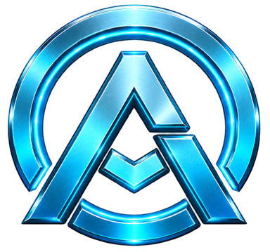
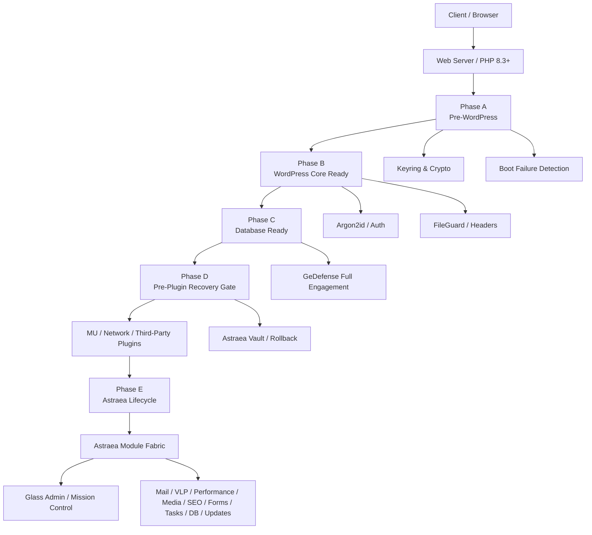

<div align="center">



# AstraeaOS™ WordPress Edition

### **WordPress without the Plugin Stack.**

**A security-first WordPress distribution with first-party cryptography, recovery, privacy, mail, performance and infrastructure built directly into the platform.**

<br>


<br>

> **One kernel. One security model. One recovery chain. Fewer infrastructure plugins.**

</div>

---

## 📚 Documentation — start here

The manuals and architecture documentation are intentionally stored in the **repository root** so they are immediately visible in GitHub releases and source archives.

| Document | Language / Purpose |
|---|---|
| 🇩🇪 **[AstraeaOS WP Handbuch — Alpha-Reihe](./AstraeaOS_WP_Handbuch_Alpha-Reihe.pdf)** | German handbook |
| 🇬🇧 **[AstraeaOS WP Handbook — Alpha Series](./AstraeaOS_WP_Handbook_Alpha-Series_EN.pdf)** | English handbook |
| 🇷🇺 **[AstraeaOS WP Руководство — Alpha Series](./AstraeaOS_WP_Handbook_Alpha-Series_RU.pdf)** | Russian handbook |
| 🏗️ **[ARCHITECTURE.md](./ARCHITECTURE.md)** | Full technical architecture map |
| 🛡️ **[SECURITY.md](./SECURITY.md)** | Security policy and reporting |
| ♻️ **[RECOVERY.md](./RECOVERY.md)** | Recovery architecture and procedures |
| 🔄 **[UPDATE_SECURITY.md](./UPDATE_SECURITY.md)** | Update-chain and release verification design |
| 🚚 **[MIGRATION.md](./MIGRATION.md)** | Migration from conventional WordPress |
| 🧩 **[COMPATIBILITY.md](./COMPATIBILITY.md)** | Runtime and plugin compatibility notes |

---

> [!CAUTION]
> ## ⚠️ ALPHA SOFTWARE
>
> AstraeaOS WordPress Edition is currently part of the **Alpha release series**.
>
> It may contain **bugs, incomplete behavior, compatibility issues, security vulnerabilities, data-loss scenarios, recovery edge cases or breaking changes**.
>
> **Do not assume that an Alpha build is suitable for mission-critical production systems.**
>
> Before deploying AstraeaOS WP on an important workload:
>
> - test it in a staging environment,
> - create independent backups,
> - verify the Astraea Vault restore path,
> - validate plugin/theme compatibility,
> - verify your mail, privacy and authentication configuration,
> - and review the current release notes and security documentation.
>
> Internal tests, security reviews and regression suites reduce risk; they do **not** prove that the software is vulnerability-free.

---


# Why AstraeaOS WordPress Edition exists

Classic WordPress is an extremely capable publishing platform.

But modern production sites often extend the core with separate plugins for:

- WAF / security,
- malware scanning,
- backups,
- recovery,
- SMTP,
- OAuth mail,
- consent management,
- analytics,
- caching,
- media hardening,
- redirects,
- SEO,
- forms,
- scheduled-task inspection,
- database maintenance,
- authentication hardening,
- and migration tooling.

That model is flexible — but it also creates a fragmented infrastructure stack with different vendors, different update cycles, different secret stores, different security assumptions and different failure modes.

**AstraeaOS takes a different architectural approach.**

Instead of treating universal infrastructure as a pile of unrelated plugins, AstraeaOS implements those capabilities as coordinated **first-party kernel modules** under a shared security, cryptography, recovery and lifecycle model.

```text
Classic WordPress
│
├── Security plugin
├── Backup plugin
├── SMTP plugin
├── Cookie / consent plugin
├── Analytics plugin
├── Cache plugin
├── Media plugin
├── Redirect plugin
├── SEO plugin
├── Forms plugin
├── Cron plugin
└── Database cleanup plugin


AstraeaOS WordPress Edition
│
└── Astraea Core Kernel
    ├── GeDefense
    ├── Vault
    ├── VLP Light + Dattrack
    ├── Mail Gateway
    ├── Performance Engine
    ├── Media Engine
    ├── Redirect Manager
    ├── SEO Essentials
    ├── Forms Light
    ├── Task Center
    ├── Database Maintenance
    ├── Maintenance Mode
    ├── Identity Center
    ├── Update Engine
    ├── Compatibility Layer
    ├── Migration Wizard
    └── Recovery Gate
```

The objective is **not to eliminate specialist plugins**.

WooCommerce, specialist business logic, integrations, editors and application-specific extensions still have a place.

The goal is to reduce the number of plugins required merely to build a **secure, private, recoverable and operationally complete baseline**.

---


# AstraeaOS vs. conventional WordPress architecture

| Area | Conventional WordPress approach | AstraeaOS WordPress Edition |
|---|---|---|
| **Password hashing** | Standard WordPress authentication stack | **Argon2id policy**, legacy migration and pepper infrastructure |
| **Privileged operations** | Session + capability + nonce model | Adds **session-bound Step-Up Authentication** |
| **Security perimeter** | Commonly provided by plugins / hosting | **GeDefense Security Kernel** integrated into boot lifecycle |
| **Cryptographic secrets** | Component/plugin-specific | Central **Keyring + AEAD CryptoService + domain separation** |
| **Backups** | External plugin or hosting feature | Native **Astraea Vault** encrypted snapshots |
| **Crash recovery** | WordPress recovery mechanisms / manual intervention | **Pre-plugin Recovery Gate** + standalone recovery console |
| **Update protection** | Standard WordPress updater | Dedicated **Astraea Update Engine** with release verification support |
| **Consent management** | Usually a plugin | Native **VLP Light** |
| **Analytics** | Usually external or plugin-based | Native **Dattrack Light** |
| **Mail transport** | `wp_mail()` plus optional SMTP plugin | Native **Mail Gateway**, StrictTLS and XOAUTH2 support |
| **Performance** | Cache/optimization plugins | Native **Performance Engine** |
| **Upload hardening** | Core validation + plugins | Native **Media Engine**, Magic Bytes and SVG hardening |
| **Forms** | Plugin | **Forms Light** with protected submission storage |
| **Redirects / 404** | Plugin | Native **Redirect Manager** |
| **Task inspection** | Plugin / WP-CLI | Native **Task Center** |
| **DB maintenance** | Plugin / manual SQL | Native maintenance with **Vault snapshot before destructive cleanup** |
| **Migration** | Manual | Native **Migration Wizard** |
| **Admin UX** | Classic wp-admin | Unified **Astraea Glass Admin Experience** |

> AstraeaOS is not “secure because it has more features.”  
> The important difference is that these features share **one lifecycle, one security model, one cryptographic foundation and one recovery architecture**.

---


# Core design principles

### 🛡️ Security by Design

Security-sensitive infrastructure is loaded at deliberate points in the boot sequence rather than being attached only after the full plugin stack is active.

### 🔐 Cryptography as a platform service

AstraeaOS centralizes secret handling through a versioned keyring, authenticated encryption and explicit cryptographic domains.

### ♻️ Recovery before convenience

The system is designed to recover from broken updates, plugins and fatal boot failures before loading the normal application stack.

### 🧱 First-party infrastructure

Universal infrastructure is integrated into `astraea-core/` instead of requiring a large collection of unrelated plugins.

### 📴 Zero external runtime dependencies

The Astraea core and Admin UI do not depend on Composer packages, npm packages, external CDNs, Google Fonts, unpkg or jsDelivr at runtime.

### 🔬 Evidence instead of decorative status lights

Health and security states are intended to reflect actual probes, integrity checks and runtime evidence rather than static “green” UI states.

---


# High-level architecture



The full physical and logical architecture is documented in **[ARCHITECTURE.md](./ARCHITECTURE.md)**.

---

# The five-phase boot sequence

AstraeaOS does not wait until the normal WordPress plugin lifecycle to initialize all critical controls.

## Phase A — Pre-WordPress Minimal

Runs before normal WordPress APIs are available.

Responsibilities include:

- runtime baseline checks,
- PSR-4 Astraea autoloader registration,
- cryptographic keyring initialization,
- early Cerberus perimeter evaluation,
- boot-failure detection,
- recovery-state preparation.

```text
HTTP Request
   ↓
Astraea Phase A
   ├── Runtime baseline
   ├── Keyring
   ├── Early perimeter
   └── Boot failure detector
```

## Phase B — WordPress Core Ready

After essential WordPress core functions are loaded:

- Argon2id password overrides,
- automatic legacy password migration,
- baseline hardening,
- FileGuard,
- security headers,
- legacy-surface pruning,
- request profiling,
- GeDefense pre-flight loading.

## Phase C — Database & Options Ready

After `$wpdb` and WordPress options are available:

- schema migrations,
- security event bridge,
- database-backed security state,
- GeDefense full engagement,
- WAF / DPI / application-layer security services.

## Phase D — Pre-Plugin Recovery Gate

This is one of the defining AstraeaOS architectural boundaries.

It runs **before normal third-party plugins**.

The Vault and recovery subsystems can evaluate incidents, boot failures and rollback conditions before a broken plugin is allowed to crash the site again.

```text
Database Ready
    ↓
Astraea Recovery Gate
    ↓
Vault incident check
    ├── Healthy → continue
    └── Failure → recover / quarantine / rollback
    ↓
Third-party plugins
```

## Phase E — Astraea Lifecycle

Normal first-party module lifecycle:

- Module Fabric,
- Vault full services,
- VLP Light,
- Mail Gateway,
- Step-Up Authentication,
- Privileged Action Guard,
- Update Guard,
- Admin UI,
- Mission Control,
- command palette,
- WP-CLI integration.

---

# Astraea Module Fabric

AstraeaOS does not model its first-party infrastructure as “17 hidden plugins”.

Modules participate in a central lifecycle with:

- module descriptors,
- dependency declarations,
- boot phases,
- capabilities,
- health state,
- enable/disable state,
- dependency resolution,
- conflict handling,
- security events,
- administrative routes.

The dependency graph is resolved topologically and detects cycles.

### Module states

```text
REGISTERED
    ↓
BOOTING
    ↓
ACTIVE

or

DEGRADED / FAILED / DISABLED / BLOCKED
```

### First-party modules

| Module | Purpose |
|---|---|
| **Recovery Gate** | Detects crash loops and exposes isolated emergency recovery |
| **GeDefense Security Kernel** | WAF, DPI, CSP, XDR, scanner, egress and runtime defenses |
| **Astraea Vault** | Encrypted snapshots, restore and rollback |
| **VLP Light** | Consent, service registry, DOM/network gating and **Dattrack Light** analytics |
| **Mail Gateway** | SMTP, StrictTLS, provider presets and XOAUTH2 |
| **Performance Engine** | Page cache, browser policy, heartbeat and profiling |
| **Media Engine** | Hardened uploads, Magic Bytes, SVG and metadata controls |
| **Redirect Manager** | Redirect rules and bounded 404 telemetry |
| **SEO Essentials** | Canonicals, metadata, schema and sitemap integration |
| **Forms Light** | Native forms, anti-abuse controls and protected submissions |
| **Task Center** | WP-Cron inspection and execution telemetry |
| **Database Maintenance** | Dry-run cleanup with mandatory pre-cleanup snapshot |
| **Maintenance Mode** | SEO-safe maintenance responses and controlled bypass |
| **Identity Center** | Session inspection, login state and authentication tooling |
| **Update Engine** | Astraea release verification and transactional update workflow |
| **Compatibility Layer** | Explicit minimum-effective security exceptions |
| **Migration Wizard** | Safe migration from infrastructure-heavy WordPress stacks |

---

# Security architecture

## GeDefense Security Kernel

GeDefense is the integrated AstraeaOS security subsystem.

It is composed of multiple defensive layers rather than one monolithic request filter.

```text
Incoming Request
      ↓
Cerberus
Early IP / perimeter decision
      ↓
Zeus
Pre-boot WAF normalization and request policy
      ↓
Aegis
Deep Packet Inspection
      ↓
Titan
Browser confinement / CSP / security headers
      ↓
Application
      ↓
XDR / event correlation / response
```

GeDefense contains or coordinates components including:

- **Cerberus** — early perimeter/IP controls,
- **Zeus** — pre-boot WAF,
- **Aegis** — payload inspection,
- **Titan** — CSP and browser-confinement policy,
- **Hades** — administrative-surface obscuration controls,
- **ThroneGuard** — privileged master-role separation and recovery controls,
- **Styx** — egress / SSRF-oriented protections,
- **Morpheus** — runtime protection concepts,
- **Gorgon** — controlled telemetry / rule synchronization architecture,
- **Trap** — honeypot capability,
- **Prometheus** — behavioral heuristics,
- **Scanner Engine** — file scanning and evidence classification,
- **XDR Fabric** — event and incident correlation.

Scanner findings are classified by evidence type instead of treating every unusual file as malware:

```text
MALWARE
SUSPICIOUS
POLICY
INFO
```

That distinction is important: **risk signals are not automatically malware verdicts**.

---

# Authentication: Argon2id first

AstraeaOS uses an **Argon2id-based password policy** for its hardened authentication path.

The architecture includes:

- Argon2id password hashing,
- timing-safe verification,
- legacy hash verification,
- automatic migration of supported legacy password hashes after successful authentication,
- optional pepper infrastructure,
- policy versioning and rehash behavior.

```text
Password
   ↓
Argon2id
   ↓
Policy + optional external pepper
   ↓
Stored verifier
```

Passwords are **hashed, not encrypted**.

The goal is to increase the cost of offline password cracking if a credential database is stolen while retaining a migration path from existing WordPress credentials.

---

# Session-bound Step-Up Authentication

Being logged in as an administrator is not treated as sufficient authorization for every destructive or security-critical action.

Sensitive actions can require a fresh **Step-Up** verification tied to the current WordPress session token.

Examples include:

- restoring backups,
- downloading protected snapshots,
- deleting snapshots,
- rotating Vault protection secrets,
- changing SMTP credentials,
- mutating privacy service registries,
- destructive database cleanup,
- changing module states.

The elevation window is intentionally short and is bound to the active session.

```text
Valid Admin Session
      ↓
Sensitive Action
      ↓
Step-Up Required
      ↓
Re-authentication
      ↓
Short-lived session-bound elevation
      ↓
Action permitted
```

This reduces the blast radius of a stolen or unattended authenticated session.

---

# Cryptographic foundation

AstraeaOS treats cryptography as shared infrastructure.

## AEAD

Authenticated encryption is provided through modern AEAD primitives such as:

- **XChaCha20-Poly1305** through Libsodium,
- **AES-256-GCM** through OpenSSL where appropriate.

AEAD protects both confidentiality and integrity.

## Keyring lifecycle

Keys are versioned and can move through explicit lifecycle states such as:

```text
ACTIVE
DECRYPT_ONLY
RETIRED
REVOKED
```

This enables controlled rotation without making historical ciphertext impossible to decrypt immediately.

## Domain separation

AstraeaOS does not reuse one generic cryptographic context for every subsystem.

Dedicated contexts include:

```text
MAIL_TRANSPORT
VLP_CONSENT
FORMS_SUBMISSION
VAULT_SNAPSHOT
DATTRACK_ANALYTICS
SECURE_OPTIONS
```

Conceptually:

```text
Astraea Master Key
        ↓
     Keyring
        ↓
HKDF domain separation
 ├── Mail
 ├── Consent
 ├── Forms
 ├── Vault
 ├── Analytics
 └── Secure Options
```

A compromise or design mistake in one data domain should not automatically mean that every other subsystem shares the exact same derived secret material.

---

# Astraea Vault

Astraea Vault is the native backup, snapshot and recovery subsystem.

It is designed around encrypted `.avb` containers and streaming operation.

Capabilities include:

- filesystem + database snapshots,
- AES-256-GCM protected backup containers,
- per-backup data keys,
- passphrase/service-key protection,
- integrity verification,
- pre-update snapshots,
- pre-maintenance snapshots,
- restore workflows,
- incident tracking,
- recovery integration,
- plugin quarantine workflows.

```text
Risky Operation
      ↓
Vault Snapshot
      ↓
Integrity Verification
      ↓
Operation
  ├── Success → commit
  └── Failure → rollback / recovery
```

Vault is also a dependency of other destructive workflows such as database maintenance and migration.

---

# Autonomous Recovery

A normal administration interface is not useful if the normal application cannot boot.

AstraeaOS therefore includes a standalone recovery surface:

```text
/astraea-recovery/
```

The recovery subsystem can operate outside the normal plugin-dependent admin flow.

Depending on the incident state and authenticated recovery capabilities, it can assist with:

- boot-failure inspection,
- disabling plugins,
- disabling problematic Astraea modules,
- maintenance-state control,
- recovery counters,
- database checks,
- integrity diagnostics.

The recovery console is protected separately and is designed to minimize pre-authentication information exposure.

> Store your generated recovery material securely and offline.

---

# Secure Genesis — security starts at installation

AstraeaOS does not treat security hardening as something that should be added only after WordPress has already been installed.

The **Secure Genesis** installer extends the normal installation process with an Astraea-specific preflight and security compilation stage.

Typical responsibilities include:

1. runtime and extension verification,
2. database compatibility checks,
3. HTTPS / deployment-state checks,
4. cryptographic random salt generation,
5. Astraea key material provisioning,
6. master identity creation,
7. ThroneGuard recovery material,
8. GeDefense security profile compilation,
9. transactional install-state persistence,
10. verified first boot.

The result is a site that starts from an Astraea security baseline instead of requiring a post-install plugin-hardening session.

---

# Privacy by default: VLP Light

**VLP Light** is the native privacy and consent layer.

Capabilities include:

- consent categories,
- cryptographically authenticated consent receipts,
- service registry,
- server-side HTML gating,
- browser-side DOM/network gating,
- scanner for external resources,
- consent-state integration with caching,
- privacy-aware first-party analytics through Dattrack Light.

AstraeaOS attempts to block or classify external resources before they become an invisible dependency of the site.

---

# Dattrack Light

Dattrack provides local analytics without requiring an external analytics SaaS as part of the Astraea baseline.

Design goals include:

- consent-aware ingestion,
- no raw-IP persistence in the normal analytics model,
- rotating pseudonymous visitor identifiers,
- AEAD-protected event payloads,
- rate limiting and global budgets,
- local database storage.

It is intentionally positioned as a sovereignty-oriented analytics foundation rather than an advertising surveillance platform.

---

# Mail Gateway

AstraeaOS includes a first-party mail transport layer.

Capabilities include:

- SMTP provider presets,
- custom SMTP,
- StrictTLS policies,
- TLS 1.2 / 1.3 enforcement,
- certificate and hostname validation,
- encrypted credential storage,
- SSRF-aware endpoint validation,
- Microsoft 365 / Outlook modern authentication,
- native XOAUTH2 support,
- SMTP diagnostics,
- bounded delivery journal.

The Mail Gateway integrates with the WordPress mail path so application code can continue using the normal mail APIs while transport policy is centralized.

---

# Performance Engine

The Performance Engine provides a baseline optimization layer without requiring a dedicated optimization plugin.

Current architecture includes:

- disk page cache,
- atomic cache writes,
- invalidation,
- consent-aware cache variance,
- browser cache policy,
- WordPress Heartbeat control,
- autoload option profiling,
- request profiling,
- lazy-loading policy,
- legacy feature pruning.

AstraeaOS deliberately avoids claiming that one performance configuration is optimal for every site. The module provides a controlled baseline and observable tuning points.

---

# Media Engine

Uploads are a security boundary.

The Media Engine adds hardening beyond trusting browser-provided MIME information.

Capabilities include:

- Magic Byte / file-content validation,
- hardened upload pipeline,
- SVG XML sanitization,
- blocking of unsafe SVG elements and references,
- metadata/EXIF privacy handling where supported,
- WebP / AVIF capability detection,
- controlled image re-encoding where supported.

The `DOMDocument` runtime dependency is treated as a blocking requirement for SVG processing rather than allowing a late fatal error.

---

# Forms Light

AstraeaOS includes a first-party form foundation for sites that do not need a large specialist form platform.

Capabilities include:

- form definitions,
- field validation,
- honeypot controls,
- rate limits and global budgets,
- upload validation,
- protected submission storage,
- AEAD encryption for sensitive submission data,
- Step-Up protection for sensitive administrative access.

For complex CRM, workflow or commerce use cases, specialist form systems may still be appropriate.

---

# Redirects, SEO, Tasks and Database Maintenance

## Redirect Manager

- 301 / 302 / 307 / 308 routing,
- bounded rule processing,
- redirect-chain awareness,
- slug-change handling,
- bounded 404 telemetry.

## SEO Essentials

- canonical URL handling,
- metadata rendering,
- JSON-LD/schema generation,
- sitemap integration,
- conflict awareness.

AstraeaOS intentionally focuses on **technical SEO infrastructure**, not subjective content scoring.

## Task Center

- WP-Cron inspection,
- delayed task visibility,
- controlled manual execution,
- operational telemetry.

## Database Maintenance

- dry-run analysis,
- revisions,
- spam/trash cleanup,
- expired transient cleanup,
- **mandatory Vault snapshot before destructive maintenance**.

---

# Update Engine

AstraeaOS is a WordPress distribution fork.

Applying an upstream WordPress core update directly over AstraeaOS could replace Astraea-specific kernel changes.

For that reason, AstraeaOS contains a **Core Update Guard** and a dedicated update path.

The update architecture is designed around:

```text
Release metadata
      ↓
Authenticity / signature verification
      ↓
Package SHA-256
      ↓
Mandatory Vault snapshot
      ↓
Isolated staging
      ↓
ZipSlip / symlink checks
      ↓
Payload integrity verification
      ↓
Controlled filesystem activation
      ↓
Schema migration
      ↓
Health probes
      ↓
Commit or recovery
```

## Ed25519 support

The release tooling and Update Engine support detached **Ed25519** verification.

> [!IMPORTANT]
> **Do not assume that every GitHub Alpha archive is cryptographically signed.**
>
> A release is authenticated only when its published assets and manifest explicitly indicate a valid signature and that signature verifies against the expected Astraea release key.
>
> Unsigned Alpha builds should be treated as **development / manually distributed artifacts**, not as authenticated updater payloads.

See **[UPDATE_SECURITY.md](./UPDATE_SECURITY.md)** for the full design.

---

# Compatibility Layer

Security controls sometimes conflict with legacy software.

Instead of silently weakening the whole system, AstraeaOS uses explicit compatibility exceptions following a **minimum-effective-exception** philosophy.

Examples may include narrowly controlled compatibility for:

- legacy XML-RPC behavior,
- selected REST behavior,
- mail fallback behavior,
- older plugin assumptions.

Compatibility exceptions should be visible, auditable and reversible.

They are not intended to become permanent “disable security” switches.

---

# Migration Wizard

AstraeaOS includes tooling to help move from an infrastructure-heavy WordPress installation.

The migration workflow is designed to:

1. inspect the existing environment,
2. identify infrastructure plugins that overlap with Astraea modules,
3. map old functionality to Astraea equivalents,
4. create a mandatory Vault snapshot,
5. deactivate selected plugins non-destructively,
6. preserve old plugin data for rollback/re-evaluation.

Example categories include security, backup, SMTP, consent, caching, SEO and forms.

**Migration does not mean deleting plugin data by default.**

Always perform real migrations on staging first.

See **[MIGRATION.md](./MIGRATION.md)**.

---

# Installation

## 1. Requirements

### Required baseline

| Component | Requirement |
|---|---|
| **PHP** | **8.3+**, 64-bit |
| **Database** | **MySQL 8.0+** or **MariaDB 10.11+** |
| **Database Engine** | InnoDB recommended/expected |
| **HTTPS** | Strongly required for public deployments |
| **PHP Extensions** | `sodium`, `openssl`, `json`, `mbstring`, `intl`, `dom` |
| **Password API** | Native `PASSWORD_ARGON2ID` support |
| **Database Driver** | `mysqli` or `pdo_mysql` |

The runtime baseline also relies on PHP's standard hashing functionality. Depending on the enabled modules and operational workflow, the following extensions are strongly recommended:

```text
gd
zip
libxml
curl
```

Always check **[COMPATIBILITY.md](./COMPATIBILITY.md)** for the release you are installing.

---

## 2. Fresh installation

### Step 1 — Obtain the correct release archive

Use the **runtime** distribution for installation.

The source archive additionally contains development tooling, test suites and release engineering material.

### Step 2 — Verify the download

If the release provides SHA-256 checksums:

```bash
sha256sum astraeaos-wp-*-runtime.zip
```

Compare the result with the published checksum.

If the release is signed, additionally verify the signature according to the release instructions.

### Step 3 — Extract into the web root

Example:

```bash
unzip astraeaos-wp-*-runtime.zip -d /var/www/astraea
```

Configure the web server document root accordingly.

### Step 4 — Create a database

Create:

- one empty database,
- one dedicated database user,
- only the permissions required for the application.

Avoid sharing database credentials with unrelated applications.

### Step 5 — Configure HTTPS

For public installations, configure a valid TLS certificate before completing the security-sensitive installation flow.

### Step 6 — Open the installer

Navigate to:

```text
https://your-domain.example/wp-admin/install.php
```

or follow the setup-config flow if a configuration file does not yet exist.

### Step 7 — Complete Secure Genesis

Secure Genesis performs the Astraea-specific initialization and security compilation.

Follow every preflight warning.

**Do not ignore missing cryptographic/runtime dependencies.**

### Step 8 — Save the recovery material

The installer may present one-time recovery material for ThroneGuard / recovery workflows.

Store it:

- offline,
- outside the server,
- outside the WordPress database,
- preferably in a password manager or encrypted offline vault.

If you lose one-time recovery material, the system cannot magically reconstruct a secret it intentionally did not retain in plaintext.

### Step 9 — Verify first boot

After installation:

- open Mission Control,
- review module health,
- review security events,
- validate Vault availability,
- confirm the Recovery Gate state,
- verify file integrity,
- verify HTTPS,
- confirm no unexpected compatibility exceptions are active.

### Step 10 — Configure operational services

Configure only what you need:

- Mail Gateway,
- VLP Light,
- Dattrack,
- Performance,
- Media,
- SEO,
- Forms,
- Redirects,
- maintenance policies.

---

# Recommended post-installation checklist

- [ ] Secure Genesis completed without unresolved blocking errors
- [ ] Recovery material stored offline
- [ ] Independent external backup exists
- [ ] Astraea Vault snapshot created and verified
- [ ] Recovery procedure tested on staging
- [ ] Admin password migrated/created under Argon2id policy
- [ ] HTTPS enforced
- [ ] Mail Gateway tested
- [ ] VLP service registry reviewed
- [ ] Dattrack consent behavior verified
- [ ] Upload/SVG behavior tested for the site workload
- [ ] Plugin and theme compatibility validated
- [ ] Compatibility exceptions reviewed
- [ ] Update channel reviewed
- [ ] Security events reviewed
- [ ] Database maintenance dry-run reviewed
- [ ] Mission Control shows expected module states

---

# Updating AstraeaOS

**Do not install a normal upstream WordPress core update over AstraeaOS.**

AstraeaOS modifies selected upstream integration points and depends on its own kernel.

Use:

- the Astraea Update Engine when a verified release channel is configured, or
- the documented manual upgrade procedure for the current Alpha release.

Before any manual upgrade:

1. create an external backup,
2. create a Vault snapshot,
3. verify the release checksum/signature status,
4. test the upgrade on staging,
5. verify database/schema compatibility,
6. confirm health probes after activation.

See **[UPDATE_SECURITY.md](./UPDATE_SECURITY.md)** and **[RELEASE_PROCESS.md](./RELEASE_PROCESS.md)**.

---

# Repository layout

```text
/
├── AstraeaOS_WP_Handbuch_Alpha-Reihe.pdf
├── AstraeaOS_WP_Handbook_Alpha-Series_EN.pdf
├── AstraeaOS_WP_Handbook_Alpha-Series_RU.pdf
│
├── ARCHITECTURE.md
├── SECURITY.md
├── RECOVERY.md
├── MIGRATION.md
├── COMPATIBILITY.md
├── UPDATE_SECURITY.md
├── RELEASE_PROCESS.md
├── THREAT_MODEL.md
├── TRADEMARKS.md
├── THIRD_PARTY_NOTICES.md
├── NOTICE.md
│
├── astraea-core/
│   ├── Bootstrap/
│   ├── Auth/
│   ├── Crypto/
│   ├── Security/
│   ├── Modules/
│   ├── GeDefense/
│   ├── Vault/
│   ├── VLP/
│   ├── Mail/
│   ├── Performance/
│   ├── Media/
│   ├── Redirects/
│   ├── SEO/
│   ├── Forms/
│   ├── Tasks/
│   ├── Database/
│   ├── Maintenance/
│   ├── Identity/
│   ├── Update/
│   ├── Compatibility/
│   ├── Migration/
│   ├── AdminUI/
│   └── Installer/
│
├── astraea-recovery/
├── wp-admin/
├── wp-includes/
├── wp-content/
│
├── tests/
├── benchmarks/
└── tools/
```

---

# Development and testing

AstraeaOS includes its own release and regression tooling.

Typical local checks:

```bash
php tests/run_tests.php
```

```bash
php tests/run_release_checks.php
```

Manifest verification:

```bash
php tools/build-release.php --verify-only
```

Release manifest generation for development/testing may be unsigned.

Production/authenticated release signing requires the appropriate external offline signing process.

## Security testing philosophy

A green test suite means:

> the cases covered by the suite passed.

It does **not** mean:

> the software has no vulnerabilities.

AstraeaOS Alpha development intentionally includes:

- static review,
- regression testing,
- exploit-chain review,
- path and archive tests,
- session tests,
- recovery tests,
- cryptographic integrity checks,
- network policy tests,
- compatibility tests.

New security findings should become regression tests whenever practical.

---

# Alpha expectations

During the Alpha series, expect:

- schema changes,
- API changes,
- UI changes,
- module behavior changes,
- stronger runtime requirements,
- migration changes,
- compatibility regressions,
- new security restrictions,
- incomplete translations,
- update/recovery changes.

Backward compatibility is a goal — but **security and data integrity take priority over preserving broken Alpha behavior**.

If you need long-term production stability, wait for a later release line and evaluate it against your own deployment requirements.

---

# Security reporting

If you believe you found a security vulnerability:

**Do not publish exploit details immediately in a public issue.**

Follow **[SECURITY.md](./SECURITY.md)**.

Useful reports include:

- affected component,
- affected revision/build,
- required privileges,
- attack prerequisites,
- reproducible steps,
- security impact,
- exploit chain if applicable,
- suggested mitigation if known.

Security reports are especially valuable when they identify the **root cause**, not only the visible symptom.

---

# Licensing

AstraeaOS WordPress Edition contains code under more than one open-source license.

## AstraeaOS-specific code

Original AstraeaOS-specific work by VisionGaiaTechnology is licensed under:

**GNU Affero General Public License v3.0 — AGPLv3**

See:

```text
LICENSE
LICENSES/AGPL-3.0.txt
```

## WordPress upstream and WordPress-derived code

WordPress upstream and WordPress-derived portions remain under:

**GNU General Public License v2 or later — GPL-2.0-or-later**

See:

```text
license.txt
LICENSES/WORDPRESS-GPL-2.0-OR-LATER.txt
```

## Third-party components

Bundled third-party components retain their respective licenses.

Copyright and license notices contained in individual files remain authoritative.

See **[THIRD_PARTY_NOTICES.md](./THIRD_PARTY_NOTICES.md)** and **[NOTICE.md](./NOTICE.md)**.

---

# Trademark

**AstraeaOS™ is a trademark of VisionGaiaTechnology.**

The project currently uses the mark as an **unregistered trademark** and does **not** claim that AstraeaOS is a registered trademark.

The open-source licenses grant copyright permissions in the software. They do not grant a general right to present modified or unrelated products as official VisionGaiaTechnology products.

Modified distributions should be clearly identified as modified and should not imply sponsorship, certification, endorsement or origin by VisionGaiaTechnology where none exists.

See **[TRADEMARKS.md](./TRADEMARKS.md)**.

WordPress and other third-party trademarks remain the property of their respective owners.

---

# Part of the AstraeaOS ecosystem

AstraeaOS WordPress Edition is **not intended to be the entire AstraeaOS project**.

It is one edition and one implementation of a broader AstraeaOS ecosystem focused on:

- secure infrastructure,
- sovereign software,
- integrated cryptographic services,
- recoverable systems,
- privacy-first architecture,
- consistent platform security.

The WordPress Edition demonstrates the core philosophy in an environment millions of developers already understand:

> **Take a fragmented infrastructure stack and turn it into one coordinated platform.**

---

# Documentation

<div align="center">

### Choose your handbook

[](./AstraeaOS_WP_Handbuch_Alpha-Reihe.pdf)
[](./AstraeaOS_WP_Handbook_Alpha-Series_EN.pdf)
[](./AstraeaOS_WP_Handbook_Alpha-Series_RU.pdf)

[](./ARCHITECTURE.md)
[](./SECURITY.md)
[](./RECOVERY.md)

</div>

---

<div align="center">

## **AstraeaOS™ WordPress Edition**

### **WordPress without the Plugin Stack.**

**Security by design · Privacy by default · Recovery built in**

<br>

**AstraeaOS™ is a trademark of VisionGaiaTechnology.**

</div>
